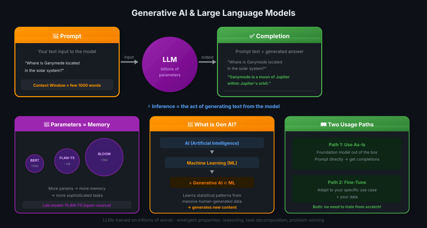

# 02 · Generative AI & Large Language Models

> **TL;DR:** Gen AI = subset of ML that generates new content. LLMs are trained on trillions of words, have billions of parameters, and are operated via text prompts — not code. Output = completion, act = inference.

---

## What is Generative AI?



**Generative AI** is a subset of traditional machine learning. Gen AI models learn by finding **statistical patterns** in massive datasets of human-generated content.

| Traditional ML | Generative AI |
|---------------|--------------|
| Classify / predict | **Create** new content |
| Labeled training data | Massive unlabeled text/image data |
| Fixed output types | Open-ended outputs |
| Code-based interaction | Natural language interaction |

---

## Large Language Models (LLMs)

**LLM:** A type of foundation model trained on **trillions of words** over weeks/months using **large amounts of compute power**, resulting in billions of parameters.

> 💡 *Parameters = model ki memory. Jitne zyada parameters, utna zyada yaad, utna zyada samajh.*

### Foundation / Base Models

**Foundation model (base model):** A large pretrained model with general capabilities, which can be used as-is or fine-tuned for specific tasks.

| Model | Creator | Relative Size |
|-------|---------|--------------|
| BERT | Google | Small (~110M) |
| FLAN-T5 | Google | Medium |
| LLaMA | Meta | Medium-Large |
| PaLM | Google | Large |
| GPT | OpenAI | Large |
| BLOOM | BigScience | Very Large (176B) |

**Key insight:** Circle size = parameter count = language understanding capability. BLOOM at 176B parameters is so large it doesn't fit the same visual scale as BERT at 110M.

### Emergent Properties

Beyond just language, foundation models with billions of parameters exhibit **emergent properties** — abilities that were not explicitly trained for:
- **Break down complex tasks**
- **Reason** across contexts
- **Problem-solve** in novel ways

---

## How LLMs Are Used: Prompts & Completions

```
┌─────────────────────────────┐      ┌──────────┐      ┌─────────────────────────────────┐
│         PROMPT              │ ───► │   LLM    │ ───► │         COMPLETION              │
│  (your text input)          │      │  (model) │      │  prompt text + generated answer │
└─────────────────────────────┘      └──────────┘      └─────────────────────────────────┘
           ↑
    Context Window
  (typically a few thousand words)
```

### Key Terms

| Term | Definition |
|------|-----------|
| **Prompt** | The text you pass to the LLM as input |
| **Context window** | The memory space available to a prompt — typically a few thousand words; varies by model |
| **Completion** | The full output: original prompt text + newly generated text |
| **Inference** | The act of using a trained model to generate text (running the model) |

> 💡 *LLM se baat karna = natural language mein type karo, model aage likhta hai. API call nahi, plain English!*

### Example

```
Prompt:   "Where is Ganymede located in the solar system?"
                        ▼
Completion: "Where is Ganymede located in the solar system?
             Ganymede is a moon of Jupiter and is located
             in the solar system within Jupiter's orbit."
```

The completion **includes the original prompt** followed by the generated answer.

---

## Interaction Paradigm Shift

**Old (traditional ML/programming):**
```python
# Write formal code to call libraries/APIs
result = library.classify(text, model="bert-base")
```

**New (LLMs):**
```
"Classify the sentiment of this review: 'I loved it!'"
→ "Positive"
```

LLMs take **natural language instructions** and perform tasks much as a human would. No formal syntax required.

---

## Modalities

This course focuses on **text → text** (natural language generation), but Gen AI models exist for multiple modalities:

| Modality | Examples |
|----------|---------|
| Text (NLG) | GPT, FLAN-T5, BLOOM — **this course** |
| Images | DALL-E, Stable Diffusion |
| Video | Sora, Runway |
| Audio & Speech | Whisper, MusicLM |
| Code | GitHub Copilot, CodeAId |

---

## What You Can Do With LLMs

Two primary paths:
1. **Use as-is** — foundation model out of the box, prompted directly
2. **Fine-tune** — adapt to your specific use case and data

Both avoid training a model from scratch — dramatically faster and cheaper.

---

## Key Takeaways

1. **Gen AI ⊂ ML** — subset of ML that generates content via statistical pattern learning
2. **Parameters = memory** — more parameters = more knowledge = more sophisticated tasks
3. **Prompts, not code** — natural language in → completion out
4. **Context window** = the working memory available per prompt (a few thousand words)
5. **Completion = prompt + generated text** (not just the generated part)
6. **Inference** = running the model to generate text
