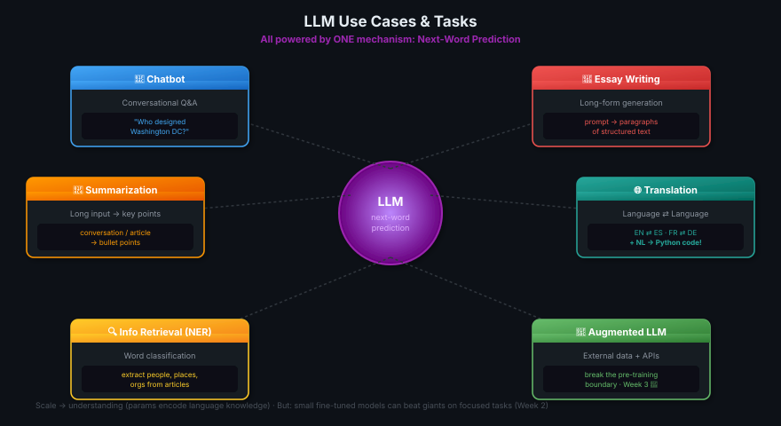

# 03 · LLM Use Cases & Tasks

> **TL;DR:** Next-word prediction is the *one* underlying mechanism powering many tasks: chat, essays, summarization, translation (incl. text-to-code), info retrieval (NER), and augmenting LLMs with external data/APIs. Scale → understanding; fine-tuning makes smaller models excel at specific tasks.

---

## The Core Insight

**Next-word prediction** is the base concept behind every LLM capability. The same simple mechanism — predict what comes next — produces all of the following:



> 💡 *Ek hi trick — agla word predict karo — aur usse poora gen AI khada hai. Simple concept, infinite power.*

---

## Use Cases at a Glance

| Use Case | What It Does | Example |
|---------|--------------|---------|
| **Chatbot** | Conversational Q&A | "Who designed Washington DC?" |
| **Essay Writing** | Generate long-form text from a prompt | "Write an essay on climate change" |
| **Summarization** | Condense long input into key points | Summarize a meeting transcript |
| **Translation (lang→lang)** | Convert between human languages | French ⇄ German, English ⇄ Spanish |
| **Translation (text→code)** | Natural language → machine code | "Return the mean of every column in this dataframe" → Python |
| **Information Retrieval (NER)** | Extract entities from text | List all people & places in a news article |
| **Augmented LLM** | Connect to external data sources or APIs | Real-time weather, DB queries, action calls |

---

## Translation Beyond Languages

Translation isn't just human-to-human languages. It includes:

```
┌──────────────────────────┐         ┌──────────────────────────┐
│ "Return the mean of      │ ───►    │  import pandas as pd     │
│  every column in this    │   LLM   │  df.mean(axis=0)         │
│  dataframe"              │         │                          │
└──────────────────────────┘         └──────────────────────────┘
   Natural Language                        Python (executable)
```

You pass the generated code to an interpreter — the LLM acts as a **natural-language → code translator**.

---

## Named Entity Recognition (NER)

**NER** = a kind of **word classification** task where the model identifies and categorizes entities in text.

```
Input:   "Tim Cook, CEO of Apple, visited Paris last week."
                              ▼  LLM
Output:  • People:  Tim Cook
         • Orgs:    Apple
         • Places:  Paris
         • Dates:   last week
```

The **knowledge encoded in the model's parameters** is what enables this — no separate training needed for each new entity type.

---

## Augmenting LLMs (Active Research Area)

LLMs have a fundamental limit: they only know what was in their **pre-training data**. Two ways to fix this:

| Augmentation | What It Adds |
|-------------|-------------|
| **External data sources** | Information beyond pre-training (recent events, your private docs) |
| **External APIs / actions** | Power real-world interactions (book flight, send email, query DB) |

> 📚 Deep-dive on this comes in **Week 3** of the course.

---

## Scale → Understanding

```
   100M params  ────────►  1B params  ────────►  100B+ params
    [BERT-base]            [FLAN-T5]              [BLOOM, GPT-3+]
        │                       │                       │
        ▼                       ▼                       ▼
   Limited tasks          Many tasks well        Reasoning, complex
                                                 problem-solving
```

**Key finding:** As foundation models grow from **hundreds of millions → billions → hundreds of billions** of parameters, their **subjective understanding of language** increases. This understanding — encoded in the parameters — is what processes, reasons, and solves tasks.

> 💡 *Parameters = neurons of memory. More memory, more samajh, more capable.*

---

## But Bigger Isn't Always Better

**Counterpoint:** Smaller models can be **fine-tuned** to perform well on specific, focused tasks — often beating giant models on those narrow tasks.

| Approach | When to Use |
|---------|------------|
| **Giant foundation model** | General knowledge, multi-task, reasoning across domains |
| **Small fine-tuned model** | Single focused task (summarization, sentiment, classification) |

> 📚 Fine-tuning techniques covered in **Week 2**.

---

## Why LLMs Got So Good So Fast

The rapid capability gains in recent years are **largely due to the architecture** powering LLMs — the **Transformer**. That's the next lesson.

---

## Key Takeaways

1. **One mechanism, many tasks** — next-word prediction underlies all use cases
2. **Translation is broad** — includes natural language → code
3. **NER = word classification** — model's parameters encode entity knowledge
4. **Augmentation extends LLMs** — external data + API actions break the pre-training boundary
5. **Scale unlocks understanding** — but small fine-tuned models win on focused tasks
6. **Architecture = the secret** — Transformer is *why* this all works (next lesson)
