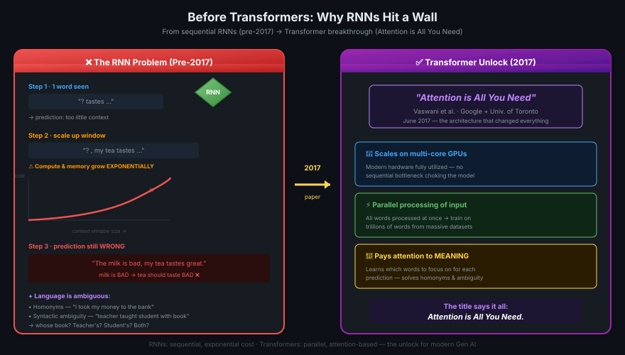

# 04 · Text Generation Before Transformers

> **TL;DR:** Pre-2017, RNNs powered text generation but hit a wall: compute/memory grew **exponentially** with context length, and they still couldn't handle ambiguity. The 2017 paper *"Attention is All You Need"* (Google + Univ. of Toronto) introduced the **Transformer** — scales on multi-core GPUs, processes input in parallel, and *pays attention to meaning*. That's the unlock behind modern Gen AI.

---

## Generative Algorithms Existed Before LLMs

Generative AI is **not new**. Previous generations used **Recurrent Neural Networks (RNNs)**.

**RNN:** A neural network architecture that processes sequences one step at a time, passing a hidden state forward to remember context from previous steps.



---

## The RNN Problem

### Step 1: Tiny context window
```
   ?  tastes ...
                    [RNN]
```
With **one previous word**, the model has almost nothing to work with — prediction is poor.

### Step 2: Scale up to see more words
```
   ?  tea tastes ...
                       [RNN]
```
Slightly better, but still not enough.

### Step 3: Scale further — and hit the wall
```
   ?  , my tea tastes ...
                          [RNN]
```

> ⚠️ **The exponential trap:** Compute and memory requirements of RNNs grow **exponentially** as you increase the window of text the model sees.

### Step 4: Even after scaling, it fails
```
   The milk is bad, my tea tastes great.
                                  ─────
                                  WRONG ❌
```

The model predicted "**great**" — but the sentence said the milk is **bad**, so the tea should taste bad. **Even with scaling, the RNN didn't see enough context to get it right.**

---

## Why Just "More Words" Wasn't Enough

To predict the next word well, models don't just need a longer window — they need to **understand**:

- The **whole sentence**
- Sometimes the **whole document**
- And the **meaning** behind the words

Language is messy. Two big problems break naive sequential models:

### Problem 1: Homonyms (one word, multiple meanings)

> *"I took my money to the **bank**."*

Is "bank" a financial institution or a riverbank? **Only sentence context disambiguates.**

### Problem 2: Syntactic Ambiguity

> *"The teacher taught the student with the book."*

Three valid readings:
1. The teacher used the book to teach (teacher's book)
2. The student had the book (student's book)
3. Both!

> 💡 *Agar humans bhi confuse ho jayein, toh algorithm ka kya kasoor? But Transformers solved this.*

---

## 2017: Everything Changed

**Paper:** *Attention is All You Need*
**Authors:** Google + University of Toronto
**Architecture:** **Transformer**

### Three Things the Transformer Unlocked

| Capability | What It Means |
|-----------|--------------|
| **🚀 Scales efficiently on multi-core GPUs** | Modern hardware can be fully utilized |
| **⚡ Parallel processing of input** | All words processed at once → much larger training datasets become feasible |
| **🎯 Learns to pay attention to meaning** | The model learns *which* words to focus on for each prediction — solves homonyms & ambiguity |

> 💡 *Transformer ka secret: words ko ek-ek karke nahi, sab ek saath dekho. Aur har word kahan dhyaan dega — woh seekh lo.*

---

## RNN vs. Transformer

| | RNN (pre-2017) | Transformer (2017+) |
|---|----------------|---------------------|
| **Processing** | Sequential (one word at a time) | Parallel (all words at once) |
| **Context scaling** | Exponential cost ❌ | Scales efficiently ✅ |
| **Hardware fit** | Poor GPU utilization | Multi-core GPU friendly |
| **Handles ambiguity?** | Struggles | Yes — via attention |
| **Training data size** | Limited | Massive (trillions of words) |

---

## The Punchline

The *title* of the paper says it all:

> **Attention is All You Need.**

Attention — the ability to look at all input positions and decide which ones matter for each output — is the entire trick.

The next lesson dives into **how the Transformer architecture actually works**.

---

## Key Takeaways

1. **Gen AI predates LLMs** — RNNs did this first, but couldn't scale
2. **RNN scaling is exponential** — making the context window bigger blew up compute/memory
3. **Long context alone wasn't enough** — models needed *understanding*, not just more words
4. **Language is ambiguous** — homonyms + syntactic ambiguity break naive models
5. **2017 paper changed everything** — *Attention is All You Need*
6. **Transformer wins on three fronts** — GPU scaling, parallelism, attention to meaning
