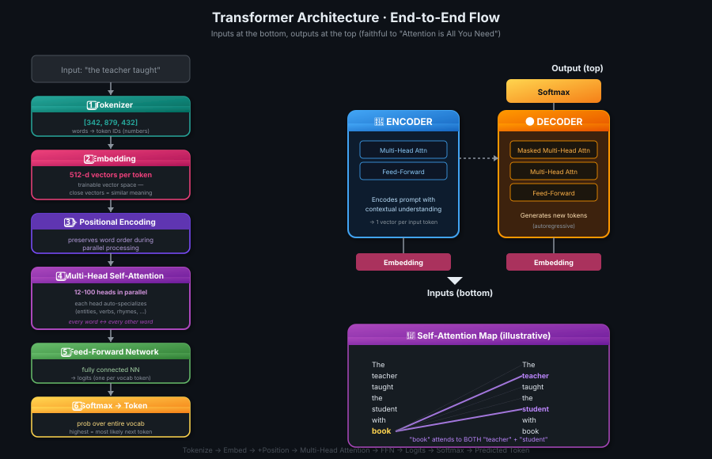

# 05 · Transformers Architecture

> **TL;DR:** Transformer = **Encoder + Decoder**. Input flows: text → **tokenize** → **embed** (vector per token, e.g. 512-dim) → **+ positional encoding** → **multi-headed self-attention** (12–100 heads, each learning a different language aspect) → **feed-forward network** → **logits** → **softmax** → probability over vocab → predicted token. Self-attention learns the relevance of *every word to every other word* — that's the secret.

---

## What Makes Transformers Powerful

The Transformer learns the **relevance and context of every word to every other word** in a sentence — not just to its neighbors. It applies **attention weights** to those relationships, no matter where the words sit in the input.

> 💡 *RNN dekhta tha pados-pados (neighbour to neighbour). Transformer? Sab ek doosre ko dekhte hain — full network of relationships.*

### Self-Attention Map

An **attention map** visualizes attention weights between each word and every other word. The thicker the line, the stronger the connection.

```
   The                      The
   teacher  ╲╱╲╱╲╱╲╱╲╱╱     teacher
   taught   ╱╲╱╲╱╲╱╲╱╲╲     taught
   the      ╲╱╲╱  book      the
   student  ╱╲╱╲╱╲╱╲╱╲╲     student
   with     ╲╱╲╱╲╱╲╱╲╱╱     with
   a        ╱╲╱╲╱╲╱╲╱╲╲     a
   book ────────────────►   book
```

Example: the word **"book"** strongly attends to **"teacher"** AND **"student"** — the model learns the ambiguity itself.

**Self-attention:** Each word attends to all other words *in the same sequence* (including itself). This is what gives Transformers their language-encoding power.

---

## High-Level Architecture



The Transformer splits into **two distinct components** that share many similarities and work together:

| Component | Role |
|-----------|------|
| **🔵 Encoder** | Encodes inputs ("prompts") with contextual understanding. Produces **one vector per input token**. |
| **🟠 Decoder** | Accepts input tokens and **generates new tokens** (the output). |

> 📐 **Diagram convention:** Inputs at the **bottom**, outputs at the **top**. (Faithful to the original *Attention is All You Need* paper.)

---

## The Full Input Flow

```
   Text Input
      │
      ▼
  ┌──────────┐
  │Tokenizer │  words → token IDs (numbers)
  └──────────┘
      │
      ▼
  ┌──────────┐
  │Embedding │  token ID → vector (e.g. 512-dim)
  └──────────┘
      │
      ▼
  ┌──────────┐
  │+ Positional│  preserves word order (parallel needs this)
  │  Encoding  │
  └──────────┘
      │
      ▼
  ┌──────────────────────┐
  │ Multi-Headed         │  many attention heads in parallel,
  │ Self-Attention       │  each learning a different aspect
  └──────────────────────┘
      │
      ▼
  ┌──────────┐
  │Feed-Fwd  │  fully-connected NN
  │ Network  │
  └──────────┘
      │
      ▼
   Logits  →  Softmax  →  Probability per word in vocab
                              │
                              ▼
                         Predicted Token
```

---

## Step 1: Tokenization

ML models are **big statistical calculators** — they work with numbers, not words. **Tokenize first.**

**Tokenization:** Convert words to numbers (token IDs). Each number = a position in the model's vocabulary dictionary.

### Two common strategies

| Strategy | Example: "the teacher taught the" |
|----------|----------------------------------|
| **Whole words** | `[342, 879, 432, 342]` — each word = 1 token ID |
| **Word pieces** | `[156, 790, 321, 890, 156]` — "teacher" → "teach" + "er" |

> ⚠️ **Critical rule:** Once you choose a tokenizer to train the model, you **must use the same tokenizer when generating text**. Mismatch = garbage output.

---

## Step 2: Embedding Layer

**Embedding:** A trainable, **high-dimensional vector space** where each token becomes a vector occupying a unique location.

- Each token ID → a multi-dimensional vector
- Vectors **encode meaning and context** of individual tokens
- Original Transformer paper: vector size = **512**
- Predates Transformers — Word2Vec used the same idea

### Why vectors? Math on meaning.

If we imagine vector size = 3 (for visualization), we can plot words in 3D space:

```
         z↑
    fire ●
            ● student
         ╱     ● book
       ╱
   internet●        →y
      ╱
   computer●
   ↙x
```

- **Words with similar meanings cluster together** (e.g., "student" and "book")
- **Distance between vectors** can be measured as an **angle**
- This gives the model **mathematical access to language meaning**

> 💡 *Words ko numbers mein convert karke, model semantic relationships ko geometry ki tarah samajhta hai. Genius idea.*

---

## Step 3: Positional Encoding

**Problem:** Transformers process all tokens **in parallel** (that's the speed advantage). But "the dog bit the man" ≠ "the man bit the dog" — **order matters.**

**Solution:** Add a **positional encoding vector** to each token embedding before feeding it into the attention layer.

```
        ┌─────────────────────────────────────┐
        │  Position embeddings  x₁ x₂ x₃ x₄  │
        │           +                         │
        │  Token embeddings     x₁ x₂ x₃ x₄  │
        └─────────────────────────────────────┘
                          │
                          ▼
                   self-attention
```

This way, parallel processing is preserved AND word order is retained.

---

## Step 4: Self-Attention Layer

This is where the model **analyzes relationships between tokens** in the input sequence — letting it attend to different parts to capture contextual dependencies.

The **self-attention weights** learned during training reflect the importance of each word in the sequence to **all other words**.

---

## Step 5: Multi-Headed Self-Attention

It doesn't happen just once. Transformers use **multi-headed self-attention**:

- **Multiple sets of self-attention weights ("heads")** are learned **in parallel**, **independently of each other**
- Common counts: **12 to 100 heads** per layer (varies by model)
- Each head learns a **different aspect of language**

### What might each head learn?

| Head | Possible focus |
|------|---------------|
| Head 1 | People entities & their relationships |
| Head 2 | The activity / verb of the sentence |
| Head 3 | Whether words rhyme |
| Head 4 | Grammatical structure |
| Head N | Something else entirely |

> ⚠️ **Key insight:** You **don't pick what each head learns ahead of time**. Weights are randomly initialized, and given enough training data + time, each head naturally specializes. Some attention maps are interpretable; others are mysterious.

> 💡 *12-100 dimagi specialists ek saath kaam karte hain — koi rhyme dekh raha, koi grammar, koi entities. Auto-specialization, no instruction needed.*

---

## Step 6: Feed-Forward Network

After attention weights are applied, the output goes through a **fully connected feed-forward network**.

**Output:** A vector of **logits** — proportional to a probability score for **every single token** in the tokenizer's vocabulary dictionary.

```
   FFN output: [logit₁, logit₂, logit₃, ..., logit_vocab_size]
                                                     ↑
                                            potentially thousands
                                            of scores!
```

---

## Step 7: Softmax → Probability → Token

The logits pass through a **softmax layer** which normalizes them into proper **probability scores** (all summing to 1.0).

```
   Logits  ──softmax──►  [0.001, 0.003, ..., 0.42, ..., 0.0001]
                                              ↑
                                  highest probability = most likely next token
```

- Probability for **every word** in the vocabulary (thousands of scores)
- **One token has the highest score** — the most likely prediction
- But you don't have to always pick the highest! There are **many sampling methods** to vary the final selection from this probability vector — covered in the **Generative Configuration** lesson.

---

## Putting It All Together

```
"the teacher taught"
        │
   [tokenize]
        │
  [342, 879, 432]
        │
   [embed → 512-d vectors]
        │
  + positional encoding
        │
  ┌──────────────────────────┐
  │  ENCODER                 │
  │  • multi-head attention  │  ← 12-100 heads in parallel
  │  • feed-forward          │
  └──────────────────────────┘
        │
        ▼ (context vectors)
  ┌──────────────────────────┐
  │  DECODER                 │
  │  • masked multi-head attn│
  │  • multi-head attn       │
  │  • feed-forward          │
  └──────────────────────────┘
        │
   [softmax]
        │
   probability per vocab word
        │
   pick token → "the"
```

---

## Key Takeaways

1. **Encoder + Decoder** — two halves, work together, similar internals
2. **Tokenize first** — models eat numbers, not words; same tokenizer for train + generate
3. **Embeddings = meaning as geometry** — close vectors ≈ similar meaning, distance ≈ angle
4. **Positional encoding** — added to embeddings to preserve order during parallel processing
5. **Self-attention** — every word attends to every other word, weights learned during training
6. **Multi-headed (12-100 heads)** — each head auto-specializes in a different language aspect
7. **FFN → logits → softmax** — final step: probability over vocab → pick token
8. **The whole architecture** is what unlocked modern Gen AI — RNNs simply couldn't do this
