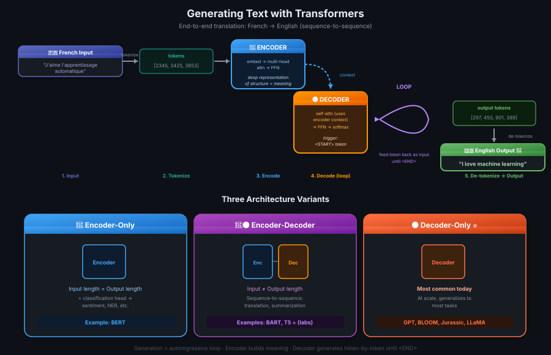

# 06 · Generating Text with Transformers

> **TL;DR:** End-to-end generation = tokenize input → encoder builds a deep representation → decoder loops (start-token → predict → feed back → predict → ... → end-token) → de-tokenize. The architecture comes in **three flavors**: encoder-only (BERT, classification), encoder-decoder (BART, T5, seq-to-seq), and decoder-only (GPT, BLOOM, LLaMA — most common today).

---

## End-to-End: Translation Walkthrough

> **Task:** translate the French phrase *"J'aime l'apprentissage automatique"* → English.
> This is a **sequence-to-sequence** task — the *original* objective the Transformer was designed for.



### The 7 Steps

```
   "J'aime l'apprentissage automatique"
                    │
                    ▼
   ┌──────────────────────────────────────────┐
   │ 1. TOKENIZE  →  [2345, 3425, 3853]       │  same tokenizer used in training
   └──────────────────────────────────────────┘
                    │
                    ▼
   ┌──────────────────────────────────────────┐
   │ 2. ENCODER side                          │
   │    embedding → multi-head attn → FFN     │
   └──────────────────────────────────────────┘
                    │
                    ▼ deep representation of structure + meaning
   ┌──────────────────────────────────────────┐
   │ 3. INSERT into middle of DECODER         │  influences decoder's self-attention
   └──────────────────────────────────────────┘
                    │
                    ▼
   ┌──────────────────────────────────────────┐
   │ 4. Add <START> token to decoder input    │  triggers prediction
   └──────────────────────────────────────────┘
                    │
                    ▼
   ┌──────────────────────────────────────────┐
   │ 5. DECODER: self-attn → FFN → softmax    │
   │    → first output token                  │
   └──────────────────────────────────────────┘
                    │
                    ▼
   ┌──────────────────────────────────────────┐
   │ 6. LOOP: feed token back as input        │
   │    → predict next → feed back → repeat   │  ← autoregressive
   │    UNTIL <END-OF-SEQUENCE> token         │
   └──────────────────────────────────────────┘
                    │
                    ▼
   ┌──────────────────────────────────────────┐
   │ 7. DE-TOKENIZE  [297, 450, 901, 389] →   │
   │    "I love machine learning"             │
   └──────────────────────────────────────────┘
```

> 💡 *Decoder ek loop mein chalta hai — har baar ek token predict karke usko wapas input mein daalo, taaki agla token aaye. Yeh autoregressive generation hai.*

---

## Encoder vs Decoder Roles (Recap)

| Component | Job | Output |
|-----------|-----|--------|
| **🔵 Encoder** | Encodes input sequence into a **deep representation** of structure + meaning | Context vectors fed into decoder's middle |
| **🟠 Decoder** | Uses encoder context + input token triggers to **generate new tokens** in a loop | One token per step, until stop condition |

**Stop condition:** the model predicts the special **`<END-OF-SEQUENCE>`** token.

---

## Multiple Ways to Pick the Next Token

The softmax layer gives a **probability over the entire vocabulary**. There are multiple methods to convert this into a single chosen token, and they directly influence **how creative** the output is:

> 📚 Covered in detail in the upcoming **Generative Configuration** lesson (temperature, top-k, top-p, etc.).

For now: greedy = always take the highest probability. Other methods sample from the distribution.

---

## Three Architecture Variants

The original Transformer has both encoder and decoder, but you can **split them apart** for different use cases.

| Variant | Architecture | Input vs Output Length | Best For | Examples |
|---------|-------------|----------------------|---------|----------|
| **Encoder-only** | Just the encoder | Same length (without modification) | Classification (e.g. sentiment) when you add classification heads | **BERT** |
| **Encoder-Decoder** | Both halves | Can differ | Sequence-to-sequence (translation, summarization) + general text generation | **BART**, **T5** *(used in this course's labs)* |
| **Decoder-only** | Just the decoder | Generates freely | Most general — **generalize to most tasks** at scale | **GPT**, **BLOOM**, **Jurassic**, **LLaMA** |

### Quick Trade-offs

**🔵 Encoder-only (BERT):**
- Naturally seq-to-seq with same I/O length
- Add layers → classification (sentiment, NER, etc.)
- Less commonly used standalone these days

**🔵🟠 Encoder-Decoder (BART, T5):**
- Sweet spot for tasks where input ≠ output length
- Translation, summarization, Q&A
- Can also scale up for general text generation

**🟠 Decoder-only (GPT, BLOOM, LLaMA):**
- **Most commonly used today**
- At scale, generalizes to most tasks
- The "default" for modern LLMs

> 💡 *Aaj kal ka maximum LLMs decoder-only hain. GPT, LLaMA, Claude, Gemini — sab decoder-only family se hain.*

---

## Why You Don't Need to Memorize This

The point of the architecture overview is to give you enough background to:
- ✅ Understand differences between models you encounter
- ✅ **Read model documentation** confidently
- ❌ NOT to memorize every detail

You'll interact with these models through **natural language prompts** — not code. That's **prompt engineering**, the next part of the course.

> 💡 *Architecture details bhool jao toh chalega — prompts likhna seekho. Wahin asli kaam hai.*

---

## Key Takeaways

1. **Generation is a loop** — predict, feed back, predict again, until end token
2. **Encoder builds meaning, decoder generates** — clear division of labor
3. **`<START>` token kicks off generation**, `<END-OF-SEQUENCE>` stops it
4. **De-tokenize at the end** — token IDs → words for the final output
5. **Three variants exist:**
   - **Encoder-only** → BERT (classification)
   - **Encoder-decoder** → BART, T5 (seq-to-seq, used in labs)
   - **Decoder-only** → GPT, BLOOM, LLaMA (most common today)
6. **You won't memorize this** — natural language prompts are the real interface
