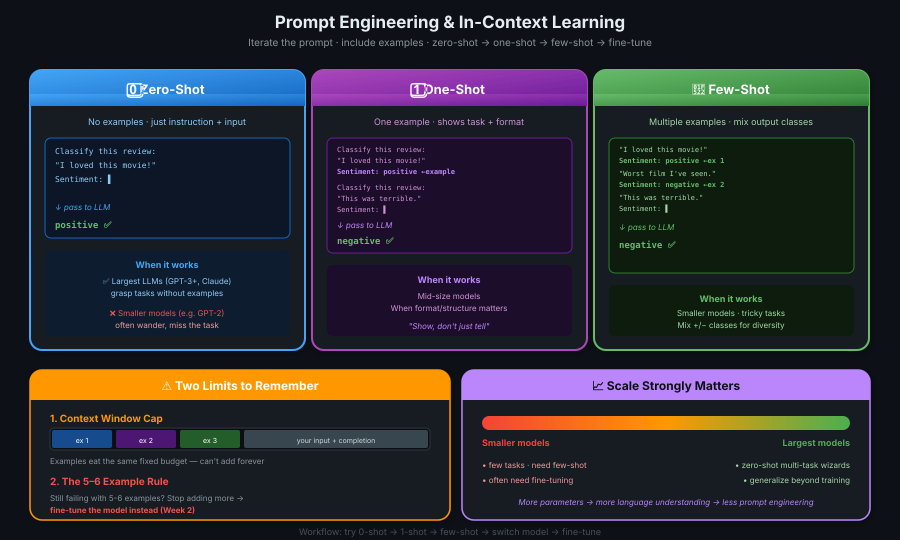

# 07 · Prompting & Prompt Engineering

> **TL;DR:** **Prompt engineering** = iterating on prompt language to get better outputs. The most powerful trick: **in-context learning** — include examples *inside the prompt*. **Zero-shot** (no examples), **one-shot** (1 example), **few-shot** (multiple examples). Bigger models work great zero-shot; smaller models need examples. If 5-6 examples still aren't enough → **fine-tune** (Week 2).

---

## Quick Vocabulary Refresh

| Term | Meaning |
|------|--------|
| **Prompt** | The text you feed into the model |
| **Inference** | The act of generating text (running the model) |
| **Completion** | The output text |
| **Context window** | Total memory available for the prompt — you can't exceed it |

---

## What is Prompt Engineering?

Models often **don't produce what you want on the first try**. You'll frequently revise:
- The **language** of your prompt
- The **way it's written** (structure, tone)
- Several iterations until it behaves correctly

This iterative work to develop and improve prompts is called **prompt engineering**.

> 💡 *Prompt engineering ka matlab nahi ki tum coder ho — tum writer ho. Apne shabdon se model ko sikhao kya karna hai.*

---

## The Killer Strategy: In-Context Learning

**In-context learning (ICL):** Include **examples or additional data inside the prompt** to help the LLM understand the task.

Three flavors based on how many examples you provide:



---

## Zero-Shot Inference

**Zero-shot:** No examples — just instruction + input.

```
┌─────────────────────────────────────────────┐
│  Classify this review:                      │
│  "I loved this movie!"                      │
│  Sentiment:                                 │
└─────────────────────────────────────────────┘
                    ▼
              ┌───────────┐
              │ Large LLM │
              └───────────┘
                    ▼
                 positive ✅
```

✅ **Largest LLMs (GPT-3+, etc.):** Surprisingly good at zero-shot — grasp the task without examples.

❌ **Smaller models (e.g., GPT-2):** Often struggle. May generate related text but **fail to follow the instruction**.

```
   GPT-2 zero-shot output:
   "I loved this movie! It was great because..."
                                          ❌ wandered off, never said positive/negative
```

---

## One-Shot Inference

**One-shot:** Provide **one complete example** showing the task + format, then ask the actual question.

```
┌──────────────────────────────────────────────┐
│  Classify this review:                       │
│  "I loved this movie!"                       │
│  Sentiment: positive          ← the example  │
│                                              │
│  Classify this review:                       │
│  "This was terrible."         ← real input   │
│  Sentiment:                                  │
└──────────────────────────────────────────────┘
                    ▼
                ┌─────────┐
                │  LLM    │
                └─────────┘
                    ▼
                 negative ✅
```

The model now sees:
- **What the task looks like**
- **The format of the response** you want

> 💡 *Ek example dikhao, model samjhega — "achha, mujhe yeh karna hai, is format mein."*

---

## Few-Shot Inference

**Few-shot:** Multiple examples — useful for **even smaller models** or **harder tasks**.

```
┌──────────────────────────────────────────────┐
│  Classify this review:                       │
│  "I loved this movie!"                       │
│  Sentiment: positive          ← example 1    │
│                                              │
│  Classify this review:                       │
│  "Worst film I've seen."                     │
│  Sentiment: negative          ← example 2    │
│                                              │
│  Classify this review:                       │
│  "This was terrible."         ← real input   │
│  Sentiment:                                  │
└──────────────────────────────────────────────┘
```

> 💡 **Pro tip:** **Mix output classes** in your examples (positive AND negative). It teaches the model the *full range* of valid answers, not just one direction.

---

## Zero / One / Few-Shot at a Glance

| Strategy | Examples in Prompt | Best For |
|----------|-------------------|---------|
| **Zero-shot** | 0 | Large models (capable, general-purpose) |
| **One-shot** | 1 | Mid-size models, or when format matters |
| **Few-shot** | 2+ (often 3-5) | Smaller models, tricky tasks, output diversity |

---

## ⚠️ Two Important Limits

### 1. Context Window Limit

```
   ┌──────── context window (e.g., 4K tokens) ────────┐
   │                                                   │
   │  [example 1] [example 2] [example 3] ... [input] │
   │                                                   │
   └───────────────────────────────────────────────────┘
                                                    ↑
                                            can't exceed this!
```

Every example eats into the same fixed budget. You **can't keep adding examples forever**.

### 2. The 5-6 Example Rule

> **If your model isn't performing well even with 5–6 examples, stop adding more — fine-tune instead.**

**Fine-tuning:** Additional training on the base model using new data to make it more capable of your specific task. (Deep dive in **Week 2**.)

| Symptom | Solution |
|---------|---------|
| Model fails zero-shot | Try one-shot |
| Still fails | Try few-shot (2-5 examples) |
| Still fails at 5-6 examples | **Fine-tune** instead — more examples won't help |

---

## Scale Strongly Matters

The bigger the model, the more it can do **without** task-specific examples.

```
   Smaller models                                  Largest models
   ──────────────────────────────────────────────────────────►
   • Few tasks they're trained on                  • Zero-shot everything
   • Need few-shot examples                        • Multi-task wizards
   • Often need fine-tuning                        • Generalize beyond training
```

**Why?** Models with more parameters capture more understanding of language. Larger models successfully complete **tasks they were never specifically trained on**.

> 💡 *Bada model = chhote prompt mein bhi kaam ho jaata. Chhota model = lambe lambe examples chahiye.*

---

## Practical Workflow

```
   1. Pick a model
        │
        ▼
   2. Try zero-shot ─────────► works? ✅ done
        │ no
        ▼
   3. Try one-shot   ─────────► works? ✅ done
        │ no
        ▼
   4. Try few-shot (2-5) ─────► works? ✅ done
        │ no
        ▼
   5. Try a different model
        │ still no
        ▼
   6. Fine-tune (Week 2)
```

You may need to try **a few different models** to find the right one for your use case.

---

## Once You've Found Your Model...

Several **configuration settings** control the *style and structure* of completions — temperature, top-k, top-p, max length, etc. That's the next lesson: **Generative Configuration**.

---

## Key Takeaways

1. **Prompt engineering = iteration** — first try rarely works; revise the prompt
2. **In-context learning** = include examples in the prompt (the most powerful trick)
3. **Zero-shot** (no examples) — large models handle this well
4. **One-shot** (1 example) — shows task + response format
5. **Few-shot** (2+ examples) — for smaller models or tricky tasks; mix output classes
6. **Context window is finite** — can't keep adding examples
7. **5-6 example rule** — if it still doesn't work, fine-tune instead
8. **Scale matters massively** — more parameters → better zero-shot → less prompt engineering needed
