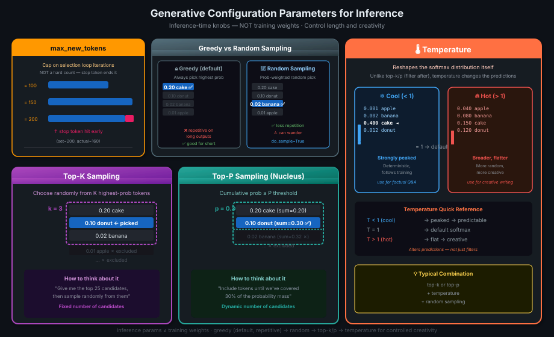

# 08 · Generative Configuration Parameters

> **TL;DR:** These are **inference-time knobs** — not training parameters. They control output length and creativity. Greedy decoding = always highest probability (repetitive). Random sampling = adds variety (can wander). Top-K and Top-P narrow the random pool. Temperature reshapes the probability distribution itself — cool = peaked/deterministic, hot = flat/creative.

---

## Configuration Params vs Training Params

> ⚠️ **Critical distinction:** These are **NOT** the weights learned during training.

| Type | Set When | What They Control |
|------|---------|------------------|
| **Training parameters** (weights) | During training | What the model *knows* |
| **Inference configuration** ← this lesson | At inference time | How the model *chooses* its output |

You find these as sliders in LLM playgrounds (Hugging Face, AWS Bedrock, etc.): `max_new_tokens`, `top_k`, `top_p`, `temperature`.

---

## Overview: All 5 Parameters



| Parameter | What It Does | Creative ↑ or ↓ |
|-----------|-------------|-----------------|
| `max_new_tokens` | Cap on tokens generated | Structural |
| Greedy decoding | Always pick highest-prob token (default) | ↓ (repetitive) |
| Random sampling | Sample from distribution by weight | ↑ (but can wander) |
| `top_k` | Restrict random sample to K highest-prob tokens | Balanced |
| `top_p` | Restrict random sample to tokens whose cumulative prob ≤ P | Balanced |
| `temperature` | Reshape the entire probability distribution | ↑ hot / ↓ cool |

---

## 1. `max_new_tokens`

**Definition:** A cap on the number of tokens the model will generate. A put on the selection loop.

> ⚠️ It's a **maximum**, not a guarantee. If the model predicts an `<END-OF-SEQUENCE>` token first, generation stops early.

```
max_new_tokens = 100   ████████████████████████████░░░░░  (stopped naturally)
max_new_tokens = 150   ████████████████████████████████████████░░░░
max_new_tokens = 200   ████████████████████████████████████████🔴   ← stop token hit at 160
                                                                       (not 200!)
```

---

## 2. Greedy Decoding (Default)

**Greedy decoding:** Always select the token with the **highest probability score**.

```
   softmax output:
   cake    0.20  ◄── ✅ greedy picks this
   donut   0.10
   banana  0.02
   apple   0.01
   ...
```

**Problem:** Works well for short outputs but becomes **repetitive** on longer outputs — the model keeps falling back to the same high-probability words.

> 💡 *Greedy = safe aur boring. Hamesha same words, same patterns.*

---

## 3. Random Sampling

**Random sampling:** Instead of always picking the top token, **sample from the full distribution using probability as weight**.

```
   cake    0.20  → 20% chance of selection
   donut   0.10  → 10% chance
   banana  0.02  → 2% chance  ← in this roll, banana was picked!
   apple   0.01  → 1% chance
   ...
```

**Benefit:** Reduces repetition, more natural-sounding text.

**Risk:** Can go *too* random — generation wanders into topics or words that don't make sense.

> 💡 *Hugging Face note:* You may need to set `do_sample=True` explicitly in code to enable random sampling (it defaults to greedy).

---

## 4. Top-K Sampling

**Top-K:** Restrict random sampling to **only the K tokens with the highest probability**. Sample randomly from those K using probability weighting.

```
   k = 3  →  only choose from:
   ┌──────────────────────────────┐
   │  cake    0.20  ◄─┐            │
   │  donut   0.10  ← random      │
   │  banana  0.02  ◄─┘ (picked!) │
   └──────────────────────────────┘
   apple   0.01  ✗ excluded
   ...
```

**Result:** Some variability, but **prevents selection of highly improbable tokens** — output stays sensible.

---

## 5. Top-P Sampling (Nucleus Sampling)

**Top-P:** Restrict random sampling to tokens whose **cumulative probability does not exceed P**.

```
   p = 0.30  →  include tokens until cumulative prob hits 0.30:
   ┌─────────────────────────────┐
   │  cake    0.20  cumsum=0.20  │
   │  donut   0.10  cumsum=0.30  │ ← stop here
   └─────────────────────────────┘
   banana  0.02  cumsum=0.32  ✗ excluded
   apple   0.01  ...          ✗ excluded
```

**Vs. Top-K:**
- **Top-K** = fixed number of candidates
- **Top-P** = dynamic number of candidates based on cumulative probability

> 💡 *Top-K: "give me the 25 best options." Top-P: "give me options until we've covered 30% of the probability mass."*

---

## 6. Temperature

**Temperature:** A scaling factor applied **inside the final softmax layer** that reshapes the probability distribution for the next token.

> ⚠️ Unlike Top-K/Top-P which filter *after* softmax, temperature **changes the distribution itself** — it alters the predictions, not just the selection method.

| Temperature | Distribution Shape | Output Style |
|------------|-------------------|-------------|
| **< 1 (cool)** | **Strongly peaked** — most prob concentrated on few tokens | Predictable, follows training patterns closely, low variability |
| **= 1** | Default softmax — unaltered distribution | Normal behavior |
| **> 1 (hot)** | **Broader, flatter** — prob spread more evenly across tokens | Higher randomness, more creative, more variability |

### Visualized

```
Temperature < 1 (cool):          Temperature > 1 (hot):
  prob                              prob
   │ ██                               │ ██
   │ ██                               │ ████
   │ ██  ░                            │ ████  ██
   │ ██  ░ ░ ░                        │ ████  ████  ██
   └─────────────►  words             └─────────────────►  words
   cake is dominant                  probability spread across many
```

> 💡 *Temperature < 1: model "chills out" and sticks to what it knows. Temperature > 1: model "gets excited" and takes more risks. Temperature = 1: default, no change to softmax.*

> 💡 *Temperature = oven ka knob. Thanda = safe baking, garam = creative chaos.*

---

## How They Interact — Quick Reference

```
   Default (greedy):        deterministic, repetitive
          │
   + random sampling:       more natural, can wander
          │
   + top-k OR top-p:        constrained randomness — sensible output
          │
   + temperature:           tune the distribution *before* sampling
```

You typically combine **top-k or top-p + temperature** for controlled creativity.

---

## Key Takeaways

1. **Inference params ≠ training params** — different timing, different purpose
2. **`max_new_tokens`** = output length cap (not guarantee — stop token can end it earlier)
3. **Greedy** = deterministic but repetitive; **random sampling** = varied but can wander
4. **Top-K** = restrict to K highest; **Top-P** = restrict to cumulative prob ≤ P
5. **Temperature** reshapes the softmax distribution itself (not just a filter):
   - **< 1** → peaked, deterministic, close to training patterns
   - **= 1** → default
   - **> 1** → flat, random, creative
6. Typical combination for natural output: **top-k or top-p + temperature + random sampling**
