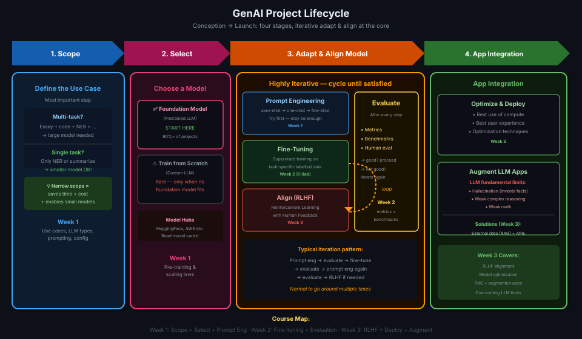

# 09 · GenAI Project Lifecycle

> **TL;DR:** Four stages: **Scope** (define use case narrowly) → **Select** (foundation model or train from scratch) → **Adapt & Align** (prompt engineering → fine-tuning → RLHF, with iterative evaluate loops) → **Application Integration** (optimize for deployment, augment with external data/APIs). The adapt & align stage is **highly iterative** and the one you'll spend most time on.

---

## The Framework at a Glance

This lifecycle maps every task from **conception to launch** of an LLM-powered application. You'll see this diagram referenced throughout the whole course.



```
  ┌──────────┐    ┌──────────┐    ┌────────────────────────────────┐    ┌─────────────────────────┐
  │  SCOPE   │ →  │  SELECT  │ →  │      ADAPT & ALIGN MODEL       │ →  │  APPLICATION INTEGRATION│
  │          │    │          │    │ ┌────────────┐  ┌───────────┐  │    │ ┌──────────┐ ┌─────────┐ │
  │ Define   │    │Foundation│    │ │  Prompt    │  │           │  │    │ │ Optimize │ │ Augment │ │
  │ the use  │    │model OR  │    │ │engineering │⟲ │ Evaluate  │  │    │ │ & deploy │ │   LLM   │ │
  │ case     │    │train own │    │ │ Fine-tuning│  │           │  │    │ │          │ │  apps   │ │
  │          │    │          │    │ │ RLHF align │  │           │  │    │          │ │         │ │
  └──────────┘    └──────────┘    │ └────────────┘  └───────────┘  │    └─────────────────────────┘
                                  └────────────────────────────────┘
```

---

## Stage 1: Scope — Define the Use Case

> **Most important step. Most underestimated step.**

Define the scope **as accurately and narrowly as possible**.

LLMs can do many things, but their abilities depend on **model size and architecture**. The question to answer:

| Question | Options |
|---------|--------|
| **Multi-task generalist?** | Needs long-form generation, many task types, high capability → larger model |
| **Single-task specialist?** | e.g., only NER or only dialogue summarization → can use smaller, cheaper model |

> 💡 **Why narrow scope saves you:** Getting specific = saves time + compute cost. A smaller fine-tuned model often beats a giant general model on a focused task.

> 💡 *Pehle decide karo kya banana hai. "Sab kuch" scope nahi hai — scope sirf ek kaam hona chahiye.*

---

## Stage 2: Select — Choose or Build a Model

Two options:

| Option | When to Use |
|--------|------------|
| **Foundation model (pre-trained)** | **Default start point** — most practical for most projects |
| **Train from scratch** | Rare — only when your domain/data/requirements are truly unique (covered later this week) |

> 💡 *Rule of thumb: start with existing model. Train from scratch sirf tab karo jab koi existing model kaam nahi karta.*

### Model Hubs
Model cards (e.g., on Hugging Face) document:
1. Model Details
2. Uses
3. Bias, Risks, and Limitations
4. Training Details
5. Evaluation

Read the model card before choosing. FLAN-T5 example: supports translation, summarization, NLI, sentence similarity — all documented.

---

## Stage 3: Adapt & Align Model — The Iterative Core

This is the **most iterative** and time-intensive stage. Three sub-steps, tried in order:

### 3a. Prompt Engineering
Start here. Sometimes enough on its own — especially for large models.
- Try zero-shot → one-shot → few-shot
- Evaluate outputs
- Iterate on prompts

### 3b. Fine-tuning
When prompt engineering isn't enough.
- **Supervised learning process:** additional training on labelled examples for your task
- Covered in detail in **Week 2**
- Week 2 lab: you fine-tune a model yourself

### 3c. Align with Human Feedback (RLHF)
As models become more capable, **alignment** becomes critical.
- **Reinforcement Learning with Human Feedback (RLHF)**
- Ensures model behaves well, avoids harmful outputs, aligns with human preferences
- Covered in **Week 3**

### The Evaluate Loop
**Evaluation** runs after every sub-step. This stage is highly iterative:

```
   prompt engineering ──► evaluate ──► good? ✅ proceed
                                  └──► not good? try fine-tuning
   fine-tuning ──────────► evaluate ──► good? ✅ proceed
                                  └──► revisit prompt engineering again
   RLHF ──────────────────► evaluate ──► aligned? ✅ proceed
```

> 💡 *Yeh loop ek baar nahi chalta — kaafi baar chalta hai. Evaluate → fix → evaluate → fix. This is normal.*

**Metrics and benchmarks** for evaluation covered in **Week 2**.

---

## Stage 4: Application Integration

### 4a. Optimize & Deploy for Inference
- Ensure you're making the best use of **compute resources**
- Best possible **user experience**
- Optimization techniques covered in the course

### 4b. Augment & Build LLM-Powered Applications
Fundamental limitations of LLMs that training alone can't fix:
- **Hallucination** — inventing facts when it doesn't know the answer
- **Limited complex reasoning** and **mathematics**

Solutions (covered in Week 3's final section):
- Connect to **external data sources** (RAG-style)
- Invoke **external APIs** and actions

> 💡 *LLM ko bahar ki duniya se connect karo — tabhi real applications bante hain.*

---

## The Full Decision Map

```
   Define use case
        │
        ▼
   Multi-task?  → Large foundation model (GPT, BLOOM...)
   Single task? → Small fine-tunable model (FLAN-T5, BERT...)
        │
        ▼
   Start with existing foundation model
   (Train from scratch only if no existing model fits)
        │
        ▼
   ┌─────────────────────────────────────────┐
   │  ADAPT & ALIGN (iterate until satisfied) │
   │                                         │
   │  1. Prompt engineering + evaluate       │
   │  2. Fine-tuning + evaluate     (Week 2) │
   │  3. RLHF + evaluate            (Week 3) │
   └─────────────────────────────────────────┘
        │
        ▼
   Deploy + optimize for inference
        │
        ▼
   Augment: external data + APIs (Week 3)
```

---

## What Each Week Covers

| Week | Focus | Lifecycle Stage |
|------|-------|----------------|
| **Week 1** (now) | Transformers, prompting, generative config | Scope + Select + Prompt Engineering |
| **Week 2** | Fine-tuning, PEFT, evaluation metrics | Adapt & Align (fine-tuning) |
| **Week 3** | RLHF, deployment, RAG, augmented LLMs | RLHF + Application Integration |

---

## Key Takeaways

1. **Four stages:** Scope → Select → Adapt & Align → Application Integration
2. **Scope first, scope narrow** — saves time + cost + enables smaller models
3. **Start with foundation model** — training from scratch is rare
4. **Adapt & Align is iterative** — expect to loop prompt→eval→finetune→eval multiple times
5. **RLHF** aligns model with human preferences (Week 3)
6. **Evaluation runs after every step** — metrics + benchmarks covered Week 2
7. **Final stage** — optimize for deployment + augment with external data to overcome hallucination limits
