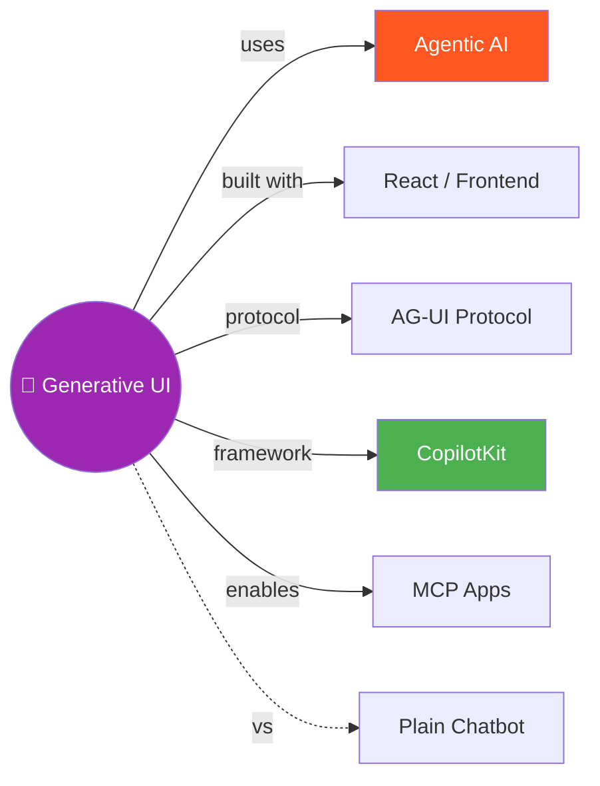

# 🎨 Building Interactive Agents with Generative UI

> Chatbot se aage badho — agents ko visual interface do! Forms, charts, whiteboards — sab dynamically generate karo 🚀

---

## 🧠 Brain — How This Connects

## 📊 Progress

| # | Module/Lesson | Confidence | Revised |
|---|---------------|-----------|---------|
| 00 | [Course Introduction](module-1-intro/00-course-intro.md) | 🟢 | — |
| 01 | Module 1: Intro to Generative UI | 🔴 | — |

**Overall confidence:** 🔴 Just started (1%)

## 🧩 Memory Fragments

> - 🎨 **Generative UI = Windows era of AI** — command line (plain text chatbots) → visual interfaces (forms, charts, apps)
> - 🔧 **3 patterns:** Controlled (handcrafted components), Declarative (schema-based layouts), Open-ended (full app sandboxes)
> - 🛠️ **AG-UI protocol** — Google + CopilotKit co-developed open spec for declarative UI
> - 🚀 **CopilotKit** — open-source framework supporting all 3 patterns, integrates with LangGraph, Google Cloud, AWS, Azure

---

## 🎬 Teach Mode — Course Flow

> Open these in order = you can teach anyone Generative UI for AI agents

### Module 1: Introduction to Generative UI

| # | Lesson | What You'll Get |
|---|--------|-----------------|
| 00 | Course Introduction | Why generative UI matters, 3 patterns overview |
| 01 | Three Pillars of Generative UI | Controlled vs Declarative vs Open-ended |

### Module 2: Controlled Generative UI
_(Will be added as we progress...)_

### Module 3: Declarative Generative UI with AG-UI
_(Will be added as we progress...)_

### Module 4: Open-Ended Generative UI with MCP Apps
_(Will be added as we progress...)_

**Supporting:**
- [Flashcards](flashcards.md) — cross-module self-test _(after content added)_
- [Cheatsheet](cheatsheet.md) — one-page everything _(after content added)_

---

## 📚 Sources

> - 🎓 Course: [Building Interactive Agents with Generative UI](https://learn.deeplearning.ai/) — DeepLearning.AI × CopilotKit
> - 👨‍🏫 Instructor: Atai Barkai (Co-founder, CopilotKit)
> - 🔗 CopilotKit: Open-source framework for generative UI
> - 📜 AG-UI Protocol: Google + CopilotKit co-developed open spec

## 🔗 Connected Topics

> → [Agentic AI](../agentic-ai/) · [React](../react/) · _LangGraph (planned)_ · _MCP (planned)_

## 30-Second Recall 🧠

> _Will be written after completing the course — for now, learn module by module!_

---

## 🎯 Course Goal

By the end: Build a full-stack agent app that:
- Renders **charts and cards** on demand (controlled UI)
- Surfaces a **live whiteboard** through custom apps (open-ended UI)
- Keeps a **shared to-do list** in sync between agent and UI (declarative UI)
