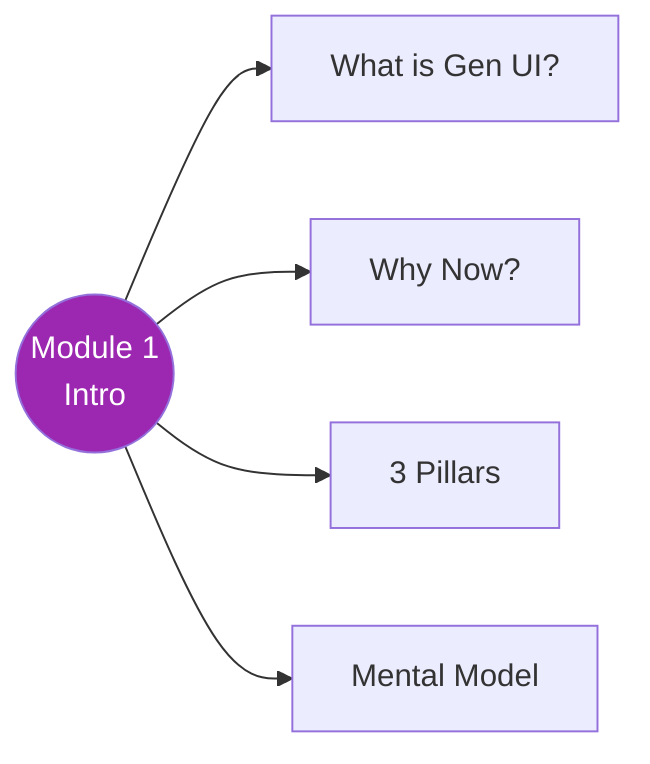

# 🎨 Module 1 — Introduction to Generative UI

> Text se visual tak ka safar — 3 patterns, ek framework! 🚀

---

## 🧠 Brain — Module Overview

## 📊 Progress

| # | Lesson | Confidence | Revised |
|---|--------|-----------|---------|
| 00 | [Course Introduction](00-course-intro.md) | 🟢 | — |
| 01 | [Three Pillars of Generative UI](01-three-pillars.md) | 🔴 | — |

**Overall confidence:** 🟡 In progress (1/2)

## 🧩 Memory Fragments

> - 🪟 **MS-DOS → Windows analogy** — Plain text chatbots = command line era. Generative UI = GUI era for AI.
> - 🎨 **3 patterns form a spectrum:** Controlled (most control, least agent freedom) → Declarative (balanced) → Open-ended (least control, most agent freedom)
> - 🔧 **Trade-off = design choice:** Need predictability? → Controlled. Need flexibility? → Declarative. Need rich experiences? → Open-ended.
> - 🚀 **CopilotKit = Swiss Army knife:** All 3 patterns in one framework, no switching tools

---

## 🎬 Teach Mode

| # | Lesson | What You'll Get |
|---|--------|-----------------|
| 00 | Course Introduction | The problem (plain text), the solution (gen UI), 3 patterns overview, course goal |
| 01 | Three Pillars of Generative UI | Deep comparison of Controlled vs Declarative vs Open-ended, when to use each |

**Supporting:** _Flashcards after module complete_

---

## 📚 Source

> 🎓 [Building Interactive Agents with Generative UI](https://learn.deeplearning.ai/) — DeepLearning.AI × CopilotKit  
> 👨‍🏫 Instructor: Atai Barkai (Co-founder, CopilotKit)

## 🔗 Connected Topics

> → [Agentic AI](../../agentic-ai/) · [React Basics](../../react/) · → Module 2: Controlled UI
