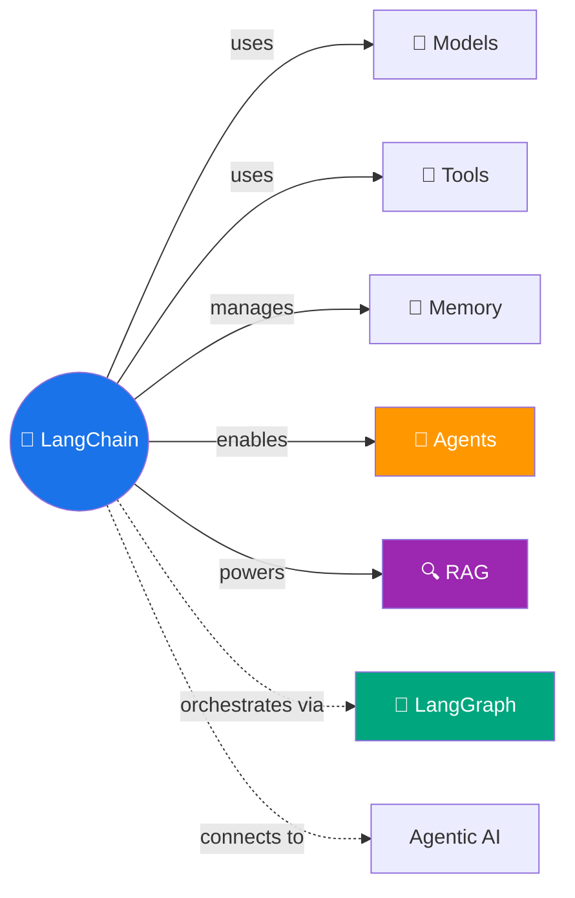

# 🦜 LangChain — Build AI Agents with Python

> Agent banane ka Swiss Army Knife — models, tools, memory, streaming sab ek jagah! 🛠️

---

## 🧠 Brain — How This Connects

## 📊 Progress

| # | Episode | Docs Page | Notes | Recorded |
|---|---------|-----------|:-----:|:--------:|
| 01 | [Overview](01-overview.md) | Overview | 🔴 | ⬜ |
| 02 | [Install & Setup](02-install.md) | Install | 🔴 | ⬜ |
| 03 | [Quickstart](03-quickstart.md) | Quickstart | 🔴 | ⬜ |
| 04 | [Philosophy](04-philosophy.md) | Philosophy | 🔴 | ⬜ |
| 05 | [Agents](05-agents.md) | Agents | 🔴 | ⬜ |
| 06 | [Models](06-models.md) | Models | 🔴 | ⬜ |
| 07 | [Messages](07-messages.md) | Messages | 🔴 | ⬜ |
| 08 | [Tools](08-tools.md) | Tools | 🔴 | ⬜ |
| 09 | [Short-Term Memory](09-short-term-memory.md) | Short-term Memory | 🔴 | ⬜ |
| 10 | [Streaming](10-streaming.md) | Streaming | 🔴 | ⬜ |
| 11 | [Structured Output](11-structured-output.md) | Structured Output | 🔴 | ⬜ |
| 12 | [Architecture](12-component-architecture.md) | Architecture | 🔴 | ⬜ |
| 13 | [Middleware Overview](13-middleware-overview.md) | Middleware | 🔴 | ⬜ |
| 14 | [Prebuilt Middleware](14-prebuilt-middleware.md) | Prebuilt | 🔴 | ⬜ |
| 15 | [Custom Middleware](15-custom-middleware.md) | Custom | 🔴 | ⬜ |
| 16 | [Guardrails](16-guardrails.md) | Guardrails | 🔴 | ⬜ |
| 17 | [Runtime](17-runtime.md) | Runtime | 🔴 | ⬜ |
| 18 | [Context Engineering](18-context-engineering.md) | Context Eng | 🔴 | ⬜ |
| 19 | [MCP](19-mcp.md) | MCP | 🔴 | ⬜ |
| 20 | [Human-in-the-Loop](20-human-in-the-loop.md) | HITL | 🔴 | ⬜ |
| 21 | [Retrieval](21-retrieval.md) | Retrieval | 🔴 | ⬜ |
| 22 | [Long-Term Memory](22-long-term-memory.md) | LT Memory | 🔴 | ⬜ |
| 23 | [Multi-Agent Overview](23-multi-agent.md) | Multi-Agent | 🔴 | ⬜ |
| 24 | [Handoffs & Router](24-handoffs-router.md) | Handoffs | 🔴 | ⬜ |
| 25 | [Subagents & Skills](25-subagents-skills.md) | Subagents | 🔴 | ⬜ |
| 26 | [Testing](26-testing.md) | Test | 🔴 | ⬜ |
| 27 | [Observability](27-observability.md) | LangSmith | 🔴 | ⬜ |
| 28 | [Deploy](28-deploy.md) | Deploy | 🔴 | ⬜ |

**Overall:** 🔴 Not started

## 🧩 Memory Fragments
> - _Add fragments as you learn..._

---

## 🎬 This IS the YouTube Playlist!

> Every lesson = one YouTube episode. Read docs → Ayra makes notes → you record.
> Full playlist plan: [`_playlists/langchain-agents/`](../../_playlists/langchain-agents/README.md)

---

## 📚 Sources
> - 📄 [LangChain Official Docs (Python)](https://docs.langchain.com/oss/python/langchain/overview)
> - 🎬 YouTube Playlist: _link after first publish_

## 🔗 Connected Topics
> → [Agentic AI](../agentic-ai/) · [RAG](../rag/) · [Agent Memory](../agent-memory/) · LangGraph (next playlist!)

## 30-Second Recall 🧠
> _Will be written after covering core concepts._
