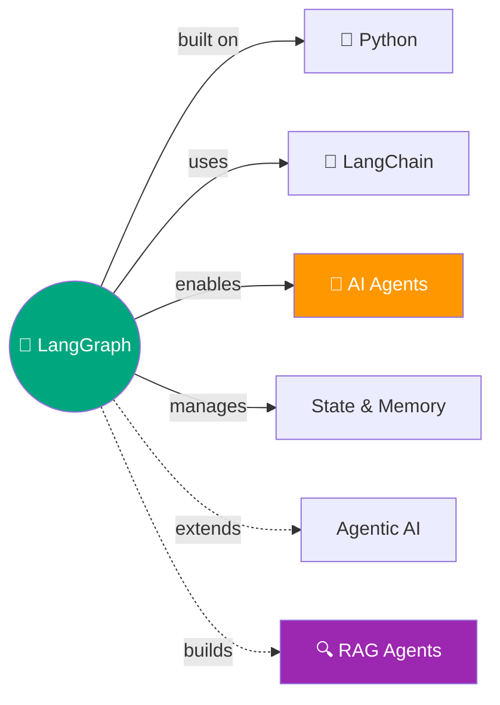

# 🔷 LangGraph — Agent Orchestration Framework

> Agents ka traffic controller — state, persistence, streaming, human-in-the-loop sab handle karta hai! 🎯

---

## 🧠 Brain — How This Connects

## 📊 Progress

| # | Episode | Docs Page | Notes | Recorded |
|---|---------|-----------|:-----:|:--------:|
| 01 | [Overview](01-overview.md) | Overview | 🔴 | ⬜ |
| 02 | [Quickstart](02-quickstart.md) | Quickstart | 🔴 | ⬜ |
| 03 | [Thinking in LangGraph](03-thinking-in-langgraph.md) | Thinking | 🔴 | ⬜ |
| 04 | [Workflows vs Agents](04-workflows-vs-agents.md) | Workflows | 🔴 | ⬜ |
| 05 | [Graph API](05-graph-api.md) | Graph API | 🔴 | ⬜ |
| 06 | [Build Your First Graph](06-use-graph-api.md) | Use Graph | 🔴 | ⬜ |
| 07 | [Functional API](07-functional-api.md) | Functional | 🔴 | ⬜ |
| 08 | [Choosing APIs](08-choosing-apis.md) | Choose | 🔴 | ⬜ |
| 09 | [Persistence](09-persistence.md) | Persistence | 🔴 | ⬜ |
| 10 | [Memory](10-memory.md) | Memory | 🔴 | ⬜ |
| 11 | [Streaming](11-streaming.md) | Streaming | 🔴 | ⬜ |
| 12 | [Human-in-the-Loop](12-interrupts.md) | Interrupts | 🔴 | ⬜ |
| 13 | [Subgraphs](13-subgraphs.md) | Subgraphs | 🔴 | ⬜ |
| 14 | [Durable Execution](14-durable-execution.md) | Durable | 🔴 | ⬜ |
| 15 | [Time Travel](15-time-travel.md) | Time Travel | 🔴 | ⬜ |
| 16 | [Frontend](16-frontend.md) | Frontend | 🔴 | ⬜ |
| 17 | [App Structure](17-app-structure.md) | App Struct | 🔴 | ⬜ |
| 18 | [Deploy](18-deploy.md) | Deploy | 🔴 | ⬜ |
| 19 | [Test & Observability](19-test-observability.md) | Test | 🔴 | ⬜ |
| 20 | [RAG Agent](20-rag-agent.md) | Agentic RAG | 🔴 | ⬜ |
| 21 | [SQL Agent](21-sql-agent.md) | SQL Agent | 🔴 | ⬜ |
| 22 | [Runtime Deep Dive](22-runtime.md) | Runtime | 🔴 | ⬜ |

**Overall confidence:** 🔴 Not started

## 🧩 Memory Fragments
> - _Add fragments as you learn..._

---

## 🎬 Teach Mode — This IS the YouTube Playlist!

> Every lesson = one YouTube episode. Read docs → Ayra makes notes → you record.
> Full playlist plan: [`_playlists/langgraph-agents/`](../../_playlists/langgraph-agents/README.md)

---

## 📚 Sources
> - 📄 [LangGraph Official Docs (Python)](https://docs.langchain.com/oss/python/langgraph/overview)
> - 🎬 YouTube Playlist: _link after first publish_

## 🔗 Connected Topics
> → [Agentic AI](../agentic-ai/) · [RAG](../rag/) · [Agent Memory](../agent-memory/)

## 30-Second Recall 🧠
> _Will be written after covering core concepts._
