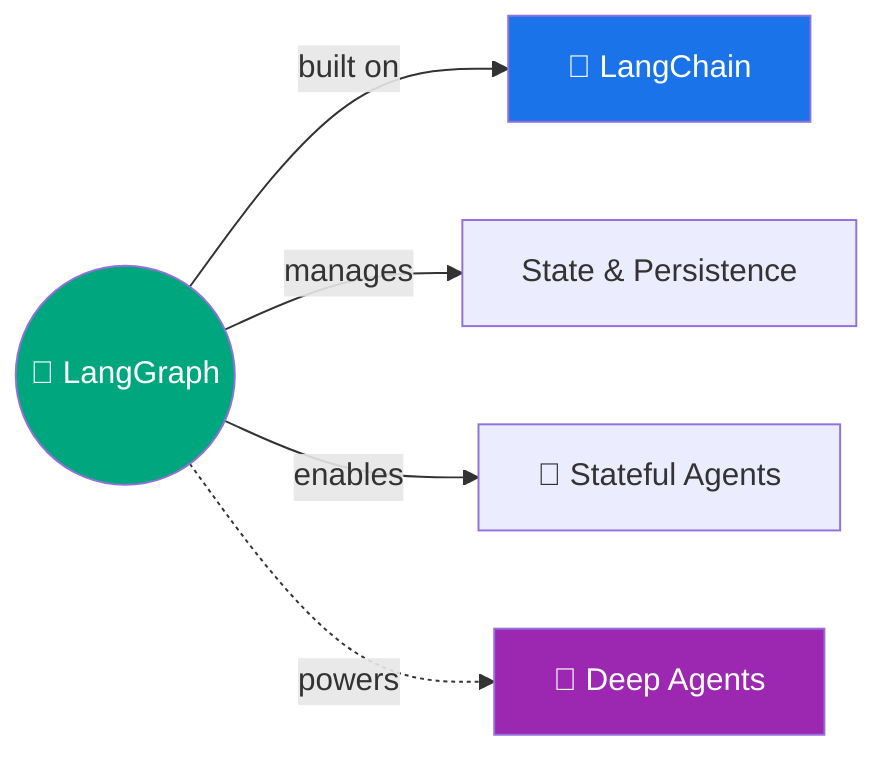

# 🔷 LangGraph — Agent Orchestration Framework

> Agents ka traffic controller — state, persistence, streaming, human-in-the-loop sab handle karta hai! 🎯

---

## 🧠 Brain — How This Connects

## 📊 Progress: 0/22 episodes · 🔴 Not started

> Full episode list: [`_playlists/langgraph-agents/`](../../_playlists/langgraph-agents/README.md)

## 🧩 Memory Fragments
> - _Add fragments as you learn..._

## 📚 Sources
> - 📄 [LangGraph Docs](https://docs.langchain.com/oss/python/langgraph/overview)
> - 🎬 YouTube Playlist: _link after first publish_

## 🔗 Connected Topics
> → [LangChain](../langchain/) (prerequisite) · [Agentic AI](../agentic-ai/) · [Deep Agents](../deepagents/)
