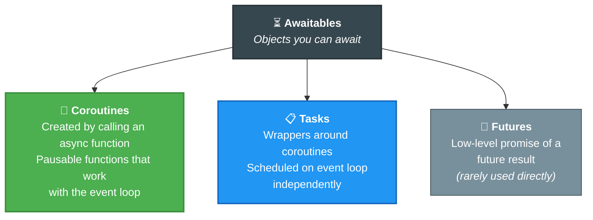
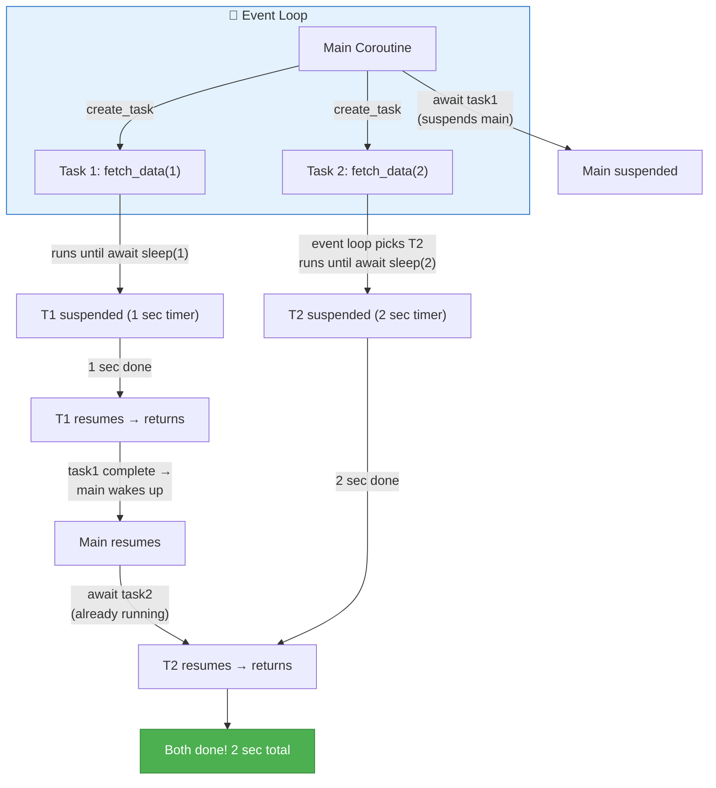
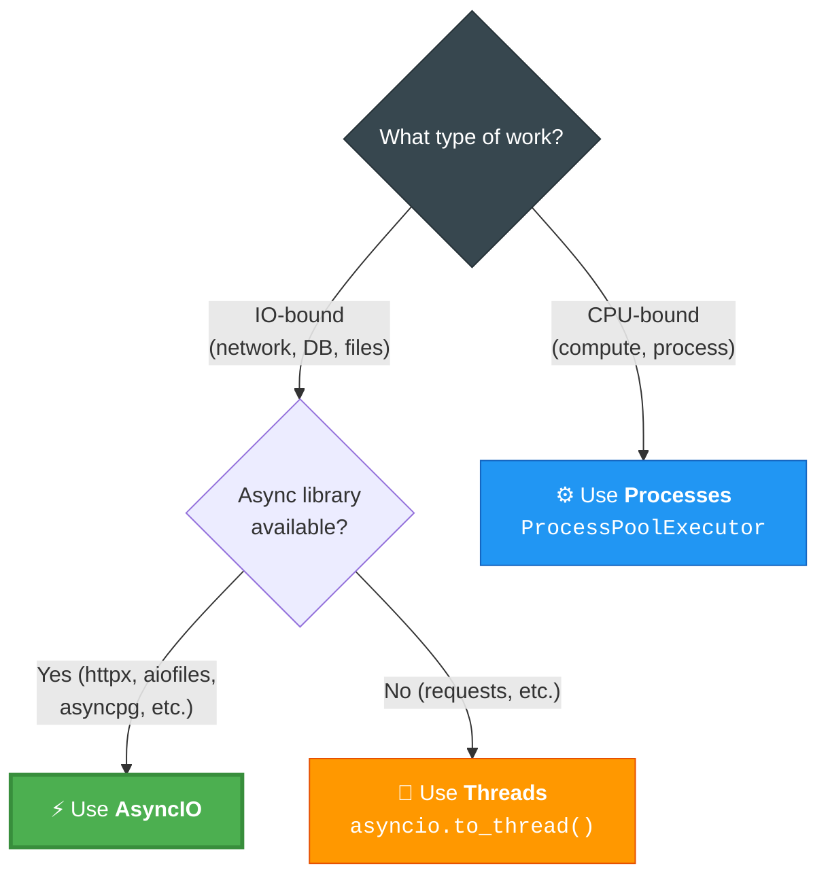

# 01 · AsyncIO — Complete Guide to Asynchronous Programming ⚡

---

## 🎯 One Line
> AsyncIO lets your Python code **do other useful work while waiting** for IO — it's not about speed, it's about not sitting idle.

---

## 📚 What This Lesson Covers

| # | Topic | Type |
|---|-------|------|
| 1 | Sync vs Concurrent (Subway vs McDonald's) | 📖 Concept |
| 2 | Key Terminology (Event Loop, Awaitables, Coroutines, Tasks, Futures) | 📖 Concept |
| 3 | Examples 1-4: From sync to real concurrency (with animations) | 💻 Code |
| 4 | Example 5: Blocking the event loop (the classic mistake) | 💻 Code |
| 5 | Example 6: Threads & Processes with AsyncIO | 💻 Code |
| 6 | Example 7: gather vs TaskGroup | 💻 Code |
| 7 | Real-world: Converting sync code → async (image pipeline) | 💻 Code |
| 8 | Profiling, Semaphores, Common Pitfalls | 📖 Concept |

---

## 🍔 Sync vs Concurrent

| | Synchronous (Subway 🥪) | Concurrent (McDonald's 🍔) |
|--|---|---|
| **How** | Make your entire sandwich start-to-finish, then next customer | Take your order, move to next customer while food is being made |
| **In code** | One thing after another — line by line | Start a task, do other work while waiting, come back when it's done |
| **Python** | Normal code (`def`, `time.sleep`) | AsyncIO code (`async def`, `await asyncio.sleep`) |

### Key Insight: Async ≠ Faster

Async doesn't make your code magically faster. It means **you don't sit idle** while waiting for IO (network requests, DB queries, file reads). You do other useful work during the wait.

---

## 🔑 Terminology (The Foundation)

### Event Loop

> The **engine** that runs and manages all async functions. It's like a scheduler — keeps track of tasks, and when one is suspended (waiting for IO), it finds another task to start or resume.

```python
asyncio.run(main())  # Starts event loop → runs tasks → closes loop when done
```

> Without the event loop running, none of your async code works. It's the conductor of the orchestra.

### Awaitables

> Objects that implement the special `__await__` method. You can only use the `await` keyword on awaitables, and only inside `async` functions.

**Why can't you `await time.sleep()`?** Because `time.sleep` is synchronous — it doesn't know how to yield control to the event loop and resume later. Use `asyncio.sleep()` instead.

### The 3 Types of Awaitables



### Coroutines (what you'll use most)

Two related terms:

| Term | What it is | Example |
|------|-----------|---------|
| **Coroutine Function** | The function definition with `async def` | `async def fetch_data():` |
| **Coroutine Object** | The awaitable returned when you *call* that function | `coro = fetch_data()` — doesn't run yet! |

**Calling a coroutine function does NOT run it.** It just creates a coroutine object. To actually run it, you must `await` it or wrap it in a task.

```python
coro = async_function("Test")   # Creates coroutine object — NOTHING runs yet
result = await coro              # NOW it runs
```

### Tasks (how you get concurrency)

> Tasks **wrap coroutines and schedule them on the event loop**. This is what allows multiple things to run concurrently.

```python
task = asyncio.create_task(fetch_data(1))  # Scheduled on event loop immediately
result = await task                         # Wait for it to finish
```

**Key difference from bare coroutines:** When you `create_task`, the coroutine gets queued on the event loop right away. When you just call a coroutine function, nothing is scheduled until you `await` it.

### Futures (you probably won't use these)

Low-level objects representing eventual results. Like JavaScript Promises, but in Python you almost never touch them directly. Tasks use futures under the hood. States: `pending` → `finished` (with result or exception) or `cancelled`.

---

## 💻 Example 1: Synchronous Baseline (3 seconds)

```python
# example_1.py — No async, just normal sequential code
def fetch_data(param):
    print(f"Do something with {param}...")
    time.sleep(param)        # Blocks for param seconds
    return f"Result of {param}"

def main():
    result1 = fetch_data(1)  # Waits 1 sec
    result2 = fetch_data(2)  # Waits 2 sec
    return [result1, result2]
# Total: 3 seconds (1 + 2 sequentially)
```

> Nothing fancy — one after another. 3 seconds total because `fetch_data(2)` can't start until `fetch_data(1)` finishes.

---

## 💻 Example 2: First Async Attempt — Still 3 seconds! ❌

```python
# example_2.py — Common mistake: awaiting coroutines directly
async def main():
    task1 = fetch_data(1)    # Just creates coroutine object (NOT scheduled)
    task2 = fetch_data(2)    # Just creates coroutine object (NOT scheduled)
    result1 = await task1    # Schedules AND runs to completion
    result2 = await task2    # Only starts after task1 is fully done
# Total: Still 3 seconds! No concurrency.
```

**Why no speedup?** Calling `fetch_data(1)` doesn't schedule anything — it just creates a coroutine object. When you `await` it, it's both scheduled AND run to completion before moving on. One task at a time = no concurrency.

---

## 💻 Example 3: Real Concurrency with create_task ✅ (2 seconds)

```python
# example_3.py — The correct way
async def main():
    task1 = asyncio.create_task(fetch_data(1))  # Scheduled NOW
    task2 = asyncio.create_task(fetch_data(2))  # Scheduled NOW
    result1 = await task1    # Yield control → event loop runs both tasks
    result2 = await task2    # task2 might already be done!
# Total: 2 seconds (both ran concurrently!)
```

**What changed:** `asyncio.create_task()` schedules coroutines on the event loop immediately. When we `await task1`, we yield control to the event loop which can run BOTH tasks. Total time = longest task (2 sec), not sum (3 sec).

### How the Event Loop Runs This



---

## 💻 Example 4: Await Order ≠ Execution Order

```python
# example_4.py — Await task2 FIRST, then task1
async def main():
    task1 = asyncio.create_task(fetch_data(1))  # Scheduled
    task2 = asyncio.create_task(fetch_data(2))  # Scheduled
    result2 = await task2    # Wait for task2 to finish
    result1 = await task1    # task1 already completed while we waited!
# Total: Still 2 seconds
```

**The takeaway:** `await` doesn't control WHEN a task runs — it controls when you **move forward**. The event loop runs tasks based on its internal FIFO queue. Awaiting just means "don't move past this line until this thing is done."

> Task 1 still runs first (it was scheduled first). But we don't print "Task 1 complete" until after task2 finishes because that's where our await is.

---

## 💻 Example 5: Blocking the Event Loop ⛔ (3 seconds again!)

```python
# example_5.py — THE classic mistake
async def fetch_data(param):
    print(f"Do something with {param}...")
    time.sleep(param)          # ⛔ BLOCKS the event loop!
    return f"Result of {param}"
```

**Why is this bad?** `time.sleep()` is synchronous — it doesn't yield control to the event loop. So even though we created tasks, the event loop is STUCK waiting for `time.sleep` to finish. No other task can run. Back to 3 seconds.

This applies to ANY blocking synchronous code: `requests.get()`, synchronous file IO, CPU-heavy computation — anything that doesn't `await`.

> `time.sleep` = road block on the highway. Nobody else can pass until it's done. `asyncio.sleep` = pulling into a rest stop, letting others drive past.

---

## 💻 Example 6: Threads & Processes (for blocking code)

When you MUST use blocking synchronous code (no async alternative exists):

### Threads: `asyncio.to_thread()`

```python
# Wraps sync function → makes it awaitable, runs in separate thread
task1 = asyncio.create_task(asyncio.to_thread(fetch_data, 1))
task2 = asyncio.create_task(asyncio.to_thread(fetch_data, 2))
result1 = await task1  # Event loop manages the threads
```

**Note:** Pass the function itself + args separately. Don't call it: `to_thread(fetch_data, 1)` not `to_thread(fetch_data(1))`.

### Processes: `ProcessPoolExecutor`

```python
from concurrent.futures import ProcessPoolExecutor

loop = asyncio.get_running_loop()
with ProcessPoolExecutor() as executor:
    task1 = loop.run_in_executor(executor, fetch_data, 1)
    task2 = loop.run_in_executor(executor, fetch_data, 2)
    result1 = await task1
    result2 = await task2
```

**Important:** Must use `if __name__ == "__main__":` guard — Python spawns new processes that re-run the script.

---

## 💻 Example 7: gather vs TaskGroup

### Three Ways to Run Multiple Tasks

| Method | How | Error Handling |
|--------|-----|---------------|
| **Manual** | `create_task()` one by one, `await` each | You handle errors yourself |
| **`asyncio.gather()`** | Pass list of coroutines/tasks, await all at once | `return_exceptions=True` → keeps running even if some fail |
| **`asyncio.TaskGroup()`** | Context manager, auto-awaits on exit | All-or-nothing — one fails, all cancel |

### gather

```python
# Pass coroutines directly
coroutines = [fetch_data(i) for i in range(1, 3)]
results = await asyncio.gather(*coroutines, return_exceptions=True)

# Or pass tasks
tasks = [asyncio.create_task(fetch_data(i)) for i in range(1, 3)]
results = await asyncio.gather(*tasks)
```

**Always use `return_exceptions=True`** — without it, one failure kills everything and orphans the rest.

### TaskGroup (preferred for all-or-nothing)

```python
async with asyncio.TaskGroup() as tg:
    results = [tg.create_task(fetch_data(i)) for i in range(1, 3)]
# All tasks auto-awaited when context manager exits
final = [r.result() for r in results]
```

No explicit `await` needed — the `async with` block handles it.

### When to Use Which

| Scenario | Use |
|----------|-----|
| All tasks must succeed or all fail together | **TaskGroup** |
| Some tasks might fail but others should continue | **gather** with `return_exceptions=True` |
| Never use | **gather** with default `return_exceptions=False` (orphans tasks on failure) |

---

## 🌍 Real-World Example: Image Download + Processing Pipeline

### The Sync Version (23 seconds)

Downloads 12 HD images → processes each with edge detection. Sequential: download one → process one → next.

### Profiling with Scalene

```bash
python -m scalene --html --outfile profile_report.html real_world_example_sync.py
```

Profiling revealed:
- **`download_single_image`** → mostly system/IO time → **IO-bound** → use async/threads
- **`process_single_image`** → mostly Python time → **CPU-bound** → use processes

### The Async Version (5 seconds — 4.7x speedup!)

| Component | Sync | Async v1 (threads) | Async v2 (httpx + processes) |
|-----------|------|--------------------|-----------------------------|
| Downloads | 13 sec | 2 sec (threads) | 1.6 sec (httpx async) |
| Processing | 10.5 sec | 10.6 sec (threads — no speedup!) | 3.3 sec (ProcessPoolExecutor) |
| **Total** | **23 sec** | **~13 sec** | **~5 sec** |

### Key Code Patterns Used

**Downloads — async with httpx:**
```python
async def download_images(urls):
    async with httpx.AsyncClient() as client:
        async with asyncio.TaskGroup() as tg:
            tasks = [tg.create_task(download_single_image(client, url, i))
                     for i, url in enumerate(urls, start=1)]
    return [task.result() for task in tasks]
```

**Processing — ProcessPoolExecutor:**
```python
async def process_images(paths):
    loop = asyncio.get_running_loop()
    with ProcessPoolExecutor(max_workers=CPU_WORKERS) as executor:
        tasks = [loop.run_in_executor(executor, process_single_image, p) 
                 for p in paths]
        return await asyncio.gather(*tasks, return_exceptions=True)
```

**Async file writing + async iteration:**
```python
async with aiofiles.open(path, "wb") as f:
    async for chunk in response.aiter_bytes(chunk_size=8192):
        await f.write(chunk)
```

---

## 🚦 Limiting Concurrency: Semaphores

Don't blast 1000 requests at once — use a semaphore to cap concurrent operations:

```python
DOWNLOAD_LIMIT = 4
semaphore = asyncio.Semaphore(DOWNLOAD_LIMIT)

async def download_single_image(url, semaphore):
    async with semaphore:         # Max 4 downloads at a time
        # ... download logic
```

For processes: `ProcessPoolExecutor(max_workers=os.cpu_count())`

---

## 🧭 Decision Guide: Async vs Threads vs Processes



**Quick heuristics to identify IO vs CPU:**
- Words like `fetch`, `get`, `request`, `download`, `query` → probably IO-bound
- Words like `compute`, `calculate`, `process`, `transform` → probably CPU-bound
- Not sure? Profile with **Scalene**

---

## ⚠️ Common Pitfalls

| # | Mistake | What happens | Fix |
|---|---------|-------------|-----|
| 1 | Forgetting to `await` tasks | Tasks get cancelled silently — no error, just doesn't run | Always `await` or use TaskGroup |
| 2 | Script ends before tasks finish | Incomplete results, no error | Make sure all tasks are awaited |
| 3 | Using `time.sleep` / `requests.get` inside async | Blocks entire event loop — no concurrency | Use `asyncio.sleep` / `httpx` / `asyncio.to_thread()` |
| 4 | Blasting too many concurrent requests | Overwhelms your machine + hammers servers | Use `asyncio.Semaphore` |

**Debugging tip:** `asyncio.run(main(), debug=True)` — catches many async mistakes. Development only!

---

## 📚 Async-Compatible Ecosystem

| Category | Libraries |
|----------|----------|
| **Web Frameworks** | FastAPI, aiohttp |
| **HTTP Clients** | httpx, aiohttp |
| **Database** | SQLAlchemy (async), asyncpg (Postgres), aiomysql |
| **File IO** | aiofiles |
| **Profiling** | Scalene |

---

## 🔑 Key Takeaways

| # | Takeaway |
|---|---------|
| 1 | **Async ≠ faster** — it means not sitting idle during IO waits |
| 2 | **Event loop** = the engine. `asyncio.run()` starts it. Without it, nothing async works. |
| 3 | **Calling an async function** creates a coroutine object — it does NOT run it. `await` or `create_task` to actually run. |
| 4 | **`create_task()` = concurrency**. Bare `await coroutine` = sequential. This is the #1 thing people get wrong. |
| 5 | **`await` = "don't move past here until done"** — NOT "run this now". Event loop decides order. |
| 6 | **Blocking sync code** (time.sleep, requests) inside async = kills concurrency. Use async alternatives or `to_thread()`. |
| 7 | **TaskGroup** for all-or-nothing. **gather(return_exceptions=True)** for continue-on-failure. |
| 8 | **IO-bound → AsyncIO/threads. CPU-bound → Processes.** Profile if unsure. |
| 9 | **Semaphores** limit concurrency — don't blast 1000 requests at once. |

---

## 🧪 Quick Check

<details>
<summary>❓ Subway vs McDonald's — kya farak hai in code terms?</summary>

**Subway (sync):** Make sandwich A completely → then start sandwich B. One at a time.
**McDonald's (concurrent):** Take order A, start cooking → take order B, start cooking → serve whoever's ready first.

AsyncIO = McDonald's model. Multiple tasks started, event loop serves whichever is ready.
</details>

<details>
<summary>❓ Why does awaiting a coroutine directly NOT give concurrency?</summary>

`await fetch_data(1)` does two things at once: schedules the coroutine AND runs it to completion. So nothing else can run until it's done. One task at a time = sequential.

Fix: `asyncio.create_task()` schedules it immediately. Then `await` just means "don't move past until done" — but the event loop can run other scheduled tasks in the meantime.
</details>

<details>
<summary>❓ time.sleep vs asyncio.sleep — kya difference hai?</summary>

`time.sleep(2)` → Blocks the ENTIRE event loop for 2 seconds. No other task can run. Road block on the highway.

`asyncio.sleep(2)` → Suspends ONLY the current coroutine, yields control to event loop. Other tasks run during the wait. Pulling into a rest stop.
</details>

<details>
<summary>❓ When to use gather vs TaskGroup?</summary>

**TaskGroup** → all-or-nothing. One fails = all cancel. Use when every task must succeed.

**gather(return_exceptions=True)** → continue-on-failure. One fails, rest keep running. Results list contains successes and exceptions mixed. Use for crawling URLs where some might fail.

**Never** use gather with default `return_exceptions=False` — orphans tasks on failure.
</details>

<details>
<summary>❓ IO-bound vs CPU-bound — kaise pehchanein?</summary>

**IO-bound:** Program waits for external stuff (network, DB, files). Keywords: fetch, get, request, download, query.

**CPU-bound:** Program does heavy computation. Keywords: compute, calculate, process, transform.

Not sure? Profile with **Scalene** — it shows Python time (CPU) vs system time (IO).
</details>

<details>
<summary>❓ How to run blocking sync code without killing the event loop?</summary>

Two options:
1. **Threads:** `asyncio.to_thread(sync_function, arg1, arg2)` — for IO-bound sync code
2. **Processes:** `loop.run_in_executor(ProcessPoolExecutor(), func, args)` — for CPU-bound sync code

Both wrap the sync code in a future that the event loop can manage.
</details>

---

> **📂 Code:** See `code/L1/` for all 7 examples + terms.py
> **🎨 Animations:** [coreyms.com/asyncio](https://coreyms.com/asyncio/) (use right-arrow to step through)
