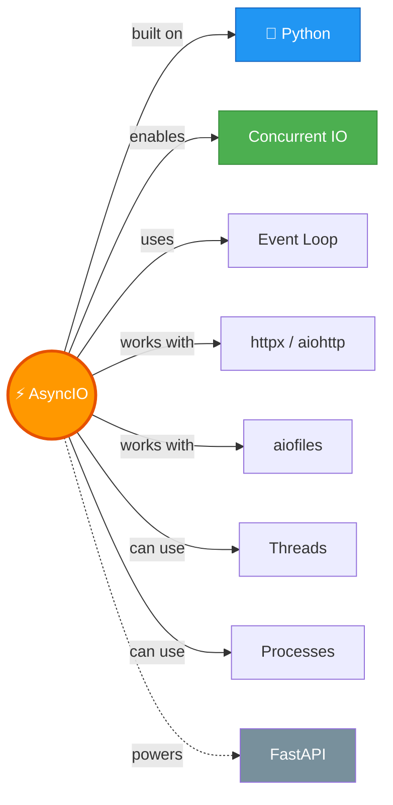

# ⚡ AsyncIO — Asynchronous Programming in Python

---

## 🧠 Brain — How This Connects

## 📊 Progress — 1/1 ✅ Complete!

| # | Lesson | Status |
|---|--------|--------|
| 01 | [AsyncIO Complete Guide](01-asyncio-complete-guide.md) | ✅ Done |

**Overall confidence:** 🟡 Learning (just completed — first revision due 2026-03-24)

## 🧩 Memory Fragments
> - ⚡ **Async ≠ faster** — it means not sitting idle during IO waits. Subway vs McDonald's!
> - 🔑 **create_task = concurrency.** Bare await coroutine = sequential. #1 mistake people make.
> - ⛔ **Blocking sync code inside async kills everything.** time.sleep, requests.get = event loop blocked.
> - 🧵 **No async library?** → `to_thread()` for IO-bound, `ProcessPoolExecutor` for CPU-bound.
> - 🎯 **await ≠ "run this now"** — it means "don't move past here until done." Event loop decides execution order.
> - 📋 **TaskGroup** for all-or-nothing. **gather(return_exceptions=True)** for continue-on-failure.
> - 🚦 **Semaphores** prevent blasting 1000 requests at once. Be kind to servers.

---

## 🎬 Teach Mode

| # | Lesson | What You'll Get |
|---|--------|-----------------|
| 01 | [AsyncIO Complete Guide](01-asyncio-complete-guide.md) | Event loop, coroutines, tasks, gather, TaskGroup, threads, processes, real-world example, profiling, semaphores |

**Supporting:** [Flashcards](flashcards.md) — 12 revision cards

---

## 📚 Source
> 🎓 [AsyncIO Complete Guide with Animations](https://www.youtube.com/watch?v=oAkLSJNr5zY) — Corey Schafer (YouTube)
> 🎨 [Animations (interactive)](https://coreyms.com/asyncio/) — use right-arrow to step through each example
> 💻 [Animations Repo](https://github.com/CoreyMSchafer/AsyncIO-Animations) — HTML files: example_1.html → example_7.html
> 💻 [Code Examples Repo](https://github.com/CoreyMSchafer/AsyncIO-Code-Examples) — Python files saved locally in `code/L1/`

### 🎨 Animation Index

| Animation | Demonstrates | Link |
|-----------|-------------|------|
| example_1.html | Synchronous baseline (no event loop) | [View](https://coreyms.com/asyncio/example_1.html) |
| example_2.html | Awaiting coroutines directly (no concurrency) | [View](https://coreyms.com/asyncio/example_2.html) |
| example_3.html | `create_task` → real concurrency ✅ | [View](https://coreyms.com/asyncio/example_3.html) |
| example_4.html | Await order ≠ execution order | [View](https://coreyms.com/asyncio/example_4.html) |
| example_5.html | Blocking event loop with `time.sleep` ⛔ | [View](https://coreyms.com/asyncio/example_5.html) |
| example_6.html | Threads + Processes with AsyncIO | [View](https://coreyms.com/asyncio/example_6.html) |
| example_7.html | gather vs TaskGroup | [View](https://coreyms.com/asyncio/example_7.html) |

## 🔗 Connected Topics
> - **Python** (parent) — core language
> - **Agent Memory** — async for memory operations, tool execution, concurrent API calls
> - **FastAPI** — web framework built on AsyncIO

## 30-Second Recall 🧠
> AsyncIO = Python's concurrent IO library. Event loop manages tasks. `async def` creates coroutine functions, calling them creates coroutine objects (doesn't run them). `create_task()` schedules on event loop = concurrency. Bare `await` = sequential. Blocking sync code (time.sleep, requests) kills the event loop — use async alternatives or `to_thread()`/`ProcessPoolExecutor`. TaskGroup for all-or-nothing, gather for continue-on-failure. Semaphores limit concurrency. IO-bound → async/threads, CPU-bound → processes.
