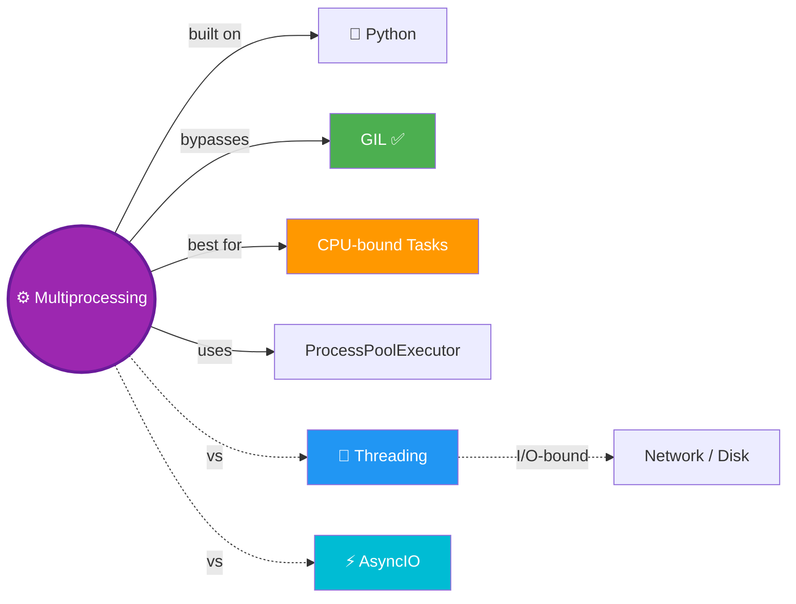

# ⚙️ Multiprocessing — True Parallelism in Python

> GIL se azaadi! Threads ki limit khatam — ab alag-alag CPUs pe sach mein parallel kaam! 🚀

---

## 🧠 Brain — How This Connects

## 📊 Progress — 1/1 ✅ Complete!

| # | Lesson | Status |
|---|--------|--------|
| 01 | [Multiprocessing Complete Guide](01-multiprocessing-complete-guide.md) | ✅ Done |

**Overall confidence:** 🟡 Learning (just completed)

## 🧩 Memory Fragments
> - ⚙️ Multiprocessing = **true parallelism** — each process runs on a separate CPU core.
> - 🔓 Bypasses the GIL — unlike threading, no single lock limiting execution.
> - 🐢 Process creation overhead is **higher** than threads — don't spin up 1000 processes!
> - 📦 Arguments to `multiprocessing.Process` must be **picklable** (serializable).
> - 🏁 `join()` inside creation loop = synchronous again — start all, then join all!
> - 🔥 `ProcessPoolExecutor` (Python 3.2+) is the preferred modern way.
> - 🔄 Switching between `ProcessPoolExecutor` ↔ `ThreadPoolExecutor` = just one word change!
> - 🌐 Real-world: 15 image processing went from **22s → 7s** with multiprocessing.
> - 🧪 Always benchmark! Image processing turned out to be I/O-bound → threads were actually faster (7.2s).

---

## 🎬 Teach Mode

| # | Lesson | What You'll Get |
|---|--------|-----------------|
| 01 | [Multiprocessing Complete Guide](01-multiprocessing-complete-guide.md) | Why multiprocessing, manual Process API, ProcessPoolExecutor, submit/map/as_completed, real-world image processing |

**Supporting:** [Flashcards](flashcards.md) — revision cards

---

## 📚 Source
> 🎬 [Python Multiprocessing Tutorial](https://www.youtube.com/watch?v=fKl2JW_qrso) — Corey Schafer (YouTube)
> 💻 [Code Snippets](https://github.com/CoreyMSchafer/code_snippets/tree/master/Python/MultiProcessing) — Original repo

## 🔗 Connected Topics
> - [🧵 Threading](../threading/) — concurrency for I/O-bound tasks (same API via `concurrent.futures`)
> - [⚡ AsyncIO](../asyncio/) — single-thread event loop for I/O concurrency
> - **Python** (parent) — core language

## 30-Second Recall 🧠
> Multiprocessing = true parallel execution across multiple CPU cores. Bypasses the GIL (unlike threading). Use `multiprocessing.Process(target=fn, args=[...])` for manual control — `.start()` to launch, `.join()` to wait. For modern usage: `concurrent.futures.ProcessPoolExecutor` with `submit()` (returns Futures) or `map()` (runs fn over iterable). Arguments must be picklable. Ideal for CPU-bound tasks. Real-world: image processing went 22s → 7s. Switching from threads to processes = just swap `ThreadPoolExecutor` → `ProcessPoolExecutor`.
