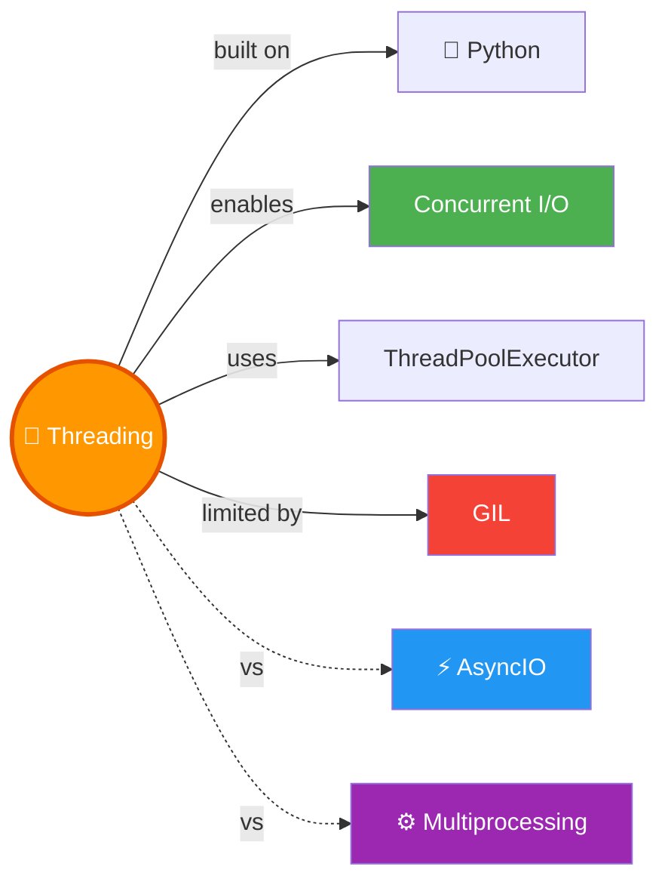

# 🧵 Threading — Concurrent Execution in Python

> CPU idle hai toh doosra kaam kar lo — threading ka yahi philosophy hai! 🧺🍽️

---

## 🧠 Brain — How This Connects

## 📊 Progress — 1/1 ✅ Complete!

| # | Lesson | Status |
|---|--------|--------|
| 01 | [Threading Complete Guide](01-threading-complete-guide.md) | ✅ Done |

**Overall confidence:** 🟡 Learning (just completed)

## 🧩 Memory Fragments
> - 🧵 Threading = concurrency (not parallelism). One CPU, overlapping I/O waits.
> - ⚡ I/O-bound → threading. CPU-bound → multiprocessing. Wrong choice = SLOWER.
> - 🚫 Don't `.join()` inside the creation loop — defeats the purpose!
> - 📦 `ThreadPoolExecutor` (Python 3.2+) is the preferred way — cleaner, auto-joins.
> - 🏁 `as_completed()` = results in completion order. `map()` = results in start order.
> - 🌐 Real-world: 15 image downloads went from 23s → 5s with threading.
> - ⚠️ `target=fn` NOT `target=fn()` — parentheses = immediate execution, not thread!

---

## 🎬 Teach Mode

| # | Lesson | What You'll Get |
|---|--------|-----------------|
| 01 | [Threading Complete Guide](01-threading-complete-guide.md) | Sync vs threaded, manual threads, ThreadPoolExecutor, submit vs map, real-world image download |

**Supporting:** [Flashcards](flashcards.md) — revision cards

---

## 📚 Source
> 🎓 [Python Threading Tutorial](https://www.youtube.com/watch?v=IEEhzQoKtQU) — Corey Schafer (YouTube)
> 💻 [Code Snippets](https://github.com/CoreyMSchafer/code_snippets/tree/master/Python/Threading) — Original repo

## 🔗 Connected Topics
> - [⚡ AsyncIO](../asyncio/) — alternative for I/O-bound concurrency (single-thread event loop)
> - **Multiprocessing** — for CPU-bound tasks (bypasses GIL)
> - **Python** (parent) — core language

## 30-Second Recall 🧠
> Threading = run code concurrently during I/O waits. Use `threading.Thread(target=fn)` for manual control (`.start()` then `.join()`), or `concurrent.futures.ThreadPoolExecutor` (preferred — context manager auto-joins). `submit()` returns Futures, use `as_completed()` for fastest-first results. `map()` returns results in start order. Only for **I/O-bound** tasks (network, disk, sleep). CPU-bound → use multiprocessing. GIL prevents true parallel execution of threads. Real-world: 15 image downloads: 23s sync → 5s threaded.
