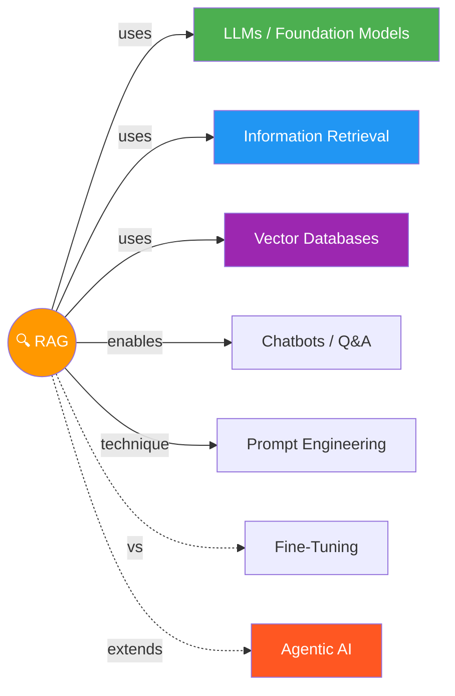

# 🔍 Retrieval Augmented Generation (RAG)

> LLM ko khud ka Google de do — pehle dhundo, phir jawab do! Search + Generate = RAG 🎯

---

## 🧠 Brain — How This Connects

## 📊 Progress

| # | Module | Lessons | Confidence | Revised |
|---|--------|---------|-----------|---------|
| 01 | [RAG Overview](module-1-rag-overview/) | 1/10 | 🔴 | — |
| 02 | [IR & Search Foundations](module-2-ir-search-foundations/) | 0/12 | 🔴 | — |
| 03 | [IR with Vector Databases](module-3-ir-vector-databases/) | 0/12 | 🔴 | — |
| 04 | [LLMs & Text Generation](module-4-llms-text-generation/) | 0/14 | 🔴 | — |
| 05 | [RAG in Production](module-5-rag-production/) | 0/14 | 🔴 | — |

## 🧩 Memory Fragments

> Things picked up over time. Random "aha!" moments, project learnings.
>
> - _Add fragments as you learn..._

---

## 🎬 Teach Mode — Module Flow

> Open these in order = you can teach anyone RAG

| # | Module | What You'll Learn | Est. Time |
|---|--------|-------------------|-----------|
| 01 | [RAG Overview](module-1-rag-overview/) | What is RAG, applications, architecture, intro to LLMs & IR | ~60 min |
| 02 | [IR & Search Foundations](module-2-ir-search-foundations/) | TF-IDF, BM25, semantic search, embeddings, hybrid search, retrieval eval | ~90 min |
| 03 | [IR with Vector Databases](module-3-ir-vector-databases/) | ANN, vector DBs, Weaviate, chunking, query parsing, reranking | ~90 min |
| 04 | [LLMs & Text Generation](module-4-llms-text-generation/) | Transformers, sampling, prompt engineering, hallucinations, agentic RAG, RAG vs fine-tuning | ~90 min |
| 05 | [RAG in Production](module-5-rag-production/) | Evaluation, monitoring, tracing, quantization, cost/latency, security, multimodal | ~90 min |

**Supporting:**
- [Flashcards](flashcards.md) — cross-module self-test _(after content added)_
- [Cheatsheet](cheatsheet.md) — one-page everything _(after content added)_

---

## 📚 Sources

> - 🎓 Course: [Retrieval Augmented Generation (RAG)](https://learn.deeplearning.ai/courses/retrieval-augmented-generation) — DeepLearning.AI
> - 📦 5 Modules · Intermediate · Self-paced · Python

## 🔗 Connected Topics

> → [Agentic AI](../agentic-ai/) · [Agent Memory](../agent-memory/) · _LLMs (planned)_ · _Prompt Engineering (planned)_

## 30-Second Recall 🧠

> _Will be written after completing the course — for now, learn module by module!_

---

## 📅 Study Plan — Day-by-Day Schedule

> **Rule:** 1 video on weekdays 📅 · 2-3 videos on weekends 🔥
> **Started:** 2026-04-04 (Saturday)

### Module 1: RAG Overview (Apr 4–10)

| Day | Date | Lesson | Status |
|-----|------|--------|--------|
| Sat 🔥 | Apr 4 | A Conversation with Andrew Ng | ✅ |
| Sat 🔥 | Apr 4 | Module 1 Introduction | ⬜ |
| Sun 🔥 | Apr 5 | Introduction to RAG | ⬜ |
| Sun 🔥 | Apr 5 | Applications of RAG | ⬜ |
| Mon | Apr 7 | RAG Architecture Overview | ⬜ |
| Tue | Apr 8 | Introduction to LLMs | ⬜ |
| Wed | Apr 9 | LLM Calls & Crafting Simple Augmented Prompts | ⬜ |
| Thu | Apr 10 | Introduction to Information Retrieval | ⬜ |
| Fri | Apr 11 | Module 1 Quiz + Conclusion | ⬜ |

### Module 2: IR & Search Foundations (Apr 12–21)

| Day | Date | Lesson | Status |
|-----|------|--------|--------|
| Sat 🔥 | Apr 12 | Module 2 Introduction + Retriever Architecture | ⬜ |
| Sun 🔥 | Apr 13 | Metadata Filtering + Keyword Search: TF-IDF | ⬜ |
| Mon | Apr 14 | Keyword Search: BM25 | ⬜ |
| Tue | Apr 15 | Semantic Search: Introduction | ⬜ |
| Wed | Apr 16 | Semantic Search: Embedding Model Deep Dive | ⬜ |
| Thu | Apr 17 | Vector Embeddings in RAG | ⬜ |
| Fri | Apr 18 | Hybrid Search | ⬜ |
| Sat 🔥 | Apr 19 | Evaluating Retrieval + Retrieval Metrics | ⬜ |
| Sun 🔥 | Apr 20 | Lab: Implementing Retriever Functions | ⬜ |
| Mon | Apr 21 | Module 2 Quiz + Conclusion | ⬜ |

### Module 3: IR with Vector Databases (Apr 22–May 1)

| Day | Date | Lesson | Status |
|-----|------|--------|--------|
| Tue | Apr 22 | ANN Algorithms | ⬜ |
| Wed | Apr 23 | Vector Databases | ⬜ |
| Thu | Apr 24 | Introduction to the Weaviate API | ⬜ |
| Fri | Apr 25 | Chunking (Concepts) | ⬜ |
| Sat 🔥 | Apr 26 | Chunking (Lab) + Advanced Chunking Techniques | ⬜ |
| Sun 🔥 | Apr 27 | Query Parsing + Cross-Encoders & ColBERT | ⬜ |
| Mon | Apr 28 | Reranking | ⬜ |
| Tue | Apr 29 | Lab: Building RAG with Vector DB | ⬜ |
| Wed | Apr 30 | Module 3 Quiz + Conclusion | ⬜ |

### Module 4: LLMs & Text Generation (May 1–13)

| Day | Date | Lesson | Status |
|-----|------|--------|--------|
| Thu | May 1 | Transformer Architecture | ⬜ |
| Fri | May 2 | LLM Sampling Strategies | ⬜ |
| Sat 🔥 | May 3 | Exploring LLM Capabilities + Choosing Your LLM | ⬜ |
| Sun 🔥 | May 4 | Prompt Engineering: Augmented Prompt + Advanced Techniques | ⬜ |
| Mon | May 5 | Prompt Engineering (Lab) | ⬜ |
| Tue | May 6 | Handling Hallucinations | ⬜ |
| Wed | May 7 | Evaluating Your LLM's Performance | ⬜ |
| Thu | May 8 | Agentic RAG | ⬜ |
| Fri | May 9 | RAG vs Fine-Tuning | ⬜ |
| Sat 🔥 | May 10 | Lab: Developing a RAG-Based Chatbot | ⬜ |
| Sun 🔥 | May 11 | Module 4 Quiz + Conclusion | ⬜ |

### Module 5: RAG in Production (May 12–24)

| Day | Date | Lesson | Status |
|-----|------|--------|--------|
| Mon | May 12 | Module 5 Introduction + What Makes Production Challenging | ⬜ |
| Tue | May 13 | Implementing RAG Evaluation Strategies | ⬜ |
| Wed | May 14 | Logging, Monitoring & Observability | ⬜ |
| Thu | May 15 | Tracing a RAG System | ⬜ |
| Fri | May 16 | Customized Evaluation | ⬜ |
| Sat 🔥 | May 17 | Quantization + Cost vs Response Quality | ⬜ |
| Sun 🔥 | May 18 | Latency vs Response Quality + Security | ⬜ |
| Mon | May 19 | Multimodal RAG | ⬜ |
| Tue | May 20 | Lab: Improving the Chatbot | ⬜ |
| Wed | May 21 | Module 5 Quiz + Conclusion | ⬜ |

### 🏁 Course Complete Target: **May 21, 2026** (~7 weeks)
