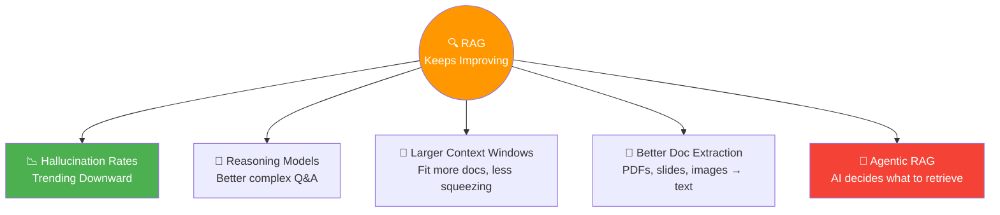
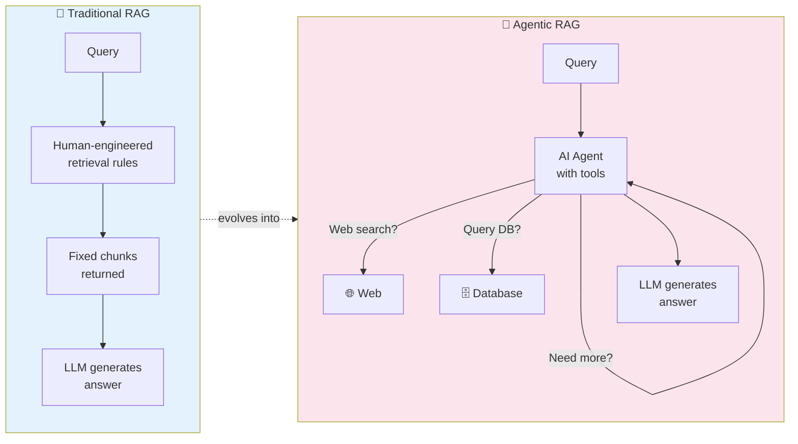

# 00 · A Conversation with Andrew Ng 🎙️

---

## 🎯 One Line
> RAG = give an LLM access to your own data before it generates a response. Retrieve first, then generate — that's why it's called **Retrieval Augmented Generation**.

---

## 🖼️ RAG in One Picture

```
┌─────────────────────────────────────────────────────────────┐
│                    WITHOUT RAG                               │
│                                                              │
│  User ──▶ "Why are Vancouver hotels expensive?" ──▶ LLM     │
│                                                     │       │
│                              trained on old internet data    │
│                                     ▼                        │
│                            ❌ Generic/outdated answer        │
├─────────────────────────────────────────────────────────────┤
│                    WITH RAG                                   │
│                                                              │
│  User ──▶ "Why are Vancouver hotels expensive?"              │
│                       │                                      │
│                       ▼                                      │
│              🔍 RETRIEVER ──▶ Knowledge Base                 │
│                       │        (news, docs, DBs)             │
│                       ▼                                      │
│            📄 "Taylor Swift concert this weekend!"           │
│                       │                                      │
│                       ▼                                      │
│           🧠 LLM + retrieved context ──▶ ✅ Accurate answer │
└─────────────────────────────────────────────────────────────┘
```

> 💡 **RAG = LLM ko Google de do. Pehle dhundo, phir jawab do. Bina RAG ke LLM = banda jo newspaper nahi padhta but opinion deta hai. With RAG = banda jo pehle research karta hai, phir bolta hai! 📰🧠**

---

## 🧱 Key Takeaways from the Conversation

| Point | What They Said |
|-------|---------------|
| **Core Idea** | Pair classical **search systems** with LLM **reasoning abilities** |
| **Most common LLM app** | RAG is arguably the **most commonly built type of LLM application** worldwide |
| **Why it matters** | LLMs only know their training data — RAG gives them access to **private, recent, or specialized** info |
| **Design choices matter** | The concept is simple but there's a "**zillion ways to implement it**" — choices affect accuracy and speed hugely |
| **Not going anywhere** | As LLMs improve, RAG improves too — they're complementary, not competing |

---

## ⚡ Why RAG Keeps Getting Better (Andrew's Observations)



| Improvement | Impact on RAG |
|-------------|--------------|
| **Lower hallucination rates** | Newer models are better at staying grounded in provided context |
| **Reasoning models** | Can tackle more complex questions, reason on top of retrieved context |
| **Larger context windows** | Less pressure on chunking — don't need to squeeze info into tiny windows |
| **Better document extraction** | Agentic extraction from PDFs, slides, diverse formats → broader knowledge bases |
| **Agentic RAG** | AI agent decides **what** to retrieve, **when**, and **whether to retrieve again** |

---

## 🤖 Agentic RAG — The Frontier



| | Traditional RAG | Agentic RAG |
|--|----------------|-------------|
| **Who decides what to retrieve?** | Human engineer (hardcoded rules) | AI agent (dynamic decisions) |
| **Retrieval strategy** | Fixed: query → retrieve → generate | Flexible: retrieve → evaluate → maybe retrieve again |
| **Error handling** | Fails silently if retrieval is bad | Can route back and try a different approach |
| **Tools** | Single knowledge base | Web search, specialized DBs, APIs |

> 💡 **Traditional RAG = GPS with fixed route. Agentic RAG = GPS that recalculates when traffic hits — "ye rasta band hai? Chalo doosra dhundte hain!" 🛣️**

---

## 🌐 Real-World RAG Applications (Mentioned)

| Use Case | How RAG Helps |
|----------|--------------|
| **Enterprise chatbots** | Answer questions about company products, internal policies |
| **Healthcare** | Answer medical questions from specialized documents/journals |
| **Education** | Tutor students using course-specific materials |
| **Search engines** | ChatGPT/Claude/Gemini "searching the web" = RAG in action |
| **Code generation** | Use your codebase as knowledge base for context-aware code suggestions |
| **Complex agentic workflows** | RAG as one step in multi-step enterprise pipelines |

---

## 📋 What You'll Learn in This Course

| What | Details |
|------|---------|
| **Prepare data** | How to format/chunk data for RAG systems |
| **Prompt the LLM** | Craft augmented prompts that maximize retrieved context |
| **Evaluate traffic** | Monitor real user queries to ensure quality |
| **Design choices** | Chunk sizes, retrieval strategies, model selection |
| **Advanced techniques** | Multi-modal RAG, agentic RAG, RAG vs fine-tuning |
| **Production skills** | Cost, latency, security, monitoring |

---

## 🧪 Quick Check

<details>
<summary>❓ What is RAG in one sentence?</summary>

RAG (Retrieval Augmented Generation) = **retrieve relevant information from a knowledge base** and **inject it into the LLM's prompt** so it can generate accurate, grounded answers using data it wasn't trained on.
</details>

<details>
<summary>❓ Why can't you just put ALL your documents in the LLM prompt instead of using RAG?</summary>

Two reasons: **(1) Context window limits** — LLMs have a maximum number of tokens they can process. **(2) Computational cost** — longer prompts = more computation, the model does a complex scan of every token before generating each new one. RAG solves this by retrieving only the **most relevant** pieces.
</details>

<details>
<summary>❓ What makes Agentic RAG different from traditional RAG?</summary>

In traditional RAG, a **human engineer** writes rules for what to retrieve. In agentic RAG, an **AI agent** dynamically decides: what to search, which database to query, whether to do another round of retrieval, and how to handle failures. It can **route back and fix its approach** if the first retrieval wasn't good enough.
</details>

---

> **Next →** [Module 1 Introduction](01-module-introduction.md)
