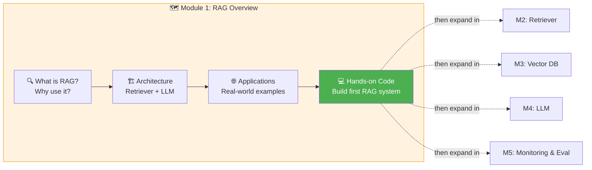

# 01 · Module 1 Introduction 🗺️

---

## 🎯 One Line
> Module 1 is the blueprint — learn what RAG is, why it works, meet every component, and build your first RAG system by the end.

---

## 🖼️ Module 1 Roadmap



---

## 🧱 What This Module Covers

| # | Topic | What You'll Get |
|---|-------|-----------------|
| 1 | **What is RAG** | Definition, why it matters, how it improves LLM responses |
| 2 | **RAG Architecture** | Retriever + LLM + Knowledge Base — deep dive on each, then how they work together |
| 3 | **Applications** | Production RAG examples + ideas for your own projects |
| 4 | **Hands-on Code** | Build a **simple RAG system** from scratch (first programming assignment) |

---

## 🔄 How Module 1 Fits the Full Course

```
Module 1 ──▶ Basic RAG (build first system)
   │
   ├── Module 2 ──▶ Robust Retriever (search foundations)
   ├── Module 3 ──▶ Vector Database (storage + retrieval)
   ├── Module 4 ──▶ Sophisticated LLM use (prompting, generation)
   └── Module 5 ──▶ Monitoring & Evaluation (production)
```

> 💡 **Module 1 = ghar ka naqsha (blueprint). Baaki modules = ek ek kamra banana. Pehle poora design samjho, phir build karo! 🏗️**

---

> **Next →** [Introduction to RAG](02-introduction-to-rag.md)
