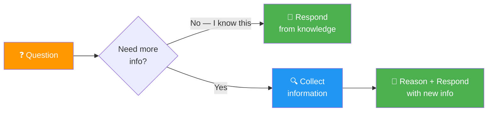
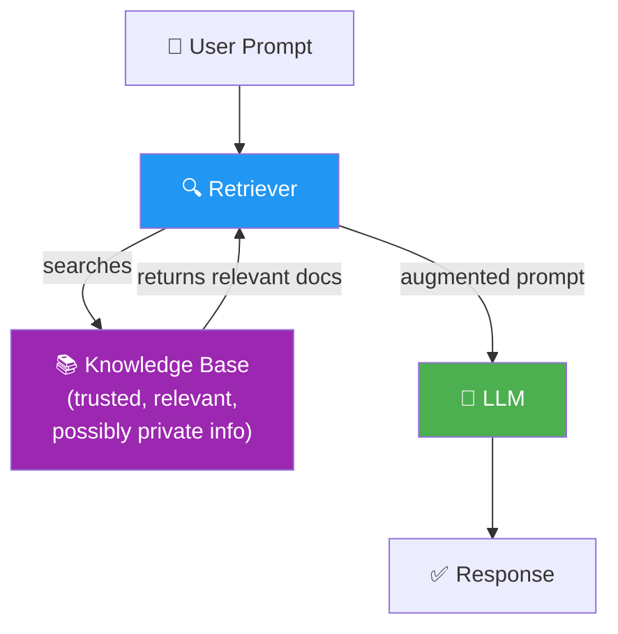

# 02 · Introduction to RAG 🔍

---

## 🎯 One Line
> RAG = before the LLM generates, a **retriever** fetches relevant info from a knowledge base and stuffs it into the prompt. Retrieve first, generate second — that's it.

---

## 🖼️ The Two Phases of Answering Questions



> Both humans AND LLMs follow this pattern — sometimes you already know the answer, sometimes you need to look it up first.

---

## 🧱 The 3 Hotel Questions — Why LLMs Need RAG

| Question | Information Needed | You / LLM Can Answer? |
|----------|-------------------|----------------------|
| "Why are hotels expensive on weekends?" | General knowledge | ✅ Already know this |
| "Why are Vancouver hotels expensive **this** weekend?" | Recent event (Taylor Swift concert) | ❌ Need to search first |
| "Why doesn't Vancouver have more hotel capacity downtown?" | Deep specialized research (urban planning, history) | ❌ Need lots of specialized info |

> 💡 **Question 1 = exam ka known topic. Question 2 = yesterday ka current affairs. Question 3 = PhD thesis. LLM bhi same — general knowledge hai, but specific/recent/deep info chahiye toh retrieval chahiye! 📚**

---

## ⚡ How RAG Works — The Core Mechanism

```
┌──────────────────────────────────────────────────────────┐
│                    RAG in 3 Steps                          │
│                                                           │
│  Step 1: USER PROMPT                                      │
│  "Why are hotels in Vancouver expensive this weekend?"    │
│                        │                                  │
│                        ▼                                  │
│  Step 2: RETRIEVAL                                        │
│  🔍 Retriever ──▶ Knowledge Base                          │
│              ◀── "Taylor Swift concert Dec 6-8, 2024"    │
│                        │                                  │
│                        ▼                                  │
│  Step 3: AUGMENTED PROMPT → LLM                           │
│  📝 Original question + retrieved info ──▶ 🧠 LLM        │
│                                               │           │
│                                               ▼           │
│                                    ✅ Accurate Response   │
└──────────────────────────────────────────────────────────┘
```

| Term | What It Means |
|------|--------------|
| **Retrieval** | Collecting relevant information before generating a response |
| **Augmented** | The prompt is enhanced/improved with retrieved info |
| **Generation** | LLM reasons over augmented prompt and generates the answer |

> 💡 **RAG ka naam hi batata hai kya karna hai: Retrieval (dhundo) → Augmented (prompt mein daalo) → Generation (jawab do). Name hi recipe hai! 🍳**

---

## 🧱 The Three RAG Components



| Component | Role |
|-----------|------|
| **Knowledge Base** | Collection of trusted, relevant, possibly private information |
| **Retriever** | Finds the most relevant info from the KB for a given query |
| **LLM** | Receives augmented prompt (question + retrieved info) → generates response |

---

## 🚫 What LLMs Don't Know (Why RAG is Needed)

| Gap | Example | Why It's Missing |
|-----|---------|-----------------|
| **Private data** | Company databases, internal docs | Never published online |
| **Hard-to-access info** | Niche/obscure knowledge | Hidden or not widely available |
| **Real-time data** | Today's news, live events | Published after training cutoff |

> LLMs are trained on massive internet data — but they're not experts on everything. Just like you, they give **much better responses when they have access to better information**.

---

## 💡 The Key Insight — "Just Put It In The Prompt"

> The entire core idea of RAG:
>
> **Modify the prompt before sending it to the LLM** — add information that helps the LLM respond accurately.
>
> That's literally it. Retrieve relevant info → stuff it into the prompt → let the LLM do its thing.

> 💡 **RAG is basically cheating on an exam — legally. LLM ko cheat sheet de do prompt mein! Open-book exam hai, use it! 📋😂**

---

## 🧪 Quick Check

<details>
<summary>❓ What do Retrieval, Augmented, and Generation each mean in "RAG"?</summary>

- **Retrieval** = collecting relevant information from a knowledge base
- **Augmented** = enhancing the prompt by adding the retrieved information
- **Generation** = LLM reasons over the augmented prompt and generates the response

The name IS the recipe!
</details>

<details>
<summary>❓ What are the 3 main components of a RAG system?</summary>

1. **Knowledge Base** — collection of trusted/private/relevant information
2. **Retriever** — searches the KB, finds most relevant docs for the query
3. **LLM** — receives augmented prompt (question + retrieved docs), generates answer
</details>

<details>
<summary>❓ What are 3 types of information that LLMs typically don't have access to?</summary>

1. **Private data** — company databases, internal docs (never published)
2. **Hard-to-access info** — niche, obscure, not widely available online
3. **Real-time data** — events after training cutoff, news published every minute

RAG fills all three gaps by retrieving from a knowledge base at query time.
</details>

---

> **Next →** [Applications of RAG](03-applications-of-rag.md)
