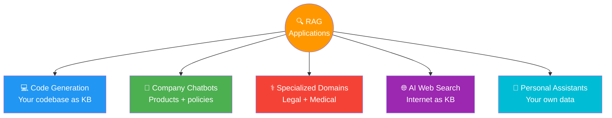

# 03 · Applications of RAG 🌐

---

## 🎯 One Line
> Wherever you have information an LLM wasn't trained on — private, recent, or specialized — there's a RAG application waiting to be built.

---

## 🖼️ RAG Applications at a Glance



---

## 🧱 The 5 Big RAG Applications

### 💻 1. Code Generation

| Problem | RAG Solution |
|---------|-------------|
| LLM trained on all public code — but not YOUR project | Use **your own codebase** as the knowledge base |
| LLM doesn't know your classes, functions, coding style | Retrieve relevant files/definitions per query |
| Generic code suggestions that don't fit your repo | **Project-specific, context-aware** suggestions |

> 💡 **LLM is like a brilliant developer who's never seen your codebase. RAG = give them your repo before they code. Pehle context do, phir code maango! 💻**

---

### 🏢 2. Company Chatbots

Every company has info an LLM never saw:

```
Enterprise Knowledge Base
├── Products           → customer-facing info, pricing, inventory
├── Policies           → HR, legal, internal guidelines
├── Communication      → tone, brand voice, FAQ answers
└── Troubleshooting    → known issues, step-by-step guides
```

| Chatbot Type | What RAG Enables |
|-------------|-----------------|
| **Customer Service** | Answers about products, current inventory, troubleshooting steps |
| **Internal Bot** | Answers about company policies, routes to documentation |

**Without RAG:** LLM gives generic/misleading answers
**With RAG:** Grounded in *your* company's actual data

---

### ⚕️ 3. Specialized Domains — Healthcare & Legal

| Domain | Knowledge Base Contains | Why RAG is Critical |
|--------|------------------------|---------------------|
| **Legal** | Case files, contracts, legal documents | Precision required — wrong answer = liability |
| **Medical** | Recent journals, patient records, drug data | Private + recent data, LLM training can't cover it |

> ⚠️ In these fields, RAG may be the **only way** to deploy a sufficiently accurate LLM product — precision is imperative and the information is both vast and private.

> 💡 **Ek doctor se poochho "naya wala cancer drug kya hai?" — woh apna training data se nahi batayega, latest journals se batayega. Yahi hai RAG. 🏥**

---

### 🌐 4. AI-Assisted Web Search

```
┌─────────────────────────────────────────────────────┐
│  Traditional Search Engine                           │
│  Query ──▶ Retriever ──▶ Returns list of URLs        │
├─────────────────────────────────────────────────────┤
│  Modern AI Search (ChatGPT/Gemini/Perplexity)        │
│  Query ──▶ Retriever ──▶ Fetches pages               │
│                               │                      │
│                               ▼                      │
│                     LLM summarizes results           │
│                               │                      │
│                               ▼                      │
│                    ✅ Skimmable AI summary            │
│                                                      │
│  Knowledge Base = The entire Internet 🌐             │
└─────────────────────────────────────────────────────┘
```

> Search engines were **already doing retrieval** long before LLMs existed. AI search = that same retriever + LLM as the generator.

---

### 👤 5. Personalized Assistants

| Your Data | What It Enables |
|-----------|----------------|
| 📱 Text messages | Context-aware replies, conversation summaries |
| 📧 Email | Draft replies, organize inbox, find info |
| 📅 Calendar | Schedule meetings, remind about commitments |
| 👥 Contacts | Know who you're talking to, relationship context |
| 📂 Documents | Work on specific files, project context |

**Key insight:** Knowledge base can be **small but dense** — your personal data is compact but extremely context-rich. A small personal KB can be *more useful* than a large generic one.

> 💡 **Tera phone ka assistant jo tumhari texts padh ke reply karta hai — that's personal RAG. Knowledge base chhota hai, but tera apna data hai, isliye relevant hai! 📱**

---

## 📊 When to Build a RAG Application

```
Does the LLM have access to this information?
              │
         ┌────┴────┐
        YES       NO
         │         │
   May not need   Is the information...
   RAG (yet)         │
                 ┌───┼───┐
              Private  Recent  Specialized
                 │      │         │
                 └───┬──┘         │
                     ▼            ▼
              ✅ BUILD A RAG APPLICATION
```

> **The RAG opportunity rule:** Whenever you have information an LLM wasn't trained on → there's a potential RAG application. It might even let LLMs be used in contexts that were **otherwise impossible**.

---

## 🧪 Quick Check

<details>
<summary>❓ Why is RAG especially important in legal and medical domains?</summary>

Two reasons:
1. **Precision is imperative** — wrong answers have real consequences (legal liability, patient safety)
2. **Vast private data** — case files, patient records, recent journals are not publicly available for LLM training

RAG may be the **only viable way** to deploy LLMs in these domains accurately.
</details>

<details>
<summary>❓ How are modern AI search engines (ChatGPT, Gemini) basically RAG systems?</summary>

Traditional search engines = pure retrieval (query → return URLs). Modern AI search = retrieve web pages + LLM summarizes them into a skimmable answer. The **entire internet is the knowledge base**. Same RAG pattern: retrieve relevant info → augment prompt → generate response.
</details>

<details>
<summary>❓ Why can a small personal knowledge base (texts, emails) be more useful than a large generic one?</summary>

Because personal data is **dense with relevant context**. Your 500 emails about a specific project contain more useful context for that project than millions of generic web pages. Relevance + specificity > raw size.
</details>

---

> **Next →** [RAG Architecture Overview](04-rag-architecture-overview.md)
