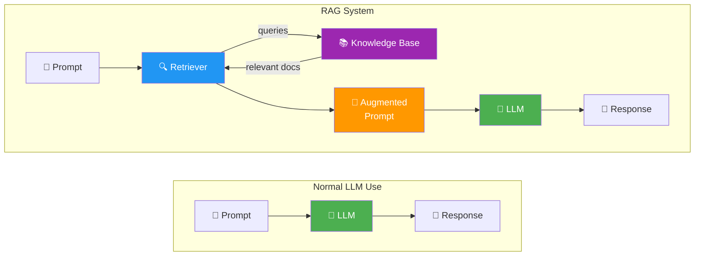
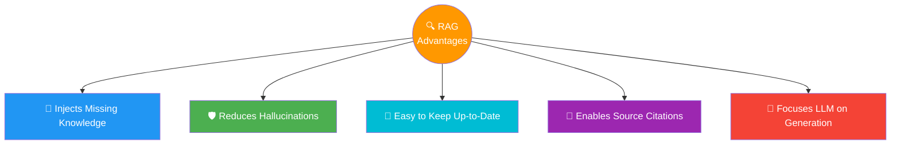

# 04 · RAG Architecture Overview 🏗️

---

## 🎯 One Line
> Same user experience, completely different insides — a retriever intercepts your prompt, fetches relevant docs, and stuffs them into the prompt before the LLM ever sees it.

---

## 🖼️ Normal LLM vs RAG System



> User sees no difference. The retriever works behind the scenes.

---

## ⚡ The 5-Step Pipeline

| Step | What Happens | Key Detail |
|------|-------------|------------|
| **1. Route** | Prompt goes to retriever first | LLM doesn't see it yet |
| **2. Query KB** | Retriever searches the knowledge base | KB = just a database of useful documents |
| **3. Augment** | Original prompt + retrieved docs combined | This is the "Augmented" in RAG |
| **4. Generate** | Augmented prompt → LLM | Uses BOTH training knowledge + retrieved context |
| **5. Respond** | User gets the answer | Slightly more latency, much better accuracy |

> 💡 **RAG = Swiggy. Customer (user) ne order diya, restaurant (LLM) ko direct nahi gaya — pehle Swiggy (retriever) ne best dishes (docs) dhundhe, phir sab saath mein bheja. Customer ko sirf plate milti hai! 🍽️**

### What an Augmented Prompt Looks Like

```
Answer the following question:
"Why are hotels in Vancouver so expensive this coming weekend?"

Here are five relevant articles that may help you respond:
[Article 1: Taylor Swift Eras Tour — BC Place...]
[Article 2: Vancouver hotel demand surges...]
...
```

Just the **original question + retrieved context** in one prompt. That's it.

---

## 🏆 5 Advantages of RAG



| # | Advantage | Why It Matters |
|---|-----------|----------------|
| 1 | **Injects Missing Knowledge** | Often the *only* way to get private/recent/specialized info into an LLM |
| 2 | **Reduces Hallucinations** | Retrieved context **grounds** responses — LLMs hallucinate most on topics absent from training data |
| 3 | **Easy to Keep Up-to-Date** | Update the KB like any database — no costly retraining. Indexed = immediately available |
| 4 | **Enables Source Citations** | Citation info flows through the augmented prompt to the response — readers can verify |
| 5 | **Focuses LLM on Generation** | Retriever = fact-finder. LLM = writer. Each does what it's best at |

> 💡 **Retriever = researcher jo library se info laata hai. LLM = writer jo polished answer likhta hai. Dono apna kaam karo! 📝🔍**

---

## 💻 Code Demo — RAG in ~10 Lines

```python
def retrieve(query: str) -> list:
    """Searches KB, returns relevant docs"""
    ...

def generate(prompt: str) -> str:
    """Sends prompt to LLM, returns response"""
    ...

prompt = "Why are hotel prices in Vancouver super expensive this weekend?"

# Without RAG — generic answer
response_no_rag = generate(prompt)

# With RAG — grounded answer
retrieved_docs = retrieve(prompt)
augmented_prompt = f"""Respond to the following prompt:
{prompt}

Using the following information retrieved to help you answer:
{retrieved_docs}"""

response_with_rag = generate(augmented_prompt)
```

> Architecturally simple: retrieve + concatenate + generate. The complexity is in making each piece work *well*.

---

## 🧪 Quick Check

<details>
<summary>❓ What is the ONLY architectural difference between normal LLM use and a RAG system?</summary>

The **retriever**. Prompt → retriever → KB → augmented prompt → LLM → response. User experience stays identical.
</details>

<details>
<summary>❓ Name the 5 advantages of RAG.</summary>

1. **Injects missing knowledge** — private/recent/specialized info
2. **Reduces hallucinations** — retrieved context grounds responses
3. **Easy to keep up-to-date** — update KB, not retrain the model
4. **Enables source citations** — verifiable responses
5. **Focuses LLM on generation** — separation of concerns (retriever finds, LLM writes)
</details>

<details>
<summary>❓ Why update a KB instead of retraining the LLM?</summary>

Retraining = costly + slow (massive compute). KB update = simple database update. Once **indexed**, immediately available. Same result, fraction of the effort.
</details>

<details>
<summary>❓ What is an "augmented prompt"?</summary>

Original user question + retrieved documents combined into one prompt. Example: *"Answer this: {question}. Here are 5 relevant articles: {retrieved text}..."*
</details>

---

> **Next →** [Introduction to LLMs](05-introduction-to-llms.md)
