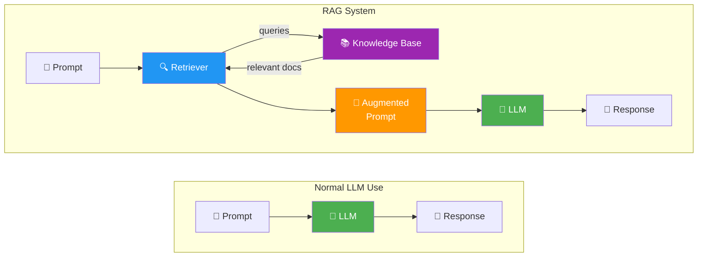
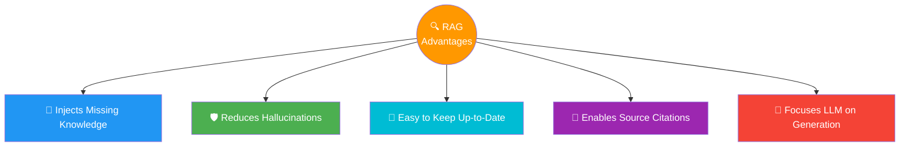

# 04 · RAG Architecture Overview 🏗️

---

## 🎯 One Line
> A RAG system intercepts your prompt, routes it through a retriever to fetch relevant docs, builds an augmented prompt, and then sends *that* to the LLM — same user experience, much better responses.

---

## 🖼️ Normal LLM vs RAG System



> From the user's perspective, both look identical — you type a prompt, you get a response. The magic happens **inside** the system, before the LLM ever sees the prompt.

---

## ⚡ The RAG Pipeline — Step by Step

```
User types prompt
       │
       ▼
┌──────────────────────────────────────────────────────┐
│  STEP 1: ROUTE TO RETRIEVER                           │
│  Prompt goes to the retriever first, NOT the LLM     │
│                        │                              │
│                        ▼                              │
│  STEP 2: QUERY KNOWLEDGE BASE                         │
│  Retriever searches the database (= knowledge base)  │
│  Returns most relevant documents for this prompt      │
│                        │                              │
│                        ▼                              │
│  STEP 3: BUILD AUGMENTED PROMPT                       │
│  Original prompt + retrieved docs = augmented prompt  │
│  "Answer this question: {user question}               │
│   Here are 5 relevant articles: {retrieved text}"     │
│                        │                              │
│                        ▼                              │
│  STEP 4: SEND TO LLM                                  │
│  Augmented prompt → LLM → generates response          │
│  LLM uses BOTH its training knowledge AND             │
│  the retrieved context to answer                      │
│                        │                              │
│                        ▼                              │
│  STEP 5: RETURN RESPONSE                              │
│  User sees the response (with slightly more latency)  │
└──────────────────────────────────────────────────────┘
```

| Step | What Happens | Key Detail |
|------|-------------|------------|
| 1. Route | Prompt goes to retriever first | LLM doesn't see it yet |
| 2. Query KB | Retriever searches the database | KB = just a database of useful documents |
| 3. Augment | Original prompt + retrieved docs combined | This is the "Augmented" in RAG |
| 4. Generate | Augmented prompt sent to LLM | LLM uses training data + retrieved context |
| 5. Respond | User gets the answer | Slightly more latency, much better accuracy |

> 💡 **RAG = delivery app. Customer (user) ne order diya, restaurant (LLM) ko direct nahi gaya — pehle Swiggy (retriever) ne best dishes (documents) dhundhe, phir sab saath mein bheja. Customer ko sirf final plate milti hai! 🍽️**

---

## 📝 What an Augmented Prompt Looks Like

```
┌─────────────────────────────────────────────────────┐
│  AUGMENTED PROMPT                                    │
│                                                      │
│  Answer the following question:                      │
│                                                      │
│  "Why are hotels in Vancouver so expensive this      │
│   coming weekend?"                                   │
│                                                      │
│  Here are five relevant articles that may help       │
│  you respond:                                        │
│                                                      │
│  [Article 1: Taylor Swift Eras Tour — BC Place...]   │
│  [Article 2: Vancouver hotel demand surges...]       │
│  [Article 3: Weekend tourism pricing trends...]      │
│  ...                                                 │
└─────────────────────────────────────────────────────┘
```

> The augmented prompt is just the **original question wrapped with context**. The LLM now has the specific info it needs, instead of guessing from general training data.

---

## 🏆 5 Advantages of RAG



| # | Advantage | What It Means | Why It Matters |
|---|-----------|--------------|----------------|
| 1 | **Injects Missing Knowledge** | Makes info available that the LLM was never trained on — company policies, personal data, this morning's headlines | Often the *only* way to get certain info into an LLM |
| 2 | **Reduces Hallucinations** | Retrieved info in the prompt **grounds** the LLM's response | LLMs hallucinate most when answering about topics absent or rare in training data — RAG fills exactly that gap |
| 3 | **Easy to Keep Up-to-Date** | Update the knowledge base like any other database — changes are reflected immediately once indexed | Retraining an LLM is costly and slow; updating a KB is cheap and instant |
| 4 | **Enables Source Citations** | Citation info can be included in the augmented prompt; LLM passes it through to the response | Readers can verify claims and dig deeper — builds trust |
| 5 | **Focuses LLM on Generation** | Retriever handles fact-finding; LLM focuses on writing a good response | Each component does what it's best at — separation of concerns |

> 💡 **Advantage 5 = division of labor. Retriever = researcher jo library mein jaake info dhundh ke laata hai. LLM = writer jo us info se polished answer likhta hai. Dono apna apna kaam karo, result better! 📝🔍**

---

## 💻 Code Demo — RAG in ~10 Lines

The actual implementation is simple — two wrapper functions and a prompt template:

```python
# Two core functions
def retrieve(query: str) -> list:
    """Wrapper around retriever — accepts query, returns relevant docs from KB"""
    ...

def generate(prompt: str) -> str:
    """Wrapper around LLM — accepts prompt, returns LLM's response"""
    ...

# Step 1: User's prompt
prompt = "Why are hotel prices in Vancouver super expensive this weekend?"

# Step 2: Direct LLM call (no RAG) — generic/outdated answer
response_no_rag = generate(prompt)

# Step 3: Retrieve relevant docs
retrieved_docs = retrieve(prompt)

# Step 4: Build augmented prompt
augmented_prompt = f"""Respond to the following prompt:
{prompt}

Using the following information retrieved to help you answer:
{retrieved_docs}"""

# Step 5: RAG call — accurate, grounded answer
response_with_rag = generate(augmented_prompt)
```

| Variable | What It Holds |
|----------|--------------|
| `prompt` | User's original question |
| `retrieved_docs` | Relevant docs from the knowledge base |
| `augmented_prompt` | Original question + retrieved context combined |
| `response_no_rag` | LLM's answer without RAG — generic, possibly outdated |
| `response_with_rag` | LLM's answer with RAG — accurate, context-aware |

> The key takeaway: **RAG is not complex architecturally**. It's a retrieve step + a string concatenation + a generate step. The complexity is in making each piece work *well*.

---

## 🔑 User Experience — What Changes?

| Aspect | Without RAG | With RAG |
|--------|------------|----------|
| **What user does** | Types prompt, gets response | Types prompt, gets response (**identical**) |
| **What happens inside** | Prompt → LLM → response | Prompt → retriever → KB → augmented prompt → LLM → response |
| **Latency** | Fast | Slightly more (retrieval step adds time) |
| **Response quality** | Limited to training data | Higher accuracy, up-to-date, context-aware |
| **Transparency** | No sources | Can include citations |

> The user never sees the retrieval happening. They just notice better answers.

---

## 🧪 Quick Check

<details>
<summary>❓ What is the main architectural difference between using an LLM directly and a RAG system?</summary>

The addition of a **retriever**. In a RAG system, the user's prompt is first routed to a retriever that searches a knowledge base for relevant documents. These documents are combined with the original prompt into an **augmented prompt**, which is then sent to the LLM. The user experience stays identical — type a prompt, get a response.
</details>

<details>
<summary>❓ Name the 5 advantages of RAG over using an LLM directly.</summary>

1. **Injects missing knowledge** — makes info available that the LLM wasn't trained on
2. **Reduces hallucinations** — retrieved context grounds the LLM's responses
3. **Easy to keep up-to-date** — update the KB instead of retraining the model
4. **Enables source citations** — citation info can flow through to the response
5. **Focuses LLM on generation** — retriever handles fact-finding, LLM handles writing (separation of concerns)
</details>

<details>
<summary>❓ Why does updating a RAG knowledge base beat retraining the LLM for keeping information current?</summary>

Retraining an LLM is **costly and time-consuming** — it requires massive compute and data preparation. Updating a knowledge base is as simple as updating entries in a database. Once the new info is **indexed**, the LLM can immediately use it in responses. Same result (current info), fraction of the effort.
</details>

<details>
<summary>❓ What does "augmented prompt" actually mean? What does it look like?</summary>

An augmented prompt combines the **original user question** with **retrieved documents** into a single prompt. Example:

*"Answer the following question: Why are hotels in Vancouver expensive this weekend? Here are five relevant articles that may help you respond: [article text]..."*

The "augmented" = the prompt has been enhanced/improved with extra context before reaching the LLM.
</details>

---

> **Next →** [Introduction to LLMs](05-introduction-to-llms.md)
