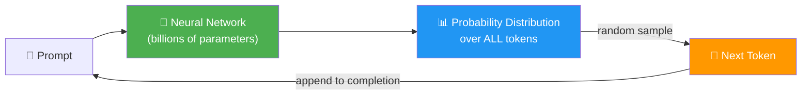
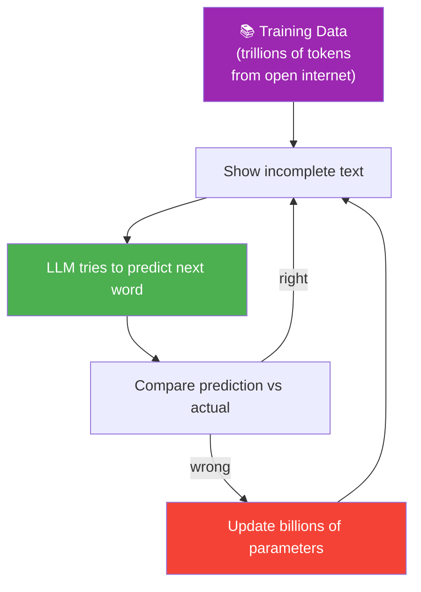
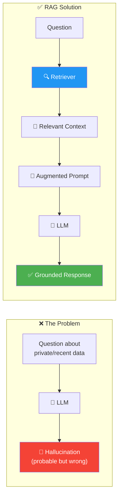

# 05 · Introduction to LLMs 🧠

---

## 🎯 One Line
> LLMs are just fancy autocomplete — they predict the next token, one at a time, based on probability distributions learned from trillions of tokens of training data. RAG works because LLMs can understand and use context they weren't trained on.

---

## 🔮 How LLMs Actually Work



> The LLM reads everything so far → scores every token in its vocabulary → randomly picks one → appends it → repeats. That's the entire generation loop.

> 💡 **LLM = exam student writing an essay. Har next word se pehle sochta hai — "is context mein kya likhna chahiye?" — and picks the most probable option. Kabhi kabhi galat bhi likh deta hai! 📝😅**

---

## 🧩 Tokens ≠ Words

| Concept | What It Means |
|---------|---------------|
| **Token** | A piece of a word — the actual unit LLMs work with |
| **Simple words** | Get their own token → `London`, `door` |
| **Compound words** | Split into multiple tokens → `program` + `matically`, `un` + `happy` |
| **Punctuation** | Gets own tokens → `.` `,` `?` |
| **Vocabulary size** | 10K to 100K+ tokens per model |

> Why not one token per word? Because compound words can be **built up** from smaller pieces — the model handles any possible word without needing a token for every single one. Flexibility over brute-force.

---

## 🎲 The Token Generation Process

Each new token goes through this cycle:

```
┌──────────────────────────────────────────────┐
│  1. READ entire completion so far             │
│     (prompt + all generated tokens)           │
│                                               │
│  2. UNDERSTAND relationships between words    │
│     + overall meaning of text                 │
│                                               │
│  3. SCORE every token in vocabulary           │
│     → probability distribution                │
│     "shining" = 80%, "rising" = 10%,          │
│     "exploding" = 0.01%, "snoring" = 0.001%   │
│                                               │
│  4. RANDOMLY SAMPLE one token                 │
│     (higher prob = more likely, but not        │
│      guaranteed — randomness is key!)          │
│                                               │
│  5. APPEND to completion → go to step 1       │
│     (repeat until done signal)                │
└──────────────────────────────────────────────┘
```

### Key Insight: **Random Sampling**

The LLM doesn't always pick the highest-probability token. It **randomly samples** from the distribution:
- 80 out of 100 times → picks "shining"
- But "rising" or even "exploding" could still be chosen
- This is why **same prompt → different completions** every time

---

## 🔄 Autoregressive = Self-Influencing

| Term | Definition |
|------|-----------|
| **Autoregressive** | Each generated token becomes part of the context for the NEXT token |

**Example — how one choice changes everything:**

```
Prompt: "What a beautiful day, the sun is..."

Choice A: "shining" → "in" → "the" → "sky"  ☀️
Choice B: "warming"  → "our" → "faces"       🌤️
Choice C: "exploding" → "into" → "a" → "supernova" 💥
```

Once the LLM picks a direction, **it follows that path**. Earlier choices influence later ones — desirable because tokens stay contextually coherent, but also means one unlucky early choice can derail the whole completion.

> 💡 **Autoregressive = ek baar Goa ka plan bana liya, toh flight, hotel, beach sab Goa ke around plan hoga. Agar "Manali" bol diya hota, toh pura trip alag hota! 🏔️ vs 🏖️**

---

## 🏋️ How LLMs Are Trained



| Aspect | Detail |
|--------|--------|
| **Before training** | Model produces gibberish — random parameters |
| **Training process** | See incomplete text → predict next word → update weights based on accuracy |
| **What it learns** | Factual information + linguistic styles from training data |
| **Scale** | Trillions of tokens, largely from the open internet |
| **Result** | Can generate text on wide variety of topics and styles — because examples were in training data |

---

## 👻 Hallucinations — Why LLMs Make Stuff Up

| Myth | Reality |
|------|---------|
| "LLMs are malfunctioning" | No — they're doing exactly what they're designed to do |
| "LLMs generate truth" | No — they generate **probable text**, not truthful text |
| "Hallucination = psychological episode" | No — it's just probabilistic word prediction without relevant data |

**When do hallucinations happen?**
- Ask about **private internal data** → not in training data
- Ask about **today's news** → not in training data
- Ask about **niche/recent topics** → probably not in training data

The LLM will still produce a **probable-sounding** sequence of words — it just won't be grounded in reality.

> **Truth (for an LLM)** = a sequence of words that is probabilistically likely based on training data. With high-quality training data, our intuitive understanding of truth aligns with the LLM's mathematical one. The gap appears when relevant info is missing.

---

## 📏 Context Window & Computation Limits

```
┌─────────────────────────────────────────┐
│        LLM Context Window               │
│  ┌───────────────┐ ┌─────────────────┐  │
│  │   PROMPT      │ │   COMPLETION    │  │
│  │ (user query + │ │ (generated      │  │
│  │  retrieved     │ │  response)      │  │
│  │  context)     │ │                 │  │
│  └───────────────┘ └─────────────────┘  │
│                                         │
│  Total tokens = prompt + completion     │
│  Hit the limit? → TRUNCATED ✂️          │
└─────────────────────────────────────────┘
```

| Constraint | Why It Matters |
|------------|---------------|
| **Computation scales with length** | Before each new token, model scans EVERY token already in the completion (including prompt). Longer prompt = more compute per token. |
| **Context window limit** | Max tokens the model can process at once. Older models: ~4K tokens. Newer models: millions. |
| **Implication for RAG** | Can't dump entire KB into the prompt — retriever must select only the MOST relevant pieces |

---

## 🔗 How RAG Exploits LLM Design

This is the punchline — **why RAG works at all**:



> LLMs are **excellent at understanding and using context** in the prompt — even info they were never trained on. RAG leverages this ability: add relevant docs to the prompt → LLM incorporates them into its response. This is called **grounding**.

---

## 🧪 Quick Check

<details>
<summary>❓ Why are LLMs sometimes called "fancy autocomplete"?</summary>

Because that's literally what they do — predict the next token that should appear in a sequence, one token at a time, based on probability. The "fancy" part is the billions of parameters and deep contextual understanding.
</details>

<details>
<summary>❓ Why do LLMs use tokens instead of whole words?</summary>

Tokens = word pieces. Compound words like "programmatically" split into smaller tokens (`program` + `matically`). This lets the model build **any possible word** from a vocabulary of 10K–100K tokens without needing a dedicated token for every word in every language.
</details>

<details>
<summary>❓ What does "autoregressive" mean in the context of LLMs?</summary>

**Self-influencing** — each token the LLM generates becomes part of the context for predicting the next token. This means earlier choices shape later ones, keeping the output coherent but also committing the model to a direction once it picks one.
</details>

<details>
<summary>❓ Why do LLMs hallucinate?</summary>

LLMs are designed to produce **probable text, not truthful text**. When asked about info not in their training data (private data, recent events, niche topics), they still generate plausible-sounding word sequences — but these aren't grounded in facts. It's not a malfunction; it's the design working as intended without relevant data.
</details>

<details>
<summary>❓ Why can't you just stuff the entire knowledge base into the prompt?</summary>

Two constraints: (1) **Computation** — longer prompts = more compute per generated token (model scans every existing token before generating each new one). (2) **Context window limit** — there's a max number of tokens the model can process at once. The retriever's job is to select only the most relevant pieces.
</details>

<details>
<summary>❓ What is the key LLM property that makes RAG possible?</summary>

LLMs can **understand and incorporate information from the prompt** into their responses — even if that information wasn't in their training data. RAG exploits this by injecting relevant retrieved documents into the prompt, **grounding** the LLM's response.
</details>

---

> **Next →** [A Brief Python Refresher](06-python-refresher.md)
