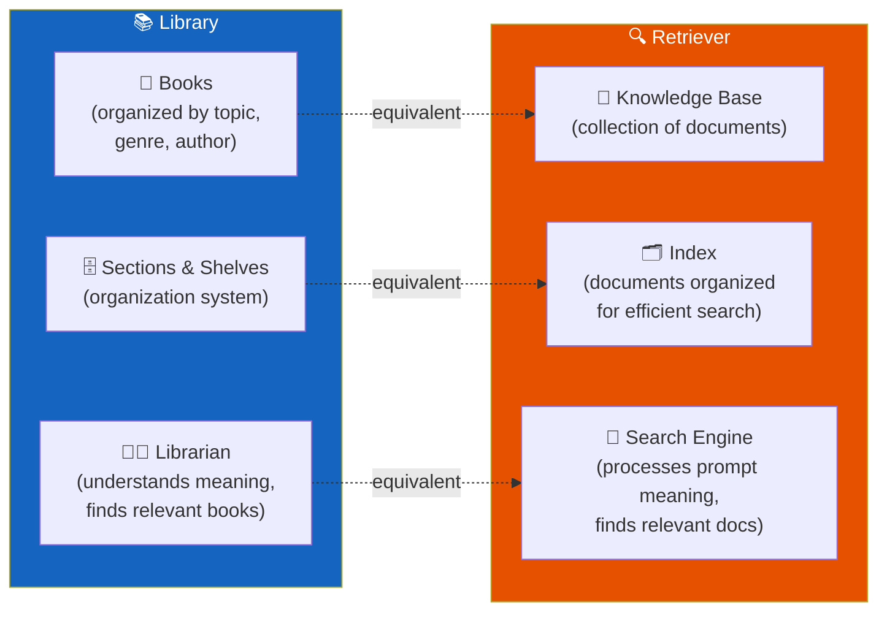
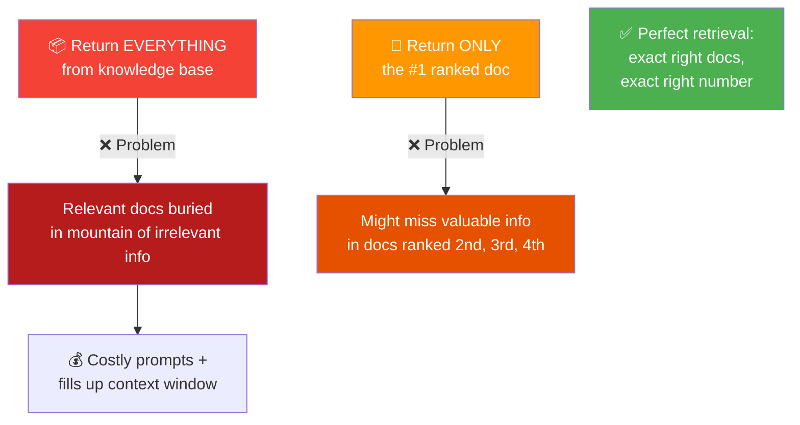
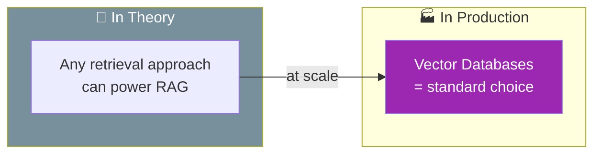
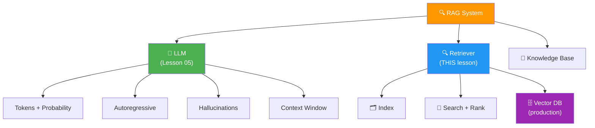

# 08 · Introduction to Information Retrieval 🔍

---

## 🎯 One Line
> The retriever = a librarian for your data. It takes your question, understands its meaning, searches an organized index of documents, ranks them by relevance, and returns only the best matches — not too many, not too few.

---

## 📚 The Library Analogy



> 💡 **Library jaake pizza recipe poochho toh librarian cooking section mein le jaata hai — na ki poori library hand over kar deta hai. Retriever bhi exactly yahi karta hai! 📚➡️🍕**

---

## 🏗️ Three Components of a Retriever

| # | Component | What It Is | Library Equivalent |
|---|-----------|-----------|-------------------|
| 1 | **Knowledge Base** | Collection of documents the retriever can search through | Library's entire book collection |
| 2 | **Index** | Organized catalog that keeps documents searchable and browsable | Sections, shelves, genre/author groupings |
| 3 | **Search Mechanism** | Interprets prompt meaning → searches index → returns relevant docs | The librarian who understands your question |

---

## ⚙️ How Retrieval Actually Works

```
┌─────────────────────────────────────────────────┐
│  1. RECEIVE the user's prompt                    │
│     "How can I make New York style pizza?"       │
│                                                  │
│  2. PROCESS to understand underlying meaning     │
│     → cooking + Italian cuisine + New York       │
│                                                  │
│  3. SEARCH the index using that understanding    │
│     → find documents about pizza, Italian food,  │
│       home cooking, NY-style recipes             │
│                                                  │
│  4. RANK every document by relevance score       │
│     → numerical similarity between prompt        │
│       and each document's text                   │
│                                                  │
│  5. RETURN the top-ranked documents              │
│     → only the most relevant ones, not all       │
└─────────────────────────────────────────────────┘
```

**The key insight:** the retriever doesn't just keyword-match — it **understands the meaning** of your question, just like a librarian knows "New York style pizza" means they should look in cooking, Italian cuisine, or possibly New York sections.

---

## 📊 Similarity Scoring & Ranking

| Concept | What It Means |
|---------|---------------|
| **Relevance score** | A numerical value assigned to each document, quantifying how relevant it is to the prompt |
| **Similarity measure** | How close the text of the prompt is to the text of the document |
| **Ranking** | All documents sorted by score — highest = most relevant |
| **Selection** | Only the top-scored documents get returned to the LLM |

> The retriever doesn't just find relevant documents — it **scores and ranks every document** in the knowledge base. Multiple approaches exist for calculating these similarity scores (covered in Module 2).

---

## ⚖️ The Retrieval Balance — Not Too Many, Not Too Few



| Extreme | Problem |
|---------|---------|
| **Return everything** | Technically you have every relevant doc — but it's lost in irrelevant noise. Also blows up prompt cost / context window. |
| **Return too few** | Might miss valuable info in lower-ranked but still relevant docs |
| **The goal** | Return ALL relevant docs + NONE of the irrelevant ones |

### The Reality Check ⚠️

In practice, retrieval is **imperfect**:
- Some relevant docs rank too low → missed
- Some irrelevant docs rank too high → included as noise
- Hard to decide the exact right cutoff number

**Solution?** Monitor retriever performance over time + experiment with different settings. This course covers how to evaluate and optimize retrieval extensively.

> 💡 **Retriever = filter coffee maker ☕. Too coarse filter → grounds leak through (irrelevant docs). Too fine filter → barely any coffee comes out (missed relevant docs). Tuning the filter = the whole game!**

---

## 🌐 Retrieval Is Everywhere

The retriever in RAG is doing something **you already know from other software**:

| System | What It Retrieves | How |
|--------|------------------|-----|
| **Web search engine** | Web pages relevant to your search query | Indexes the internet, ranks pages by relevance |
| **Relational database** | Rows and tables matching a query | SQL queries against structured data |
| **RAG retriever** | Documents relevant to the LLM prompt | Indexes knowledge base, ranks by similarity |

> The field of **information retrieval** was already mature when LLMs were first developed. RAG retrievers borrow heavily from these established ideas.

---

## 🗄️ Vector Databases — The Production Choice

| Question | Answer |
|----------|--------|
| **What is a vector database?** | A specialized database optimized for rapidly finding documents that most closely match a prompt |
| **Is it required for RAG?** | Not strictly — any retrieval mechanism works in theory |
| **Why use one?** | At production scale, vector DBs are the fastest way to search large knowledge bases |
| **What about existing databases?** | Many companies already have data in relational DBs — you CAN retrieve from those, but vector DBs are optimized for similarity search |



> This course covers **both**: general information retrieval principles (applicable to many search technologies) AND vector databases (the typical production retriever).

---

## 🔗 Module 1 Recap — What We Know Now



---

## 🧪 Quick Check

<details>
<summary>❓ What are the 3 components of a retriever?</summary>

1. **Knowledge base** — the collection of documents to search through
2. **Index** — organized catalog that keeps documents searchable
3. **Search mechanism** — processes the prompt's meaning, searches the index, returns relevant docs

Think of it as: the library's books, the shelf organization system, and the librarian.
</details>

<details>
<summary>❓ How does a retriever decide which documents to return?</summary>

It **ranks every document** in the knowledge base by assigning a numerical **relevance score** — a measure of similarity between the prompt text and the document text. Documents with the highest scores are returned.
</details>

<details>
<summary>❓ What goes wrong if the retriever returns too many documents?</summary>

The relevant documents get buried in a **mountain of irrelevant information**. Plus, it leads to costly prompts (more tokens = more computation) or entirely fills up the LLM's context window.
</details>

<details>
<summary>❓ What goes wrong if the retriever returns too few documents?</summary>

You might **miss valuable relevant information** that was in documents ranked 2nd, 3rd, or 4th — relevant docs that just didn't make the strict cutoff.
</details>

<details>
<summary>❓ Why are vector databases commonly used for production RAG systems?</summary>

They're a **specialized database type optimized for rapidly finding documents that most closely match a prompt**. While not strictly necessary (any retrieval approach works in theory), at production scale, vector DBs are the standard choice for fast similarity search over large knowledge bases.
</details>

<details>
<summary>❓ Name 2 familiar systems that perform similar tasks to a RAG retriever.</summary>

1. **Web search engine** — retrieves web pages relevant to a search query
2. **Relational database** — retrieves rows/tables matching a SQL query

Both solve the same core problem: finding relevant information from a large collection. The field of information retrieval was already mature before LLMs existed.
</details>

---

> **Next →** [Introduction to RAG Systems](09-introduction-to-rag-systems.md)
