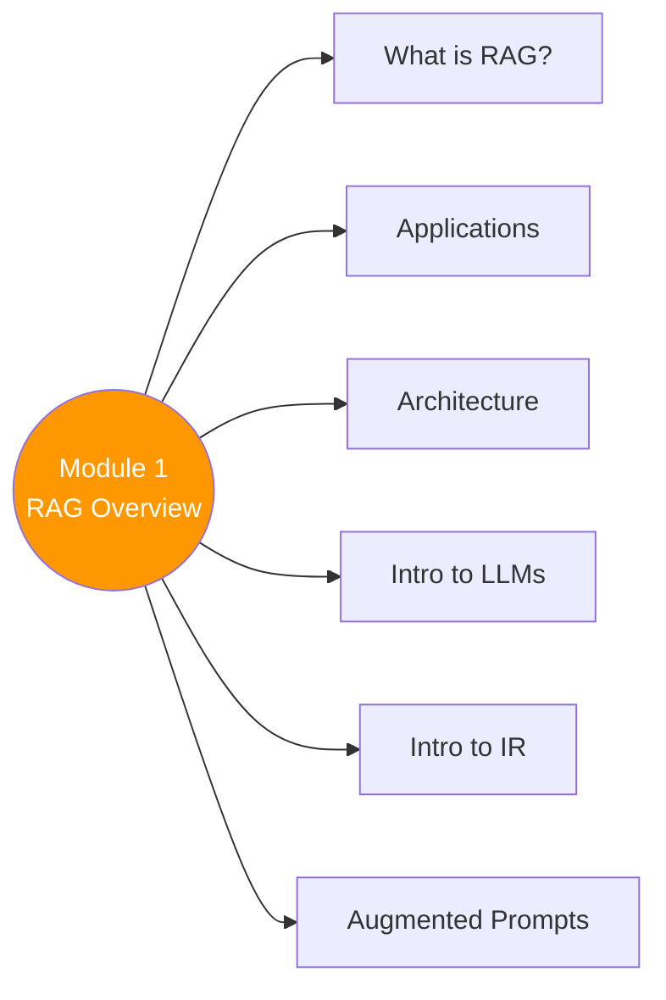

# 🚀 Module 1 — RAG Overview

> RAG kya hai, kyu chahiye, kahan use hota hai, aur kaise kaam karta hai — foundation yahan se! 🎯

---

## 🧠 Brain — Module Overview

## 📊 Progress

| # | Lesson | Confidence | Revised |
|---|--------|-----------|---------|
| 00 | [A Conversation with Andrew Ng](00-conversation-andrew-ng.md) | 🟢 | — |
| 01 | [Module 1 Introduction](01-module-introduction.md) | 🟢 | — |
| 02 | [Introduction to RAG](02-introduction-to-rag.md) | 🔴 | — |
| 03 | [Applications of RAG](03-applications-of-rag.md) | 🟢 | — |
| 04 | [RAG Architecture Overview](04-rag-architecture-overview.md) | 🔴 | — |
| 05 | [Introduction to LLMs](05-introduction-to-llms.md) | 🔴 | — |
| 06 | [A Brief Python Refresher](06-python-refresher.md) | 🔴 | — |
| 07 | [LLM Calls & Crafting Augmented Prompts](07-llm-calls-augmented-prompts.md) | 🔴 | — |
| 08 | [Introduction to Information Retrieval](08-introduction-to-ir.md) | 🔴 | — |
| 09 | [Introduction to RAG Systems](09-introduction-to-rag-systems.md) | 🔴 | — |

**Overall confidence:** 🔴 Not started

## 🧩 Memory Fragments
> - 🔍 RAG = pair search systems + LLM reasoning. Most commonly built LLM app type.
> - 🤖 Agentic RAG = AI agent decides what to retrieve, when, and whether to try again.
> - 📉 Hallucination rates trending down as newer models get better at staying grounded.
> - 📏 Larger context windows = less chunking pressure, but still need RAG for cost/efficiency.
> - 💻 Code RAG = your codebase as KB. LLM can't code for your project without seeing your code.
> - ⚕️ Legal/Medical RAG = may be ONLY viable option. Precision + private data = RAG mandatory.
> - 🌐 AI web search (ChatGPT/Gemini) = RAG with the entire internet as knowledge base.
> - 👤 Small personal KB (texts, emails) > large generic KB — dense context beats raw size.

---

## 🎬 Teach Mode

| # | Lesson | What You'll Get |
|---|--------|-----------------|
| 00 | [A Conversation with Andrew Ng](00-conversation-andrew-ng.md) | Why RAG matters — Andrew's perspective |
| 01 | [Module 1 Introduction](01-module-introduction.md) | Course overview and roadmap |
| 02 | [Introduction to RAG](02-introduction-to-rag.md) | What is RAG, why do we need it |
| 03 | [Applications of RAG](03-applications-of-rag.md) | Real-world RAG use cases |
| 04 | [RAG Architecture Overview](04-rag-architecture-overview.md) | End-to-end RAG pipeline |
| 05 | [Introduction to LLMs](05-introduction-to-llms.md) | LLM foundations for RAG |
| 06 | [A Brief Python Refresher](06-python-refresher.md) | Python essentials for the course |
| 07 | [LLM Calls & Augmented Prompts](07-llm-calls-augmented-prompts.md) | Making LLM calls, building augmented prompts |
| 08 | [Introduction to IR](08-introduction-to-ir.md) | Information retrieval fundamentals |
| 09 | [Intro to RAG Systems](09-introduction-to-rag-systems.md) | Putting retrieval + generation together |

**Supporting:** [Flashcards](flashcards.md)

---

## 📚 Source
> 🎓 [RAG Course — Module 1](https://learn.deeplearning.ai/courses/retrieval-augmented-generation) — DeepLearning.AI

## 🔗 Connected Topics
> → [Module 2: IR & Search Foundations](../module-2-ir-search-foundations/) · [Agentic AI](../../agentic-ai/)
