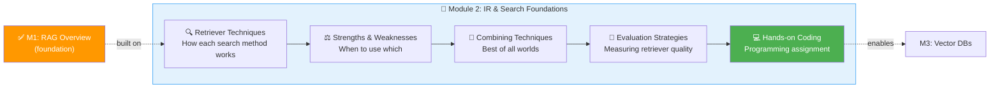

# 01 · Module 2 Introduction 🔎

---

## 🎯 One Line
> Module 2 is the deep dive on the retriever — the component that makes or breaks your RAG system by finding the right documents in fractions of a second.

---

## 🖼️ Module 2 Roadmap



---

## 🧩 The Retriever's Job

| What It Does | Why It's Hard |
|---|---|
| Find documents in the KB that help the LLM answer a prompt | Users send **messy, conversational** queries — not structured SQL |
| Return the most relevant pieces in **fractions of a second** | Documents are structured for **humans to read**, not computers to search |
| Bridge the gap between human language and stored knowledge | Content ranges from personal emails to medical journals — wildly diverse |

> 💡 **Retriever = translator between "human baat-cheet" aur "computer ka organized duniya." User bolega kuch bhi, retriever ko samajhna padega! 🗣️→🔍**

---

## 🗺️ What This Module Covers

| # | Topic | What You'll Learn |
|---|-------|-------------------|
| 1 | **Retriever Techniques** | Primary methods a retriever uses — keyword search, semantic search, hybrid approaches |
| 2 | **How Each Works** | Theoretical understanding of the mechanics behind each technique |
| 3 | **Strengths & Weaknesses** | When each technique shines and where it breaks down |
| 4 | **Combining Techniques** | How a retriever uses multiple methods together for best results |
| 5 | **Evaluation Strategies** | How to measure whether your retriever is actually doing a good job |
| 6 | **Hands-on Coding** | Programming assignment to directly implement what you learn |

---

## 🔗 Why the Retriever Is the Hard Part

```
User Query                          Knowledge Base
┌─────────────────────┐             ┌─────────────────────┐
│ "what's the return   │             │ Personal emails     │
│  policy for shoes?"  │             │ Company memos       │
│                      │  ───🔍───▶  │ Medical journal     │
│ (casual, messy,      │             │ Product catalogs    │
│  conversational)     │             │ Legal documents     │
└─────────────────────┘             └─────────────────────┘
                                            │
                                     Fractions of a second
                                            │
                                    ┌───────▼───────┐
                                    │ Most Relevant  │
                                    │ Documents Only │
                                    └───────────────┘
```

**Two-sided mess:**
- **Query side** — users chat like they're talking to a person, not writing database queries
- **Document side** — content is rich but human-structured (paragraphs, not rows/columns)

The retriever handles both sides simultaneously — and does it **fast**.

---

> **Next →** [Retriever Architecture Overview](02-retriever-architecture.md)
