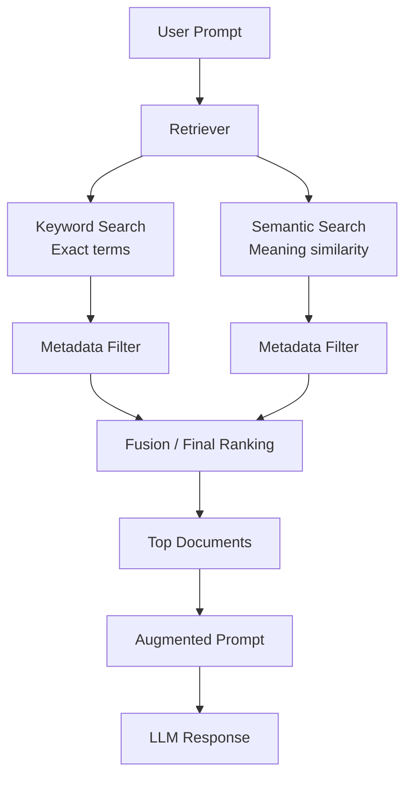

# 02 · Retriever Architecture Overview 🧩

---

## 🎯 One Line
> A high-performing retriever is a hybrid pipeline: keyword search + semantic search + metadata filtering + rank fusion, then top documents go to the LLM.

---

## 🖼️ End-to-End Retriever Flow

> 💡 **Retriever ka funda:** ek hi search pe भरोसा mat karo — "exact words" bhi chahiye, "same meaning" bhi chahiye, aur "right audience" filter bhi chahiye.

---

## 🧱 Core Components

| Component | What it does | Why it matters |
|---|---|---|
| **Keyword Search** | Finds documents containing exact prompt words | Preserves precise term matching (time-tested IR behavior) |
| **Semantic Search** | Finds documents with similar meaning | Recovers relevant docs even when wording differs |
| **Metadata Filtering** | Keeps only docs matching strict metadata rules (team, region, role, etc.) | Enforces hard business constraints |
| **Fusion / Re-ranking** | Combines keyword + semantic result lists into one final ranking | Balances precision and recall from both search styles |

---

## ⚙️ What Happens in Practice

1. Prompt arrives at retriever.
2. Retriever runs **keyword** and **semantic** searches in parallel.
3. Each search returns a candidate set (often around 20–50 docs).
4. Apply metadata filtering to both candidate sets.
5. Merge filtered sets and produce one final rank.
6. Return top-ranked docs to build augmented prompt.

---

## ✅ Why This Is Called Hybrid Search

Hybrid search combines multiple retrieval signals:
- **Exact-word sensitivity** (keyword)
- **Meaning-level flexibility** (semantic)
- **Rule-based control** (metadata)

Design quality comes from tuning the balance between these signals for your project goals.

---

## ⚠️ Gotchas
- Using only keyword search misses paraphrased but relevant documents.
- Using only semantic search can miss exact-term intent.
- Skipping metadata filtering can leak irrelevant department/domain docs.
- Poor fusion tuning can over-favor one signal and hurt retrieval quality.

---

> **Next →** [Metadata Filtering](03-metadata-filtering.md)
