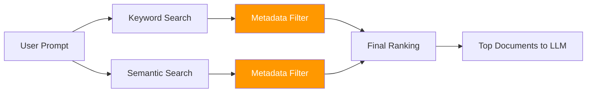

# 03 · Metadata Filtering 🧱

---

## 🎯 One Line
> Metadata filtering is a strict rule-based gate that narrows candidate documents by fields like author/date/access/region, but it cannot judge content relevance by itself.

---

## 🖼️ Where Metadata Filtering Sits in Retrieval



> 💡 Metadata filter is a **bouncer**, not a **judge**: "ID check karo, phir andar jaane do." Quality check later hota hai.

---

## 🧱 What Is Metadata Filtering?

Metadata filtering uses rigid criteria on document metadata fields, such as:
- title
- author
- creation/publication date
- section/category/tags
- access privilege (free vs paid)
- geography/region

Only documents matching **all required conditions** pass the filter.

---

## 📰 Newspaper Example (from lesson)

Knowledge base: thousands of articles.
Each article has metadata like title, date, author, section.

Filter queries can be:
- single condition: "all articles published on 2023-10-01"
- multi-condition: "opinion articles by Michael Chen between June–July 2024"

SQL-like pattern:

```sql
SELECT * FROM articles
WHERE publication_date = '2023-10-01';
```

If you've filtered rows in a spreadsheet, you've already used the same idea.

---

## 🔐 User-Attribute Driven Filtering in RAG

In production RAG, filters are often set from **user attributes**, not prompt text.

| Scenario | Metadata rule |
|---|---|
| Non-subscriber user | Exclude `subscription = paid` |
| Reader in North America | Include only `region = North America` |

This gives hard policy control before results reach the LLM.

---

## ✅ Advantages

- Simple mental model → easy to debug
- Fast, mature, and well-optimized
- Only method that enforces strict include/exclude rules

## ⚠️ Limitations

- Not a true search method; mostly a refinement step
- Ignores document content/meaning
- No ranking by relevance after filtering
- Useless if used alone for retrieval

---

## 🧠 Practical Rule

Use metadata filtering as a **constraint layer** with keyword/semantic search:
- keyword/semantic = find relevant content
- metadata = enforce business/policy boundaries

You need both for useful retrieval.

---

> **Next →** [Keyword Search: TF-IDF](04-keyword-search-tfidf.md)
