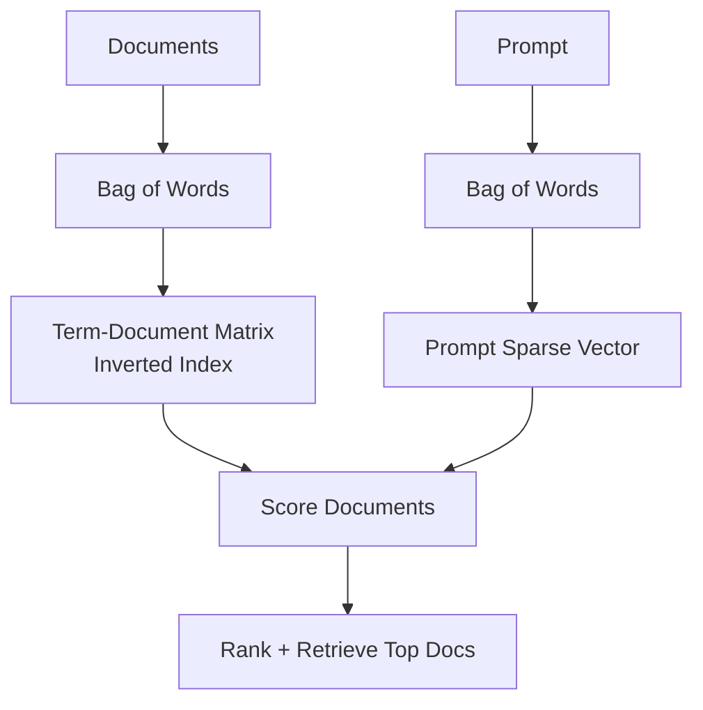
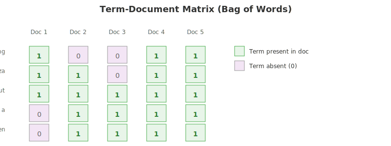
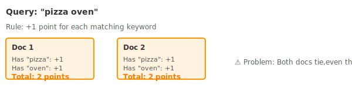
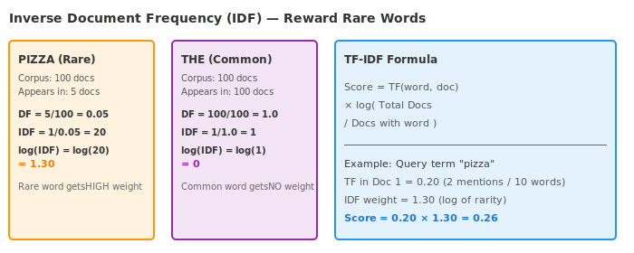
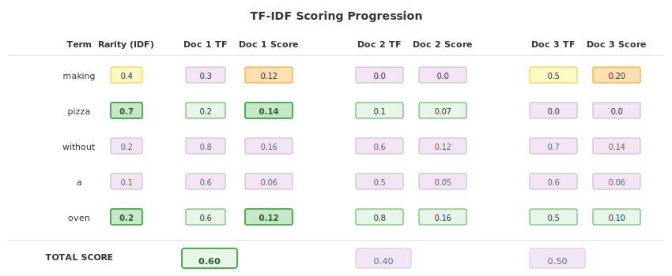

# 04 · Keyword Search: TF-IDF 🔤

---

## 🎯 One Line
> TF-IDF ranks documents by rewarding frequent query terms in a document (TF) and giving extra weight to rare, informative terms across the corpus (IDF).

---

## 🖼️ Keyword Search Pipeline (Bag-of-Words)

> 💡 Keyword search ka rule simple hai: prompt ke words jitne strong match honge, doc utna upar aayega.

---

## 🧱 Core Ideas

| Concept | Meaning |
|---|---|
| **Bag of words** | Word order ignored; only word presence + frequency matter |
| **Sparse vector** | One dimension per vocabulary word; most values are zero |
| **Term-document matrix** | Rows = words, columns = documents |
| **Inverted index** | Start from a word, quickly find documents containing that word |

Example prompt: "making pizza without a pizza oven"
- `pizza` appears 2 times
- `making`, `without`, `a`, `oven` appear 1 time each

---

## 📊 Visual: Term-Document Matrix

Query: "making pizza without a pizza oven"

---

## ⚙️ Scoring Evolution (4 Progressive Improvements)

### Step 1️⃣: Binary Keyword Score

### Step 2️⃣: Term Frequency (TF) Score

### Step 3️⃣: Length Normalization

### Step 4️⃣: IDF Weighting (The Final Piece)

---

## 🎯 Complete TF-IDF Example: "making pizza without a pizza oven"

**Key Insight:** Doc 1 scores highest because it contains the rare keywords `pizza` and `oven` proportionally more than the other docs, even though simpler metrics might rank them differently.

---

## ✅ Why TF-IDF Is a Strong Baseline

- Fast and mature
- Easy to implement and debug
- Captures both frequency (within doc) and rarity (across corpus)
- Still a standard baseline for keyword retrieval quality

## ⚠️ Limitation (and what's next)

TF-IDF is foundational, but production retrievers often use **BM25**, a refined keyword scoring method.

---

> **Next →** [Keyword Search: BM25](05-keyword-search-bm25.md)
