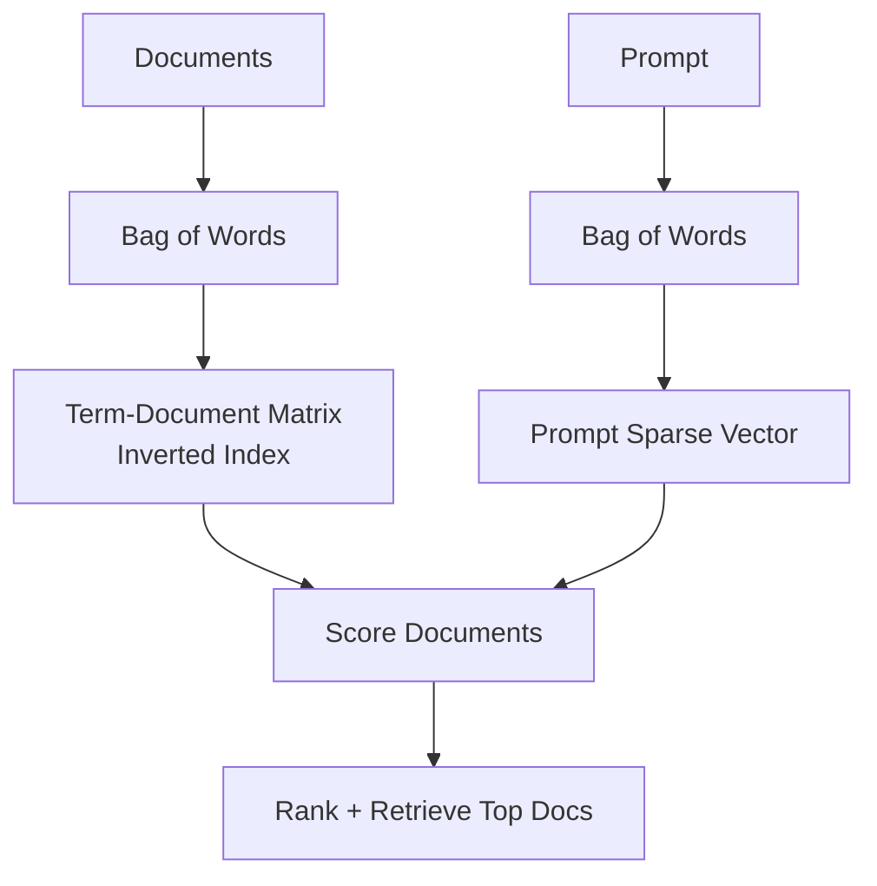

# 04 · Keyword Search: TF-IDF 🔤

---

## 🎯 One Line
> TF-IDF ranks documents by rewarding frequent query terms in a document (TF) and giving extra weight to rare, informative terms across the corpus (IDF).

---

## 🖼️ Keyword Search Pipeline (Bag-of-Words)

> 💡 Keyword search ka rule simple hai: prompt ke words jitne strong match honge, doc utna upar aayega.

---

## 🧱 Core Ideas

| Concept | Meaning |
|---|---|
| **Bag of words** | Word order ignored; only word presence + frequency matter |
| **Sparse vector** | One dimension per vocabulary word; most values are zero |
| **Term-document matrix** | Rows = words, columns = documents |
| **Inverted index** | Start from a word, quickly find documents containing that word |

Example prompt: "making pizza without a pizza oven"
- `pizza` appears 2 times
- `making`, `without`, `a`, `oven` appear 1 time each

---

## 📊 Visual: Term-Document Matrix

Query: "making pizza without a pizza oven"

<svg viewBox="0 0 800 300" xmlns="http://www.w3.org/2000/svg" style="border: 1px solid #ccc; background: #f9f9f9; max-width: 100%; height: auto;">
  <!-- Title -->
  <text x="400" y="25" font-size="18" font-weight="bold" text-anchor="middle" fill="#333">Term-Document Matrix (Bag of Words)</text>
  
  <!-- Column headers (documents) -->
  <text x="80" y="70" font-size="12" text-anchor="middle" fill="#666">Doc 1</text>
  <text x="160" y="70" font-size="12" text-anchor="middle" fill="#666">Doc 2</text>
  <text x="240" y="70" font-size="12" text-anchor="middle" fill="#666">Doc 3</text>
  <text x="320" y="70" font-size="12" text-anchor="middle" fill="#666">Doc 4</text>
  <text x="400" y="70" font-size="12" text-anchor="middle" fill="#666">Doc 5</text>
  
  <!-- Row headers (terms) -->
  <text x="10" y="110" font-size="12" text-anchor="end" fill="#666">making</text>
  <text x="10" y="150" font-size="12" text-anchor="end" fill="#666">pizza</text>
  <text x="10" y="190" font-size="12" text-anchor="end" fill="#666">without</text>
  <text x="10" y="230" font-size="12" text-anchor="end" fill="#666">a</text>
  <text x="10" y="270" font-size="12" text-anchor="end" fill="#666">oven</text>
  
  <!-- Grid cells with values -->
  <!-- making row -->
  <rect x="60" y="95" width="40" height="35" fill="#e8f5e9" stroke="#4caf50" stroke-width="1"/>
  <text x="80" y="120" font-size="14" text-anchor="middle" font-weight="bold" fill="#2e7d32">1</text>
  
  <rect x="140" y="95" width="40" height="35" fill="#f3e5f5" stroke="#999" stroke-width="1"/>
  <text x="160" y="120" font-size="14" text-anchor="middle" fill="#666">0</text>
  
  <rect x="220" y="95" width="40" height="35" fill="#f3e5f5" stroke="#999" stroke-width="1"/>
  <text x="240" y="120" font-size="14" text-anchor="middle" fill="#666">0</text>
  
  <rect x="300" y="95" width="40" height="35" fill="#e8f5e9" stroke="#4caf50" stroke-width="1"/>
  <text x="320" y="120" font-size="14" text-anchor="middle" font-weight="bold" fill="#2e7d32">1</text>
  
  <rect x="380" y="95" width="40" height="35" fill="#e8f5e9" stroke="#4caf50" stroke-width="1"/>
  <text x="400" y="120" font-size="14" text-anchor="middle" font-weight="bold" fill="#2e7d32">1</text>
  
  <!-- pizza row -->
  <rect x="60" y="135" width="40" height="35" fill="#e8f5e9" stroke="#4caf50" stroke-width="1"/>
  <text x="80" y="160" font-size="14" text-anchor="middle" font-weight="bold" fill="#2e7d32">1</text>
  
  <rect x="140" y="135" width="40" height="35" fill="#e8f5e9" stroke="#4caf50" stroke-width="1"/>
  <text x="160" y="160" font-size="14" text-anchor="middle" font-weight="bold" fill="#2e7d32">1</text>
  
  <rect x="220" y="135" width="40" height="35" fill="#f3e5f5" stroke="#999" stroke-width="1"/>
  <text x="240" y="160" font-size="14" text-anchor="middle" fill="#666">0</text>
  
  <rect x="300" y="135" width="40" height="35" fill="#e8f5e9" stroke="#4caf50" stroke-width="1"/>
  <text x="320" y="160" font-size="14" text-anchor="middle" font-weight="bold" fill="#2e7d32">1</text>
  
  <rect x="380" y="135" width="40" height="35" fill="#e8f5e9" stroke="#4caf50" stroke-width="1"/>
  <text x="400" y="160" font-size="14" text-anchor="middle" font-weight="bold" fill="#2e7d32">1</text>
  
  <!-- without row -->
  <rect x="60" y="175" width="40" height="35" fill="#e8f5e9" stroke="#4caf50" stroke-width="1"/>
  <text x="80" y="200" font-size="14" text-anchor="middle" font-weight="bold" fill="#2e7d32">1</text>
  
  <rect x="140" y="175" width="40" height="35" fill="#e8f5e9" stroke="#4caf50" stroke-width="1"/>
  <text x="160" y="200" font-size="14" text-anchor="middle" font-weight="bold" fill="#2e7d32">1</text>
  
  <rect x="220" y="175" width="40" height="35" fill="#e8f5e9" stroke="#4caf50" stroke-width="1"/>
  <text x="240" y="200" font-size="14" text-anchor="middle" font-weight="bold" fill="#2e7d32">1</text>
  
  <rect x="300" y="175" width="40" height="35" fill="#e8f5e9" stroke="#4caf50" stroke-width="1"/>
  <text x="320" y="200" font-size="14" text-anchor="middle" font-weight="bold" fill="#2e7d32">1</text>
  
  <rect x="380" y="175" width="40" height="35" fill="#e8f5e9" stroke="#4caf50" stroke-width="1"/>
  <text x="400" y="200" font-size="14" text-anchor="middle" font-weight="bold" fill="#2e7d32">1</text>
  
  <!-- a row -->
  <rect x="60" y="215" width="40" height="35" fill="#f3e5f5" stroke="#999" stroke-width="1"/>
  <text x="80" y="240" font-size="14" text-anchor="middle" fill="#666">0</text>
  
  <rect x="140" y="215" width="40" height="35" fill="#e8f5e9" stroke="#4caf50" stroke-width="1"/>
  <text x="160" y="240" font-size="14" text-anchor="middle" font-weight="bold" fill="#2e7d32">1</text>
  
  <rect x="220" y="215" width="40" height="35" fill="#e8f5e9" stroke="#4caf50" stroke-width="1"/>
  <text x="240" y="240" font-size="14" text-anchor="middle" font-weight="bold" fill="#2e7d32">1</text>
  
  <rect x="300" y="215" width="40" height="35" fill="#e8f5e9" stroke="#4caf50" stroke-width="1"/>
  <text x="320" y="240" font-size="14" text-anchor="middle" font-weight="bold" fill="#2e7d32">1</text>
  
  <rect x="380" y="215" width="40" height="35" fill="#e8f5e9" stroke="#4caf50" stroke-width="1"/>
  <text x="400" y="240" font-size="14" text-anchor="middle" font-weight="bold" fill="#2e7d32">1</text>
  
  <!-- oven row -->
  <rect x="60" y="255" width="40" height="35" fill="#f3e5f5" stroke="#999" stroke-width="1"/>
  <text x="80" y="280" font-size="14" text-anchor="middle" fill="#666">0</text>
  
  <rect x="140" y="255" width="40" height="35" fill="#e8f5e9" stroke="#4caf50" stroke-width="1"/>
  <text x="160" y="280" font-size="14" text-anchor="middle" font-weight="bold" fill="#2e7d32">1</text>
  
  <rect x="220" y="255" width="40" height="35" fill="#e8f5e9" stroke="#4caf50" stroke-width="1"/>
  <text x="240" y="280" font-size="14" text-anchor="middle" font-weight="bold" fill="#2e7d32">1</text>
  
  <rect x="300" y="255" width="40" height="35" fill="#e8f5e9" stroke="#4caf50" stroke-width="1"/>
  <text x="320" y="280" font-size="14" text-anchor="middle" font-weight="bold" fill="#2e7d32">1</text>
  
  <rect x="380" y="255" width="40" height="35" fill="#e8f5e9" stroke="#4caf50" stroke-width="1"/>
  <text x="400" y="280" font-size="14" text-anchor="middle" font-weight="bold" fill="#2e7d32">1</text>
  
  <!-- Legend -->
  <rect x="480" y="95" width="20" height="20" fill="#e8f5e9" stroke="#4caf50" stroke-width="1"/>
  <text x="510" y="110" font-size="12" fill="#333">Term present in doc</text>
  
  <rect x="480" y="125" width="20" height="20" fill="#f3e5f5" stroke="#999" stroke-width="1"/>
  <text x="510" y="140" font-size="12" fill="#333">Term absent (0)</text>
</svg>

---

## ⚙️ Scoring Evolution (4 Progressive Improvements)

### Step 1️⃣: Binary Keyword Score

<svg viewBox="0 0 600 150" xmlns="http://www.w3.org/2000/svg" style="border: 1px solid #ddd; background: #fafafa; margin: 10px 0; max-width: 100%; height: auto;">
  <text x="10" y="25" font-size="14" font-weight="bold" fill="#333">Query: "pizza oven"</text>
  <text x="10" y="50" font-size="12" fill="#666">Rule: +1 point for each matching keyword</text>
  
  <rect x="10" y="65" width="150" height="70" fill="#fff3e0" stroke="#ff9800" stroke-width="2" rx="4"/>
  <text x="20" y="85" font-size="12" font-weight="bold" fill="#333">Doc 1</text>
  <text x="20" y="105" font-size="11" fill="#555">Has "pizza": +1</text>
  <text x="20" y="120" font-size="11" fill="#555">Has "oven": +1</text>
  <text x="20" y="135" font-size="12" font-weight="bold" fill="#f57c00">Total: 2 points</text>
  
  <rect x="200" y="65" width="150" height="70" fill="#fff3e0" stroke="#ff9800" stroke-width="2" rx="4"/>
  <text x="210" y="85" font-size="12" font-weight="bold" fill="#333">Doc 2</text>
  <text x="210" y="105" font-size="11" fill="#555">Has "pizza": +1</text>
  <text x="210" y="120" font-size="11" fill="#555">Has "oven": +1</text>
  <text x="210" y="135" font-size="12" font-weight="bold" fill="#f57c00">Total: 2 points</text>
  
  <text x="400" y="110" font-size="12" font-style="italic" fill="#666">⚠️ Problem: Both docs tie, even though Doc 2 mentions "oven" 3 times!</text>
</svg>

### Step 2️⃣: Term Frequency (TF) Score

<svg viewBox="0 0 600 180" xmlns="http://www.w3.org/2000/svg" style="border: 1px solid #ddd; background: #fafafa; margin: 10px 0; max-width: 100%; height: auto;">
  <text x="10" y="25" font-size="14" font-weight="bold" fill="#333">Query: "pizza oven"</text>
  <text x="10" y="50" font-size="12" fill="#666">Rule: Add points for EACH occurrence of a keyword</text>
  
  <rect x="10" y="65" width="150" height="100" fill="#e8f5e9" stroke="#4caf50" stroke-width="2" rx="4"/>
  <text x="20" y="85" font-size="12" font-weight="bold" fill="#333">Doc 1</text>
  <text x="20" y="105" font-size="11" fill="#555">"pizza" appears 2x: +2</text>
  <text x="20" y="120" font-size="11" fill="#555">"oven" appears 1x: +1</text>
  <text x="20" y="140" font-size="12" font-weight="bold" fill="#2e7d32">Total: 3 points</text>
  
  <rect x="200" y="65" width="150" height="100" fill="#c8e6c9" stroke="#388e3c" stroke-width="3" rx="4"/>
  <text x="210" y="85" font-size="12" font-weight="bold" fill="#333">Doc 2 ⭐</text>
  <text x="210" y="105" font-size="11" fill="#555">"pizza" appears 1x: +1</text>
  <text x="210" y="120" font-size="11" fill="#555">"oven" appears 3x: +3</text>
  <text x="210" y="140" font-size="12" font-weight="bold" fill="#1b5e20">Total: 4 points</text>
  
  <text x="400" y="110" font-size="12" font-style="italic" fill="#666">✓ Doc 2 wins!  ⚠️ Problem: Longer docs naturally get higher scores just because they have more words</text>
</svg>

### Step 3️⃣: Length Normalization

<svg viewBox="0 0 600 200" xmlns="http://www.w3.org/2000/svg" style="border: 1px solid #ddd; background: #fafafa; margin: 10px 0; max-width: 100%; height: auto;">
  <text x="10" y="25" font-size="14" font-weight="bold" fill="#333">Query: "pizza oven"</text>
  <text x="10" y="50" font-size="12" fill="#666">Rule: Divide by document length to level playing field</text>
  
  <rect x="10" y="65" width="160" height="120" fill="#e8f5e9" stroke="#4caf50" stroke-width="2" rx="4"/>
  <text x="20" y="85" font-size="12" font-weight="bold" fill="#333">Doc 1 (10 words)</text>
  <text x="20" y="105" font-size="11" fill="#555">Raw score: 3</text>
  <text x="20" y="125" font-size="11" fill="#555">Normalized:</text>
  <text x="20" y="140" font-size="11" font-weight="bold" fill="#2e7d32">3 ÷ 10 = 0.30</text>
  <text x="20" y="160" font-size="10" fill="#666">(30% keywords)</text>
  
  <rect x="210" y="65" width="160" height="120" fill="#c8e6c9" stroke="#388e3c" stroke-width="2" rx="4"/>
  <text x="220" y="85" font-size="12" font-weight="bold" fill="#333">Doc 2 (50 words)</text>
  <text x="220" y="105" font-size="11" fill="#555">Raw score: 4</text>
  <text x="220" y="125" font-size="11" fill="#555">Normalized:</text>
  <text x="220" y="140" font-size="11" font-weight="bold" fill="#2e7d32">4 ÷ 50 = 0.08</text>
  <text x="220" y="160" font-size="10" fill="#666">(8% keywords)</text>
  
  <text x="410" y="110" font-size="12" font-style="italic" fill="#666">✓ Now Doc 1 wins! It's denser with keywords.  ⚠️ Problem: "pizza" and "the" treated equally, but "pizza" is more meaningful</text>
</svg>

### Step 4️⃣: IDF Weighting (The Final Piece)

<svg viewBox="0 0 700 280" xmlns="http://www.w3.org/2000/svg" style="border: 1px solid #ddd; background: #fafafa; margin: 10px 0; max-width: 100%; height: auto;">
  <text x="10" y="25" font-size="14" font-weight="bold" fill="#333">Inverse Document Frequency (IDF) — Reward Rare Words</text>
  
  <!-- Pizza (rare) -->
  <rect x="10" y="45" width="160" height="220" fill="#fff3e0" stroke="#ff9800" stroke-width="2" rx="4"/>
  <text x="20" y="70" font-size="12" font-weight="bold" fill="#333">PIZZA (Rare)</text>
  <text x="20" y="90" font-size="10" fill="#555">Corpus: 100 docs</text>
  <text x="20" y="105" font-size="10" fill="#555">Appears in: 5 docs</text>
  
  <text x="20" y="130" font-size="10" font-weight="bold" fill="#333">DF = 5/100 = 0.05</text>
  <text x="20" y="150" font-size="10" font-weight="bold" fill="#333">IDF = 1/0.05 = 20</text>
  <text x="20" y="170" font-size="10" font-weight="bold" fill="#333">log(IDF) = log(20)</text>
  <text x="20" y="185" font-size="11" font-weight="bold" fill="#f57c00">= 1.30</text>
  
  <text x="20" y="210" font-size="10" font-style="italic" fill="#666">Rare word gets HIGH weight</text>
  
  <!-- The (common) -->
  <rect x="190" y="45" width="160" height="220" fill="#f3e5f5" stroke="#9c27b0" stroke-width="2" rx="4"/>
  <text x="200" y="70" font-size="12" font-weight="bold" fill="#333">THE (Common)</text>
  <text x="200" y="90" font-size="10" fill="#555">Corpus: 100 docs</text>
  <text x="200" y="105" font-size="10" fill="#555">Appears in: 100 docs</text>
  
  <text x="200" y="130" font-size="10" font-weight="bold" fill="#333">DF = 100/100 = 1.0</text>
  <text x="200" y="150" font-size="10" font-weight="bold" fill="#333">IDF = 1/1.0 = 1</text>
  <text x="200" y="170" font-size="10" font-weight="bold" fill="#333">log(IDF) = log(1)</text>
  <text x="200" y="185" font-size="11" font-weight="bold" fill="#9c27b0">= 0</text>
  
  <text x="200" y="210" font-size="10" font-style="italic" fill="#666">Common word gets NO weight</text>
  
  <!-- The formula -->
  <rect x="370" y="45" width="310" height="220" fill="#e3f2fd" stroke="#2196f3" stroke-width="2" rx="4"/>
  <text x="380" y="70" font-size="12" font-weight="bold" fill="#333">TF-IDF Formula</text>
  
  <text x="380" y="100" font-size="11" fill="#555">Score = TF(word, doc)</text>
  <text x="380" y="120" font-size="11" fill="#555">        × log( Total Docs</text>
  <text x="380" y="140" font-size="11" fill="#555">               / Docs with word )</text>
  
  <rect x="380" y="160" width="290" height="1" fill="#666"/>
  
  <text x="380" y="185" font-size="11" fill="#333">Example: Query term "pizza"</text>
  <text x="380" y="205" font-size="11" fill="#555">TF in Doc 1 = 0.20 (2 mentions / 10 words)</text>
  <text x="380" y="225" font-size="11" fill="#555">IDF weight = 1.30 (log of rarity)</text>
  <text x="380" y="245" font-size="11" font-weight="bold" fill="#1976d2">Score = 0.20 × 1.30 = 0.26</text>
</svg>

---

## 🎯 Complete TF-IDF Example: "making pizza without a pizza oven"

<svg viewBox="0 0 850 350" xmlns="http://www.w3.org/2000/svg" style="border: 1px solid #ddd; background: #fafafa; margin: 10px 0; max-width: 100%; height: auto;">
  <!-- Title -->
  <text x="425" y="25" font-size="14" font-weight="bold" text-anchor="middle" fill="#333">TF-IDF Scoring Progression</text>
  
  <!-- Column headers -->
  <text x="100" y="60" font-size="11" font-weight="bold" text-anchor="middle" fill="#333">Term</text>
  <text x="160" y="60" font-size="11" font-weight="bold" text-anchor="middle" fill="#333">Rarity (IDF)</text>
  <text x="260" y="60" font-size="11" font-weight="bold" text-anchor="middle" fill="#333">Doc 1 TF</text>
  <text x="340" y="60" font-size="11" font-weight="bold" text-anchor="middle" fill="#333">Doc 1 Score</text>
  <text x="480" y="60" font-size="11" font-weight="bold" text-anchor="middle" fill="#333">Doc 2 TF</text>
  <text x="560" y="60" font-size="11" font-weight="bold" text-anchor="middle" fill="#333">Doc 2 Score</text>
  <text x="700" y="60" font-size="11" font-weight="bold" text-anchor="middle" fill="#333">Doc 3 TF</text>
  <text x="780" y="60" font-size="11" font-weight="bold" text-anchor="middle" fill="#333">Doc 3 Score</text>
  
  <!-- Divider -->
  <line x1="10" y1="70" x2="840" y2="70" stroke="#ddd" stroke-width="1"/>
  
  <!-- making row -->
  <text x="100" y="100" font-size="11" text-anchor="middle" fill="#333">making</text>
  <rect x="140" y="85" width="40" height="20" fill="#fff9c4" stroke="#fbc02d" stroke-width="1" rx="2"/>
  <text x="160" y="100" font-size="10" text-anchor="middle" fill="#333">0.4</text>
  
  <rect x="235" y="85" width="50" height="20" fill="#f3e5f5" stroke="#bbb" stroke-width="1" rx="2"/>
  <text x="260" y="100" font-size="10" text-anchor="middle" fill="#333">0.3</text>
  
  <rect x="310" y="85" width="60" height="20" fill="#ffe0b2" stroke="#ff9800" stroke-width="1" rx="2"/>
  <text x="340" y="100" font-size="10" text-anchor="middle" fill="#333">0.12</text>
  
  <rect x="450" y="85" width="60" height="20" fill="#f3e5f5" stroke="#bbb" stroke-width="1" rx="2"/>
  <text x="480" y="100" font-size="10" text-anchor="middle" fill="#333">0.0</text>
  
  <rect x="530" y="85" width="60" height="20" fill="#f3e5f5" stroke="#bbb" stroke-width="1" rx="2"/>
  <text x="560" y="100" font-size="10" text-anchor="middle" fill="#333">0.0</text>
  
  <rect x="670" y="85" width="60" height="20" fill="#fff9c4" stroke="#fbc02d" stroke-width="1" rx="2"/>
  <text x="700" y="100" font-size="10" text-anchor="middle" fill="#333">0.5</text>
  
  <rect x="750" y="85" width="60" height="20" fill="#ffe0b2" stroke="#ff9800" stroke-width="1" rx="2"/>
  <text x="780" y="100" font-size="10" text-anchor="middle" fill="#333">0.20</text>
  
  <!-- pizza row -->
  <text x="100" y="145" font-size="11" text-anchor="middle" fill="#333">pizza</text>
  <rect x="140" y="130" width="40" height="20" fill="#c8e6c9" stroke="#4caf50" stroke-width="2" rx="2"/>
  <text x="160" y="145" font-size="10" font-weight="bold" text-anchor="middle" fill="#1b5e20">0.7</text>
  
  <rect x="235" y="130" width="50" height="20" fill="#e8f5e9" stroke="#4caf50" stroke-width="1" rx="2"/>
  <text x="260" y="145" font-size="10" text-anchor="middle" fill="#333">0.2</text>
  
  <rect x="310" y="130" width="60" height="20" fill="#c8e6c9" stroke="#4caf50" stroke-width="2" rx="2"/>
  <text x="340" y="145" font-size="10" font-weight="bold" text-anchor="middle" fill="#1b5e20">0.14</text>
  
  <rect x="450" y="130" width="60" height="20" fill="#e8f5e9" stroke="#4caf50" stroke-width="1" rx="2"/>
  <text x="480" y="145" font-size="10" text-anchor="middle" fill="#333">0.1</text>
  
  <rect x="530" y="130" width="60" height="20" fill="#e8f5e9" stroke="#4caf50" stroke-width="1" rx="2"/>
  <text x="560" y="145" font-size="10" text-anchor="middle" fill="#333">0.07</text>
  
  <rect x="670" y="130" width="60" height="20" fill="#f3e5f5" stroke="#bbb" stroke-width="1" rx="2"/>
  <text x="700" y="145" font-size="10" text-anchor="middle" fill="#333">0.0</text>
  
  <rect x="750" y="130" width="60" height="20" fill="#f3e5f5" stroke="#bbb" stroke-width="1" rx="2"/>
  <text x="780" y="145" font-size="10" text-anchor="middle" fill="#333">0.0</text>
  
  <!-- without row -->
  <text x="100" y="190" font-size="11" text-anchor="middle" fill="#333">without</text>
  <rect x="140" y="175" width="40" height="20" fill="#f3e5f5" stroke="#bbb" stroke-width="1" rx="2"/>
  <text x="160" y="190" font-size="10" text-anchor="middle" fill="#666">0.2</text>
  
  <rect x="235" y="175" width="50" height="20" fill="#f3e5f5" stroke="#bbb" stroke-width="1" rx="2"/>
  <text x="260" y="190" font-size="10" text-anchor="middle" fill="#666">0.8</text>
  
  <rect x="310" y="175" width="60" height="20" fill="#f3e5f5" stroke="#bbb" stroke-width="1" rx="2"/>
  <text x="340" y="190" font-size="10" text-anchor="middle" fill="#666">0.16</text>
  
  <rect x="450" y="175" width="60" height="20" fill="#f3e5f5" stroke="#bbb" stroke-width="1" rx="2"/>
  <text x="480" y="190" font-size="10" text-anchor="middle" fill="#666">0.6</text>
  
  <rect x="530" y="175" width="60" height="20" fill="#f3e5f5" stroke="#bbb" stroke-width="1" rx="2"/>
  <text x="560" y="190" font-size="10" text-anchor="middle" fill="#666">0.12</text>
  
  <rect x="670" y="175" width="60" height="20" fill="#f3e5f5" stroke="#bbb" stroke-width="1" rx="2"/>
  <text x="700" y="190" font-size="10" text-anchor="middle" fill="#666">0.7</text>
  
  <rect x="750" y="175" width="60" height="20" fill="#f3e5f5" stroke="#bbb" stroke-width="1" rx="2"/>
  <text x="780" y="190" font-size="10" text-anchor="middle" fill="#666">0.14</text>
  
  <!-- a row -->
  <text x="100" y="235" font-size="11" text-anchor="middle" fill="#333">a</text>
  <rect x="140" y="220" width="40" height="20" fill="#f3e5f5" stroke="#bbb" stroke-width="1" rx="2"/>
  <text x="160" y="235" font-size="10" text-anchor="middle" fill="#666">0.1</text>
  
  <rect x="235" y="220" width="50" height="20" fill="#f3e5f5" stroke="#bbb" stroke-width="1" rx="2"/>
  <text x="260" y="235" font-size="10" text-anchor="middle" fill="#666">0.6</text>
  
  <rect x="310" y="220" width="60" height="20" fill="#f3e5f5" stroke="#bbb" stroke-width="1" rx="2"/>
  <text x="340" y="235" font-size="10" text-anchor="middle" fill="#666">0.06</text>
  
  <rect x="450" y="220" width="60" height="20" fill="#f3e5f5" stroke="#bbb" stroke-width="1" rx="2"/>
  <text x="480" y="235" font-size="10" text-anchor="middle" fill="#666">0.5</text>
  
  <rect x="530" y="220" width="60" height="20" fill="#f3e5f5" stroke="#bbb" stroke-width="1" rx="2"/>
  <text x="560" y="235" font-size="10" text-anchor="middle" fill="#666">0.05</text>
  
  <rect x="670" y="220" width="60" height="20" fill="#f3e5f5" stroke="#bbb" stroke-width="1" rx="2"/>
  <text x="700" y="235" font-size="10" text-anchor="middle" fill="#666">0.6</text>
  
  <rect x="750" y="220" width="60" height="20" fill="#f3e5f5" stroke="#bbb" stroke-width="1" rx="2"/>
  <text x="780" y="235" font-size="10" text-anchor="middle" fill="#666">0.06</text>
  
  <!-- oven row -->
  <text x="100" y="280" font-size="11" text-anchor="middle" fill="#333">oven</text>
  <rect x="140" y="265" width="40" height="20" fill="#c8e6c9" stroke="#4caf50" stroke-width="2" rx="2"/>
  <text x="160" y="280" font-size="10" font-weight="bold" text-anchor="middle" fill="#1b5e20">0.2</text>
  
  <rect x="235" y="265" width="50" height="20" fill="#e8f5e9" stroke="#4caf50" stroke-width="1" rx="2"/>
  <text x="260" y="280" font-size="10" text-anchor="middle" fill="#333">0.6</text>
  
  <rect x="310" y="265" width="60" height="20" fill="#c8e6c9" stroke="#4caf50" stroke-width="2" rx="2"/>
  <text x="340" y="280" font-size="10" font-weight="bold" text-anchor="middle" fill="#1b5e20">0.12</text>
  
  <rect x="450" y="265" width="60" height="20" fill="#e8f5e9" stroke="#4caf50" stroke-width="1" rx="2"/>
  <text x="480" y="280" font-size="10" text-anchor="middle" fill="#333">0.8</text>
  
  <rect x="530" y="265" width="60" height="20" fill="#e8f5e9" stroke="#4caf50" stroke-width="1" rx="2"/>
  <text x="560" y="280" font-size="10" text-anchor="middle" fill="#333">0.16</text>
  
  <rect x="670" y="265" width="60" height="20" fill="#e8f5e9" stroke="#4caf50" stroke-width="1" rx="2"/>
  <text x="700" y="280" font-size="10" text-anchor="middle" fill="#333">0.5</text>
  
  <rect x="750" y="265" width="60" height="20" fill="#e8f5e9" stroke="#4caf50" stroke-width="1" rx="2"/>
  <text x="780" y="280" font-size="10" text-anchor="middle" fill="#333">0.10</text>
  
  <!-- Totals row -->
  <line x1="10" y1="305" x2="840" y2="305" stroke="#ddd" stroke-width="1"/>
  
  <text x="100" y="330" font-size="11" font-weight="bold" text-anchor="middle" fill="#333">TOTAL SCORE</text>
  <rect x="230" y="315" width="70" height="25" fill="#e8f5e9" stroke="#4caf50" stroke-width="2" rx="3"/>
  <text x="265" y="335" font-size="11" font-weight="bold" text-anchor="middle" fill="#1b5e20">0.60</text>
  
  <rect x="450" y="315" width="70" height="25" fill="#f3e5f5" stroke="#ccc" stroke-width="1" rx="3"/>
  <text x="485" y="335" font-size="11" text-anchor="middle" fill="#666">0.40</text>
  
  <rect x="670" y="315" width="70" height="25" fill="#f3e5f5" stroke="#ccc" stroke-width="1" rx="3"/>
  <text x="705" y="335" font-size="11" text-anchor="middle" fill="#666">0.50</text>
</svg>

**Key Insight:** Doc 1 scores highest because it contains the rare keywords `pizza` and `oven` proportionally more than the other docs, even though simpler metrics might rank them differently.

---

## ✅ Why TF-IDF Is a Strong Baseline

- Fast and mature
- Easy to implement and debug
- Captures both frequency (within doc) and rarity (across corpus)
- Still a standard baseline for keyword retrieval quality

## ⚠️ Limitation (and what's next)

TF-IDF is foundational, but production retrievers often use **BM25**, a refined keyword scoring method.

---

> **Next →** [Keyword Search: BM25](05-keyword-search-bm25.md)
