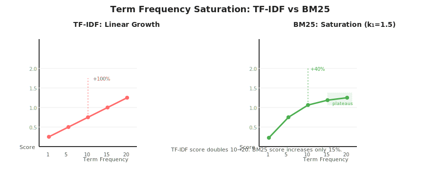
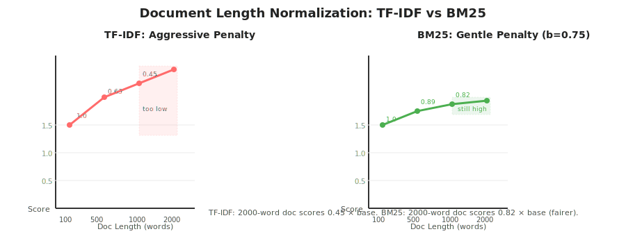
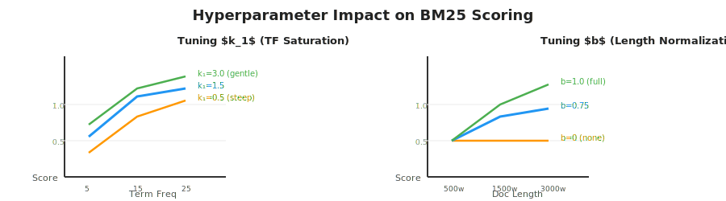

# Lesson 05: Keyword Search — BM25

## 📌 Overview

While TF-IDF is a classic keyword search algorithm, most modern retrievers use **BM25 (Best Matching 25)** — the 25th variant in a series of scoring functions. BM25 improves upon TF-IDF with two critical insights: **term frequency saturation** and **diminishing length penalties**, plus tunable hyperparameters for production optimization.

---

## 🎯 Key Concepts

### 1. BM25 Formula & Structure

BM25 calculates a relevance score per keyword, then sums across all query keywords:

$$\text{BM25}(D, Q) = \sum_{i}^{n} \text{IDF}(q_i) \cdot \frac{f(q_i, D) \cdot (k_1 + 1)}{f(q_i, D) + k_1 \cdot (1 - b + b \cdot \frac{|D|}{avgdl})}$$

Where:
- $f(q_i, D)$ = frequency of query term $q_i$ in document $D$
- $|D|$ = length of document (word count)
- $avgdl$ = average document length in corpus
- $k_1$ = term frequency saturation parameter (typical: 1.5)
- $b$ = length normalization parameter (typical: 0.75)

---

### 2. Term Frequency Saturation

**Problem with TF-IDF:** Document with "pizza" 20 times scores 2x higher than "pizza" 10 times — unrealistic relevance boost.

**BM25 Solution:** Scoring plateaus. Adding more repetitions yields diminishing returns.

---

### 3. Document Length Normalization

**Problem with TF-IDF:** Long documents penalized too aggressively — a 1000-word relevant document scores lower than a 100-word marginally relevant document.

**BM25 Solution:** Diminishing length penalties. Long documents still score high if keyword frequency is substantial.

---

### 4. Hyperparameters: $k_1$ and $b$

BM25's power comes from **two tunable hyperparameters**, allowing optimization for your specific corpus:

| Parameter | Role | Typical Value | Effect |
|-----------|------|---------------|--------|
| **$k_1$** | Term Frequency Saturation | 1.5 | Controls how quickly TF rewards plateau. Higher = slower saturation. |
| **$b$** | Length Normalization Strength | 0.75 | Controls penalty for long docs. 0 = no length penalty, 1.0 = full normalization. |

---

## 📊 BM25 vs TF-IDF Comparison Table

| Aspect | TF-IDF | BM25 |
|--------|--------|------|
| **TF Scoring** | Linear (f(q, D)) | Saturating with $k_1$ parameter |
| **Length Penalty** | $1/\sqrt{len}$ (aggressive) | Diminishing via $b$ parameter (configurable) |
| **Tunable** | No hyperparameters | Two hyperparameters ($k_1$, $b$) |
| **Production Ready** | Older, less common | Industry standard (used in Elasticsearch, Solr, etc.) |
| **Computational Cost** | Very low | Very low (similar to TF-IDF) |
| **Typical Performance** | Baseline | 10-30% better than TF-IDF on real corpora |

---

## 🔑 Keyword Search Summary

### Core Principle
Match documents to queries by keyword presence frequency. Both queries and documents converted to **sparse vectors** (word counts), then scored using TF-IDF or **BM25** (modern standard).

### Strengths ✅
1. **Simplicity** — Straightforward, easy to understand and implement
2. **Exactness** — Guarantees retrieved docs contain query keywords (critical for technical searches, product names)
3. **Speed** — Fast computation, can be competitive benchmark
4. **Flexibility** — Can be tuned (BM25 hyperparameters)

### Weaknesses ❌
1. **Lexical Gap** — Fails when user query has different wording than matching document
   - Query: "fast vehicle"
   - Document: "quick car" ← Missed (no keyword overlap)
2. **Synonyms** — Doesn't understand "automobile" ≈ "car"
3. **Semantic Misses** — Query meaning present but keywords absent

---

## 🚀 Why BM25 Is the Standard

- **Decades-Tested** — Proven in production since 1990s
- **Good Balance** — Complexity vs. real-world performance
- **Tunable** — Hyperparameters let you optimize per domain
- **Competitive** — Often matches or beats more complex methods
- **Foundation** — Frequently combined with semantic search in hybrid retrievers

---

## 📚 Key Takeaways

1. **BM25 improves TF-IDF** with term frequency saturation (diminishing returns on repeated terms) and flexible length normalization
2. **Hyperparameters $k_1$ and $b$** allow optimization for your specific corpus and use case
3. **Keyword search strength** is exactness (retrieves docs with actual keywords), critical for technical/product queries
4. **Keyword search weakness** is lexical gap (synonyms, paraphrasing cause misses)
5. **BM25 is the production standard**, industry-wide choice for keyword retrieval in production systems

---

## 💡 Flashcards

### Card 01: BM25 Purpose
**Q:** Why is BM25 used instead of TF-IDF in most modern retrievers?
**A:** BM25 adds term frequency saturation (diminishing returns on repeated keywords) and configurable length normalization, plus two tunable hyperparameters ($k_1$, $b$) that allow optimization for specific corpora. It performs 10-30% better than TF-IDF on real data with similar computational cost.

### Card 02: Term Frequency Saturation
**Q:** What is term frequency saturation in BM25, and why is it important?
**A:** Saturation means scores plateau as term frequency increases—a doc with "pizza" 20 times doesn't score twice as high as "pizza" 10 times (unlike TF-IDF). This is more realistic: beyond a certain repetition count, additional keyword instances add little relevance boost.

### Card 03: Hyperparameter $k_1$
**Q:** What does the $k_1$ hyperparameter control in BM25?
**A:** $k_1$ controls how quickly term frequency saturation occurs. Typical value is 1.5. Higher $k_1$ = slower saturation (rewards more term repetitions). Lower $k_1$ = faster saturation (penalizes repetition more aggressively).

### Card 04: Hyperparameter $b$
**Q:** What does the $b$ hyperparameter control in BM25?
**A:** $b$ controls the strength of length normalization (penalty for long documents). Typical value is 0.75. $b=0$ means no length penalty. $b=1.0$ means full normalization. BM25's diminishing penalties keep long docs relevant if keyword frequency is high (unlike TF-IDF's aggressive penalties).

### Card 05: Length Normalization Difference
**Q:** How does BM25 handle long documents differently than TF-IDF?
**A:** TF-IDF uses $1/\sqrt{length}$ (aggressive penalty). BM25 uses diminishing penalties controlled by $b$. Result: a 2000-word document with high keyword frequency scores 0.82× base in BM25 vs. 0.45× in TF-IDF—much fairer for relevant long documents.

### Card 06: Tunable vs Non-Tunable
**Q:** What's the advantage of BM25's hyperparameters over TF-IDF's fixed approach?
**A:** BM25's $k_1$ and $b$ can be tuned per corpus/domain to optimize performance. TF-IDF has no hyperparameters. This makes BM25 more flexible for production systems where you can A/B test or learn optimal settings from training data.

### Card 07: BM25 Formula Structure
**Q:** Summarize what the BM25 formula does conceptually.
**A:** For each query keyword, calculate IDF × (a term frequency component scaled by $k_1$ and length-normalized by $b$). Sum across all keywords to get total relevance score. This combines rarity (IDF), frequency saturation ($k_1$), and fair length treatment ($b$).

### Card 08: Keyword Search Strength
**Q:** What is the primary strength of keyword search (TF-IDF/BM25)?
**A:** **Exactness**: Guarantees retrieved documents contain the actual keywords from the user's query. Critical for technical searches, product names, or exact term requirements where semantic similarity isn't sufficient.

### Card 09: Keyword Search Weakness
**Q:** What is the primary weakness of keyword search?
**A:** **Lexical gap**: Fails when the query and document have the same meaning but different words. Example: query "fast vehicle" won't match document "quick car" because no keywords overlap. Synonyms and paraphrases are invisible to keyword search.

### Card 10: BM25 Production Adoption
**Q:** Why is BM25 the industry standard for keyword retrieval?
**A:** Decades-tested (since 1990s), good balance of simplicity and performance, tunable hyperparameters, computational efficiency (similar to TF-IDF), and proven effectiveness. Often used as a baseline—more complex methods must beat BM25 to justify the added cost.

---

## 🔗 Related Topics
- **04-keyword-search-tfidf.md** — Foundation: TF-IDF scoring (what BM25 improves on)
- **06-semantic-search-embeddings.md** — Next: Semantic search (addresses keyword search's lexical gap)
- **07-hybrid-retrieval.md** — Integration: Combining keyword (BM25) + semantic search

---

**Status:** 🟢 Complete | **Last Revised:** 2026-04-22 | **Confidence:** 🟢 Solid
