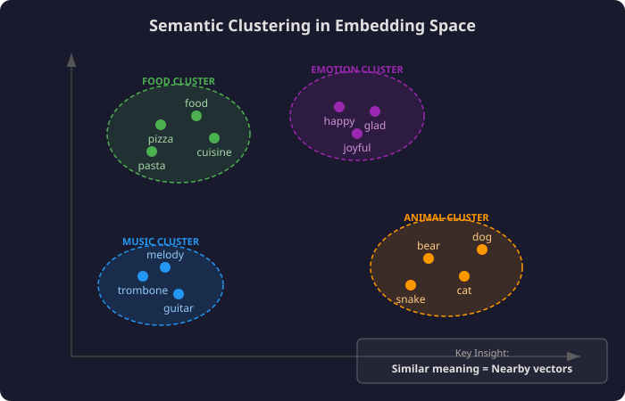
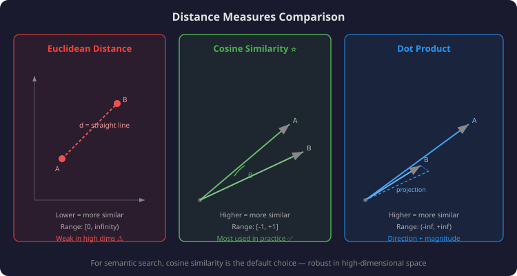

# Lesson 06: Semantic Search — Embeddings & Vector Similarity

## 📌 Overview

Semantic search matches documents to queries based on **shared meaning**, not shared keywords. It solves keyword search's biggest weakness: the **lexical gap** (synonyms like "happy"/"glad" get matched; polysemy like "Python" language vs. snake gets disambiguated). The core technology: **embedding models** that map text → vectors in high-dimensional space where similar meanings = nearby points.

---

## 🎯 Key Concepts

### 1. High-Level Pipeline (Same Shape as Keyword Search)

| Step | Keyword Search | Semantic Search |
|------|---------------|-----------------|
| 1. Vectorize documents | Count word frequencies | Run through **embedding model** |
| 2. Vectorize query | Count word frequencies | Run through **embedding model** |
| 3. Compare vectors | TF-IDF/BM25 scoring | Distance/similarity metric |
| 4. Rank & return | Sort by score | Sort by closeness |

> 💡 **Key insight:** The pipeline is identical — the only difference is *how* vectors are created.

---

### 2. Embedding Models — The Magic

An embedding model maps any piece of text → a **fixed-size vector** (coordinates in high-dimensional space).

**Critical property:** Semantically similar inputs → nearby vectors.



**Why high dimensions?**

| Dimensions | Capacity | Reality |
|-----------|----------|---------|
| 2D | Can't capture complex relationships | Toy examples only |
| 3D | Slightly better | Still too limited |
| 100–1000+ | Rich clustering of nuanced concepts | What real models use |

> Jitna zyada dimensions, utna zyada room for nuance — like having more shelves to organize books 📚

**Input types:** Embedding models exist for words, sentences, paragraphs, and full documents. Output is always a single vector.

---

### 3. Distance Measures

Three ways to quantify "how close" two vectors are:



#### a) Euclidean Distance

$$d(\vec{a}, \vec{b}) = \sqrt{\sum_{i=1}^{n}(a_i - b_i)^2}$$

- Straight-line distance (Pythagorean theorem scaled up)
- **Lower = more similar**
- Problem in high dimensions: all points tend to be far apart → loses discriminating power

#### b) Cosine Similarity (Most Common)

$$\cos(\theta) = \frac{\vec{a} \cdot \vec{b}}{|\vec{a}| \cdot |\vec{b}|}$$

- Measures **direction** similarity, ignores magnitude
- Range: **−1** (opposite) to **+1** (identical direction)
- **Higher = more similar**
- Robust in high dimensions ✅

#### c) Dot Product

$$\vec{a} \cdot \vec{b} = \sum_{i=1}^{n} a_i \cdot b_i$$

- Measures projection of one vector onto another
- Sensitive to both direction AND magnitude
- Range: $(-\infty, +\infty)$
- **Higher = more similar**

| Metric | Range | Higher means... | Best for |
|--------|-------|----------------|----------|
| Euclidean | $[0, \infty)$ | Less similar | Low-dim, normalized vectors |
| Cosine | $[-1, 1]$ | More similar | Most use cases ✅ |
| Dot Product | $(-\infty, \infty)$ | More similar | When magnitude matters |

---

### 4. Semantic Search Pipeline (Step by Step)

```
┌─────────────────────────────────────────────────┐
│  INDEXING (one-time)                            │
│                                                 │
│  Doc₁ ──→ Embedding Model ──→ vec₁  ┐          │
│  Doc₂ ──→ Embedding Model ──→ vec₂  ├→ Store   │
│  Doc₃ ──→ Embedding Model ──→ vec₃  ┘          │
└─────────────────────────────────────────────────┘

┌─────────────────────────────────────────────────┐
│  QUERY TIME                                     │
│                                                 │
│  Query ──→ Embedding Model ──→ vec_q            │
│                                                 │
│  Compare vec_q with [vec₁, vec₂, vec₃]         │
│  using cosine similarity                        │
│                                                 │
│  Rank by similarity → Return top-k docs         │
└─────────────────────────────────────────────────┘
```

**Why it works:** The embedding model is trained so that semantically related content occupies nearby regions. So "closest vectors" = "most relevant documents."

---

### 5. Keyword vs Semantic — When Each Wins

| Scenario | Keyword Search | Semantic Search |
|----------|:-------------:|:--------------:|
| Query "happy", doc has "glad" | ❌ Miss | ✅ Match |
| Query "Python language", doc about snakes | ❌ False match | ✅ Correct separation |
| Query exact product ID "SKU-4829" | ✅ Exact match | ❌ May miss |
| Query "bank" (financial vs. river) | ❌ Confused | ✅ Context-aware |
| Novel/rare technical terms | ✅ If exact word present | ❌ May not know term |

> This is exactly why **hybrid search** (lesson 08) combines both! 🎯

---

## 📊 Visual Summary

```
                    SEMANTIC SEARCH
                    
    Text ──→ Embedding Model ──→ Vector (coordinates in space)
    
    Key Properties:
    ┌────────────────────────────────────────┐
    │  Similar meaning  →  Nearby vectors    │
    │  Different meaning → Distant vectors   │
    │  Relevance = vector closeness          │
    └────────────────────────────────────────┘
    
    Distance Metrics:
    ┌────────────────────────────────────────┐
    │  Cosine Similarity  →  Direction only  │  ← Most used
    │  Dot Product        →  Direction + Mag │
    │  Euclidean          →  Straight line   │
    └────────────────────────────────────────┘
```

---

## 🧠 Key Takeaways

1. **Same pipeline, different vectors** — semantic search swaps word counts for embedding model outputs
2. **Embedding = coordinates** — each text gets a location in high-dimensional space
3. **Similar meaning = nearby** — the embedding model's training ensures this property
4. **Cosine similarity wins** — direction-based, robust in high dimensions, range [-1, 1]
5. **Not perfect alone** — misses exact matches; that's why hybrid search exists

---

## 🃏 Flashcards

### Card 01: Semantic vs Keyword — Core Difference
**Q:** What's the fundamental difference between semantic search and keyword search?
**A:** Both map text to vectors and compare them. The difference is *how* vectors are created: keyword search counts word occurrences; semantic search runs text through an **embedding model** that captures meaning. Result: semantic search matches by meaning, not exact words.

### Card 02: Embedding Model Property
**Q:** What's the critical property of an embedding model that makes semantic search work?
**A:** **Semantically similar inputs are mapped to nearby locations in vector space.** "Happy" and "glad" get nearby vectors; "happy" and "trombone" get distant vectors. Proximity = semantic relatedness.

### Card 03: Why High Dimensions?
**Q:** Why do embedding models use 100–1000+ dimensional vectors instead of 2D or 3D?
**A:** Complex semantic relationships can't be captured in few dimensions. High-dimensional space provides enough "room" for nuanced clusters — synonyms group together while polysemous words separate based on context. More dimensions = more expressive power.

### Card 04: Cosine vs Euclidean
**Q:** Why is cosine similarity preferred over Euclidean distance for semantic search?
**A:** In high-dimensional space, all points tend to be far apart (curse of dimensionality), making Euclidean distance lose discriminating power. Cosine similarity measures **direction** regardless of magnitude, remaining effective in high dimensions. Range: [-1, +1], higher = more similar.

### Card 05: Dot Product Interpretation
**Q:** What does the dot product measure geometrically, and when might you prefer it?
**A:** It measures the length of the **projection** of one vector onto another. Unlike cosine similarity, it's sensitive to both direction AND magnitude. Prefer it when vector magnitude carries meaningful information (e.g., document importance/length encoded in vector norm).

### Card 06: Semantic Search Weakness
**Q:** When does semantic search fail compared to keyword search?
**A:** Exact/rare terms (product IDs like "SKU-4829"), novel technical jargon not seen during training, or when the user literally wants documents containing specific keywords. The embedding model may not represent unseen terms well.

### Card 07: Pipeline Steps
**Q:** Describe the semantic search pipeline in 4 steps.
**A:** 1) **Index:** Embed all documents → store vectors. 2) **Query:** Embed the user's prompt → get query vector. 3) **Compare:** Measure distance (cosine similarity) between query vector and all document vectors. 4) **Rank:** Return top-k documents with highest similarity scores.

### Card 08: Synonyms and Polysemy
**Q:** How does semantic search handle synonyms ("happy"/"glad") and polysemy ("Python" language vs snake)?
**A:** Embedding models are trained on context, so synonyms get nearby vectors (both express positive emotion). For polysemy, context determines the embedding — "Python programming" maps near code concepts, "Python snake" maps near animals. Keyword search fails both cases.

---

## 🔗 Related Topics
- **05-keyword-search-bm25.md** — Previous: BM25 (what semantic search complements)
- **07-embedding-model-deepdive.md** — Next: How embedding models are trained (contrastive learning)
- **08-hybrid-search.md** — Combining keyword + semantic for best of both

---

**Status:** 🟢 Complete | **Last Revised:** 2026-05-02 | **Confidence:** 🟢 Solid
