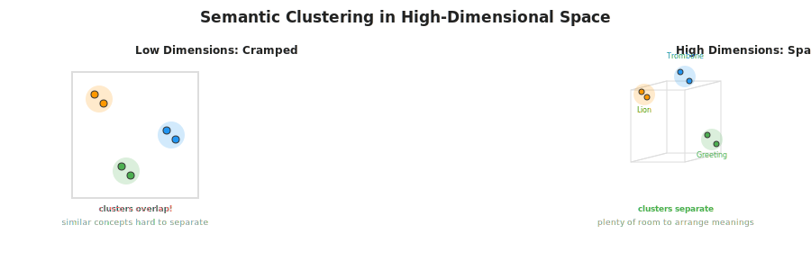

# Lesson 07: Semantic Search — Embedding Model Deep Dive

## 📌 Overview

Embedding models transform text into **dense numerical vectors** that capture semantic meaning. Their job is deceptively simple: place similar text close together in vector space and dissimilar text far apart. Yet achieving this requires sophisticated learning from massive labeled datasets using **contrastive training** — a technique that learns meaning by contrasting positive and negative examples.

---

## 🎯 Core Concepts

### 1. The Embedding Model's Objective

**Two Core Principles:**
1. **Positive Pairs:** Similar text embeds to vectors that are **close together**
   - Example: "good morning" ↔ "hello" (should be nearby in vector space)
2. **Negative Pairs:** Dissimilar text embeds to vectors that are **far apart**
   - Example: "good morning" ↔ "that's a noisy trombone" (should be distant in vector space)

---

### 2. Contrastive Training: How Embedding Models Learn

Embedding models are trained using **contrastive learning**, which works by contrasting positive and negative pairs:

#### Phase 1: Initialize with Random Vectors
- At the start, embedding models assign each piece of text a **random vector**
- These vectors have NO relationship to text meaning
- Using an untrained model produces gibberish results

#### Phase 2: Evaluate Performance Using Contrastive Pairs
- For each text, the model checks: "How close are my positive pairs? How far are my negative pairs?"
- The model calculates a **contrastive loss** that measures how well positive pairs cluster and negative pairs separate

#### Phase 3: Iteratively Update Parameters
- Based on the loss, the model adjusts its internal parameters
- **Goal:** Move positive pairs closer together, push negative pairs further apart
- This process repeats many times (thousands of iterations)

#### Phase 4: Semantic Clusters Emerge
- After many training rounds, similar texts naturally cluster together
- Dissimilar texts stay far apart
- The vector space encodes semantic relationships

---

### 3. Single Anchor Point Evolution

To understand the training process, imagine one "anchor" text and how it interacts with positive and negative examples:

**Anchor Text:** "he could smell the roses"
- **Positive Example:** "a field of fragrant flowers" ← should move close
- **Negative Example:** "a lion roared majestically" ← should move far

---

### 4. High-Dimensional Vector Space: Why It Matters

When training with **millions of examples**, every vector is being pulled and pushed in many directions simultaneously. This complexity explains why embedding models use **high-dimensional vectors** (hundreds or even thousands of dimensions):

| Dimensionality | Flexibility | Use Case |
|---|---|---|
| **3–10 dimensions** | Low | Easy to visualize, but limited space for nuanced relationships |
| **100–384 dimensions** | High | Standard for lightweight embeddings (e.g., MiniLM) |
| **768–1536 dimensions** | Very High | Standard for state-of-the-art models (e.g., OpenAI, Cohere) |
| **3000+ dimensions** | Extreme | Rare; research or highly specialized domains |

**Key Insight:** High-dimensional spaces provide vastly more "room" for the algorithm to position vectors such that semantically similar clusters form while dissimilar clusters stay separated.

---

## 🔑 Key Principles for Using Embedding Models

### Principle 1: Vectors Capture Meaning Through Training
- Embedding models learn semantic meaning ONLY from contrastive training data
- Similar concepts naturally cluster together in vector space after training
- The spatial location of a cluster is somewhat arbitrary (random initialization differs each training run)

### Principle 2: Same Model, Always
- **ONLY compare vectors generated by the same embedding model**
- Different models trained on:
  - Different training data
  - Different numbers of dimensions
  - Different random initializations
- Comparing vectors from two different models produces **meaningless results**

### Principle 3: Abstract Spatial Meaning
- Before training: locations in vector space have no meaning
- After training: similar semantic concepts cluster together
- But the absolute location "where" a cluster forms is arbitrary
- What matters: **relative distances between vectors** from the same model

### Principle 4: Off-the-Shelf Models Work Well
- In practice, use pre-trained embedding models (not training your own)
- Pre-trained models achieve remarkable performance
- They reliably place similar texts close together
- You typically won't need to implement distance calculations yourself

---

## 📊 From Training to Retrieval

**Training Phase (embedding model developer):**
1. Collect millions of positive/negative text pairs
2. Initialize with random vectors
3. Use contrastive loss to iteratively move positive pairs closer, negative pairs farther
4. After many epochs, release trained model

**Inference Phase (you, building RAG system):**
1. Use pre-trained embedding model to encode corpus documents
2. Use same model to encode user query
3. Calculate distances between query vector and document vectors
4. Rank documents by distance (closest = most similar)

---

## 💡 Flashcards

### Card 01: Embedding Model Objective
**Q:** What is the core job of an embedding model?
**A:** Embed similar text to vectors that are close together in vector space, and dissimilar text to vectors that are far apart. This enables semantic similarity-based retrieval.

### Card 02: Positive vs Negative Pairs
**Q:** What are positive and negative pairs in contrastive training?
**A:** A positive pair consists of two similar texts (e.g., "good morning" and "hello") that should be embedded close together. A negative pair consists of dissimilar texts (e.g., "good morning" and "that's a noisy trombone") that should be embedded far apart.

### Card 03: Contrastive Training Process
**Q:** Describe the four phases of contrastive training at a high level.
**A:** (1) Initialize with random vectors (meaningless). (2) Evaluate how well positive pairs cluster and negative pairs separate using contrastive loss. (3) Update model parameters to move positive pairs closer and negative pairs farther. (4) Repeat until semantic clusters form and meaning emerges.

### Card 04: Random Initialization
**Q:** Why is it acceptable to initialize embedding models with random vectors?
**A:** Random initialization is fine because the training process will iteratively adjust parameters to move similar texts together and dissimilar texts apart. After many training iterations, the randomness disappears and semantic meaning emerges.

### Card 05: Anchor Point Dynamics
**Q:** From one anchor text's perspective, what happens during contrastive training?
**A:** The anchor wants to pull its positive examples as close as possible and push its negative examples as far as possible. Every vector simultaneously experiences multiple pull/push forces from different positive/negative relationships, iteratively moving toward optimal positions.

### Card 06: High-Dimensional Space Necessity
**Q:** Why do embedding models use high-dimensional vectors (100s–1000s of dimensions)?
**A:** High-dimensional spaces provide more "room" for the algorithm to position vectors such that millions of positive pairs cluster together and negative pairs separate, without overlap. Lower dimensions lead to crowding and conflicts.

### Card 07: Vector Space Clusters
**Q:** What does a semantic cluster represent in vector space after training?
**A:** A cluster is a region where similar concepts naturally aggregate—e.g., a "lion cluster" containing related words, and a "trombone cluster" for music. Similar concepts cluster together, dissimilar ones remain distant.

### Card 08: Arbitrary Cluster Locations
**Q:** If you train the same embedding model twice with different random initializations, will clusters appear in the same location in vector space?
**A:** No. The same semantic clusters will form (e.g., lions together, trombones together), but they'll be at different locations in vector space. The relative distances matter, not absolute positions.

### Card 09: Cross-Model Incompatibility
**Q:** Can you compare or combine vectors from two different embedding models?
**A:** No. Different models trained on different data, with different dimensions, and different random seeds produce incomparable vectors. Mixing vectors from different models produces meaningless results.

### Card 10: Pre-trained Model Usage
**Q:** Why do you use pre-trained embedding models rather than training your own?
**A:** Pre-trained models are already optimized on large datasets and work remarkably well. You avoid the cost and complexity of collecting millions of training pairs and training from scratch. Understanding how they work helps you use them better.

---

## 🔗 Related Topics
- **06-semantic-search-introduction.md** — Conceptual overview of semantic search
- **05-keyword-search-bm25.md** — Keyword search foundation (contrast with semantic)
- **08-vector-embeddings-in-rag.md** — Next: Applying embeddings in RAG pipelines
- **09-hybrid-search.md** — Combining keyword + semantic search

---

**Status:** 🟢 Complete | **Last Revised:** 2026-04-24 | **Confidence:** 🟢 Solid
