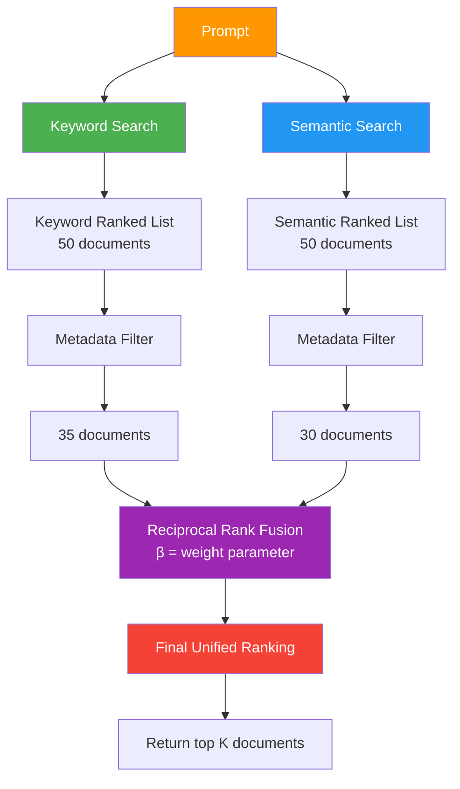

# 08 — Hybrid Search

## What Is Hybrid Search?

**Hybrid search combines multiple retrieval techniques to leverage their complementary strengths:**

| Technique | Scores By | Strength | Weakness |
|-----------|-----------|----------|----------|
| **Metadata Filtering** | Rigid yes/no criteria (author, date, access) | Fast, strict control layer | Can't rank by relevance — just filters |
| **Keyword Search** (BM25) | Exact word matches in prompt | Fast, excels at technical terms / product names | Misses similar meanings with different words |
| **Semantic Search** (Embeddings) | Meaning similarity (vector distance) | Flexible, captures intent & synonyms | Slower, computationally expensive |

> 💡 **Teen tarike ki search, ek se kaam — exact match, fuzzy meaning, aur strict gate! Combine karo toh best of all worlds milta hai. 🎯**

---

## Hybrid Search Pipeline



### Step-by-Step Execution

| Step | What Happens | Why |
|------|--------------|-----|
| 1️⃣ **Parallel Search** | Both keyword (BM25) and semantic (embeddings) search run simultaneously | Each returns ~50 ranked documents |
| 2️⃣ **Metadata Filtering** | Each list filtered independently using metadata criteria (e.g., "remove docs not relevant to user's role") | Strict yes/no gate — keyword list → 35 docs, semantic list → 30 docs |
| 3️⃣ **Rank Fusion** | Both filtered lists combined using **Reciprocal Rank Fusion (RRF)** | Single unified ranking from two separate rankings |
| 4️⃣ **Top K Selection** | Return the top K documents (e.g., K=10) from final ranking | This is what the LLM receives as context |

> 💡 **Do rankings milti hain, dono ka best merge karna hai — RRF formula se! Think of it like combining two examiners' marks into one final grade. 🎓**

---

## Reciprocal Rank Fusion (RRF)

**Formula:**

$$
\text{RRF Score} = \sum_{\text{rankings}} \frac{1}{k + \text{rank}}
$$

### How It Works

**Documents earn points based on their rank in EACH list:**

| Rank | Points (k=0) | Points (k=50) |
|------|-------------|---------------|
| 1st  | 1/1 = **1.00** | 1/51 = **0.0196** |
| 2nd  | 1/2 = **0.50** | 1/52 = **0.0192** |
| 10th | 1/10 = **0.10** | 1/60 = **0.0167** |

**Example:** A document ranked **2nd in keyword search** and **10th in semantic search**:

```
Score (k=0)  = 1/2 + 1/10 = 0.5 + 0.1 = 0.6
Score (k=50) = 1/52 + 1/60 = 0.0192 + 0.0167 = 0.0359
```

Documents are re-ranked by their **total RRF score** across both lists.

> 💡 **Har list mein position ke points milte hain — 1st place = 1 point, 2nd = 0.5, 10th = 0.1 (when k=0). Dono lists ke points add karo = final score! 🧮**

### The Role of `k` — Controlling Top-Rank Dominance

| k Value | Effect | 1st vs 10th Difference | When to Use |
|---------|--------|------------------------|-------------|
| **k = 0** | Top rank dominates | **10× difference** (1.0 vs 0.1) | When a single #1 ranking should strongly boost a document |
| **k = 50** | Balanced influence | **1.2× difference** (0.0196 vs 0.0167) | When you want both rankings to matter equally, not just whoever topped one list |

**Key insight:** RRF **only uses rank position**, NOT the original scores. Even if the top document scored 0.95 and second scored 0.94 (very close), RRF only sees "1st vs 2nd" — the closeness is ignored.

> 💡 **k badhao toh #1 rank ka jaadu kam ho jata hai — otherwise ek list mein top hona = instant winner! k=50 se balance milta hai. ⚖️**

---

## Beta (β) — Weighting Keyword vs Semantic

**Beta controls how much weight each ranking contributes:**

| β Value | Semantic Weight | Keyword Weight | Use When |
|---------|----------------|----------------|----------|
| **β = 0.8** | 80% | 20% | Meaning & synonyms matter more than exact words |
| **β = 0.7** | 70% | 30% | **Good default balance** — most common starting point |
| **β = 0.5** | 50% | 50% | Equal importance |
| **β = 0.3** | 30% | 70% | Exact keyword matching is critical (e.g., product codes, technical jargon, API names) |

**Examples:**

- **Technical documentation search (β = 0.3):** User searches for "OAuth 2.0" → exact term match matters more than semantic similarity
- **Customer support chat (β = 0.7):** User asks "how do I reset my password?" → many ways to phrase the same question, semantic search helps

> 💡 **Beta = tuning knob 🎛️ — exact keywords matter? Beta kam karo (0.3). Fuzzy meaning matters? Beta badha do (0.7-0.8). Most apps: 70-30 split works well!**

---

## Why Hybrid Search?

### Playing to Each Technique's Strengths

| Scenario | Best Technique | Why |
|----------|---------------|-----|
| Search for "API rate limit error 429" | **Keyword (BM25)** | Technical terms, error codes — exact match critical |
| Search for "how to speed up my app" | **Semantic (embeddings)** | Many ways to phrase "performance optimization" |
| Search limited to "documents from Finance team" | **Metadata filtering** | Strict access control — yes/no gate |
| General search across mixed queries | **Hybrid** | Handles both exact match AND fuzzy meaning |

### Tunable System

Hybrid search exposes multiple tuning knobs:

| Parameter | What It Controls | Default Starting Point |
|-----------|------------------|------------------------|
| **k (RRF)** | Top-rank dominance | k=50 (balanced) |
| **β (beta)** | Keyword vs semantic weight | β=0.7 (70% semantic, 30% keyword) |
| **k₁, b (BM25)** | Term saturation & doc length | k₁=1.5, b=0.75 |
| **Metadata rules** | Which fields to filter on | Domain-specific (author, date, access) |

This lets you **adapt the retriever to your specific use case and data**.

> 💡 **Sab settings tune kar sakte ho — your retriever, your rules! Start with defaults (k=50, β=0.7), phir dekho kya best hai for your data. 🔧**

---

## Workflow Summary

```ascii
┌─────────────────────────────────────────────────────────────┐
│                        PROMPT                                │
└─────────────────────────────────────────────────────────────┘
                          ▼
          ┌───────────────┴───────────────┐
          ▼                               ▼
   ┌─────────────┐                 ┌─────────────┐
   │  Keyword    │                 │  Semantic   │
   │  Search     │                 │  Search     │
   │  (BM25)     │                 │ (Embedding) │
   └─────────────┘                 └─────────────┘
          │                               │
          │ 50 docs                       │ 50 docs
          ▼                               ▼
   ┌─────────────┐                 ┌─────────────┐
   │  Metadata   │                 │  Metadata   │
   │  Filter     │                 │  Filter     │
   └─────────────┘                 └─────────────┘
          │                               │
          │ 35 docs                       │ 30 docs
          └───────────────┬───────────────┘
                          ▼
                ┌──────────────────┐
                │ Reciprocal Rank  │
                │    Fusion        │
                │  (k=50, β=0.7)   │
                └──────────────────┘
                          ▼
                ┌──────────────────┐
                │  Final Ranking   │
                └──────────────────┘
                          ▼
                ┌──────────────────┐
                │   Return top K   │
                │   (e.g., K=10)   │
                └──────────────────┘
```

---

## Key Takeaways

| Concept | Summary |
|---------|---------|
| **Hybrid Search** | Combines keyword (BM25), semantic (embeddings), and metadata filtering into one retrieval pipeline |
| **Strengths** | Keyword = exact match, Semantic = fuzzy meaning, Metadata = strict gate |
| **RRF** | Merges two ranked lists by scoring documents based on their rank position (not original scores) |
| **k parameter** | Controls top-rank dominance — k=0 → #1 dominates, k=50 → balanced |
| **β parameter** | Weights keyword vs semantic — β=0.7 (70-30 split) is a good default |
| **Tunable** | Multiple knobs to adapt to your data: k, β, BM25 (k₁, b), metadata rules |
| **Use case** | When your queries mix technical keywords AND fuzzy natural language — most real-world RAG systems |

> 💡 **Hybrid search = best of all worlds 🌍 — exact keywords milenge, fuzzy meanings bhi milenge, aur strict access control bhi. Production retriever ka default choice! 🚀**
