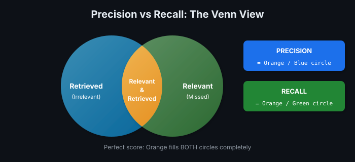
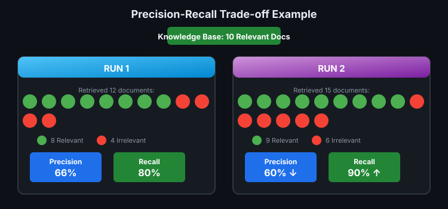
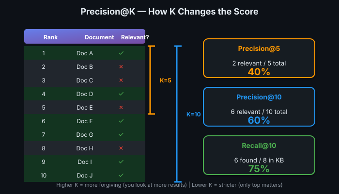
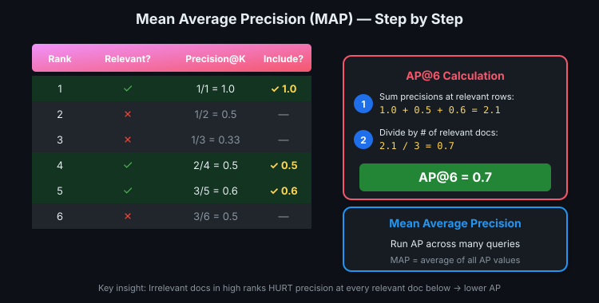
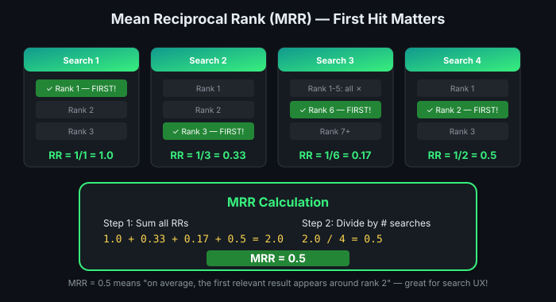

# 10 — Evaluating Retrieval: Quality Metrics

> Retriever bana liya — ab pata kaise chalega ki kaam kar raha hai? 📊

---

## The Evaluation Setup

Before measuring anything, you need **three ingredients**:

| Ingredient | What It Is | Example |
|------------|-----------|---------|
| **Query** | The prompt/search input | "What are the side effects of aspirin?" |
| **Retrieved List** | Ranked documents your retriever returns | Doc A (rank 1), Doc B (rank 2), ... |
| **Ground Truth** | All relevant documents in your KB (hand-labeled) | Docs A, C, F, G, J (5 total relevant) |

> 💡 Agar answer key nahi hai, toh marks kaise doge? Ground truth = answer key.

---

## The Two Foundational Metrics



### Precision — "How trustworthy are my results?"

$$\text{Precision} = \frac{\text{Relevant Retrieved}}{\text{Total Retrieved}}$$

**Penalizes:** Returning irrelevant junk  
**Question it answers:** "Of everything I got back, how much is actually useful?"

### Recall — "How comprehensive am I?"

$$\text{Recall} = \frac{\text{Relevant Retrieved}}{\text{Total Relevant in KB}}$$

**Penalizes:** Missing relevant documents  
**Question it answers:** "Of all the good stuff out there, how much did I find?"

---

## Worked Example: Precision vs Recall Trade-off



| Run | Retrieved | Relevant Found | Precision | Recall |
|-----|-----------|----------------|-----------|--------|
| **Run 1** | 12 docs | 8 relevant | 8/12 = **66%** | 8/10 = **80%** |
| **Run 2** | 15 docs | 9 relevant | 9/15 = **60%** | 9/10 = **90%** |

**Interpretation:** Run 2 traded 6% precision for 10% more recall — returned 3 more docs total, but only 1 more was relevant.

> 💡 Perfect score = find ALL relevant docs AND return ONLY those. Otherwise, it's always a balancing act. ⚖️

---

## Precision@K and Recall@K

Metrics depend on how many documents you look at. **@K** means "looking at top K ranked results only."



### Worked Example

| Rank | Relevant? | Precision@K | Running Recall (if 8 total relevant) |
|------|-----------|-------------|--------------------------------------|
| 1 | ✅ | 1/1 = 100% | 1/8 = 12.5% |
| 2 | ❌ | 1/2 = 50% | 1/8 = 12.5% |
| 3 | ❌ | 1/3 = 33% | 1/8 = 12.5% |
| 4 | ✅ | 2/4 = 50% | 2/8 = 25% |
| 5 | ❌ | 2/5 = 40% | 2/8 = 25% |
| 6 | ✅ | 3/6 = 50% | 3/8 = 37.5% |
| 7 | ✅ | 4/7 = 57% | 4/8 = 50% |
| 8 | ❌ | 4/8 = 50% | 4/8 = 50% |
| 9 | ✅ | 5/9 = 56% | 5/8 = 62.5% |
| 10 | ✅ | 6/10 = **60%** | 6/8 = **75%** |

**Precision@5** = 40% (2 of top 5 relevant)  
**Precision@10** = 60% (6 of top 10 relevant)  
**Recall@10** = 75% (found 6 of 8 total relevant)

### Which K to Use?

| Scenario | Typical K | Why |
|----------|-----------|-----|
| Strict evaluation | @1, @3, @5 | "Did we nail the very top results?" |
| General evaluation | @5 to @15 | More forgiving, practical for RAG |
| Comprehensive check | @20+ | When recall matters more than precision |

---

## Mean Average Precision (MAP@K)

MAP captures **both** coverage AND ranking quality. It rewards putting relevant documents at the TOP.

### Step 1: Calculate Average Precision (AP)



| Rank | Relevant? | Precision@K |
|------|-----------|-------------|
| 1 | ✅ | 1/1 = **1.0** |
| 2 | ❌ | 1/2 = 0.5 |
| 3 | ❌ | 1/3 = 0.33 |
| 4 | ✅ | 2/4 = **0.5** |
| 5 | ✅ | 3/5 = **0.6** |
| 6 | ❌ | 3/6 = 0.5 |

**AP@6 Calculation:**
1. **Sum precisions only at relevant rows:** 1.0 + 0.5 + 0.6 = 2.1
2. **Divide by relevant count:** 2.1 / 3 = **0.7**

### Step 2: MAP = Average of APs

Run AP across many queries, then average them → **Mean** Average Precision.

### Why MAP Rewards Good Ranking

If an irrelevant doc sneaks into a high rank, it **tanks the precision** at every relevant doc below it → lower AP → lower MAP.

> 💡 High MAP = "relevant stuff is at the top, not buried in page 2."

---

## Mean Reciprocal Rank (MRR)

MRR measures: **"How quickly do I find the FIRST relevant result?"**

$$\text{Reciprocal Rank} = \frac{1}{\text{Rank of First Relevant Doc}}$$

| First Relevant At | Reciprocal Rank |
|-------------------|-----------------|
| Rank 1 | 1/1 = **1.0** |
| Rank 2 | 1/2 = **0.5** |
| Rank 4 | 1/4 = **0.25** |
| Rank 10 | 1/10 = **0.1** |

### MRR Worked Example



| Search | First Relevant At | Reciprocal Rank |
|--------|-------------------|-----------------|
| Query 1 | Rank 1 | 1/1 = 1.0 |
| Query 2 | Rank 3 | 1/3 = 0.33 |
| Query 3 | Rank 6 | 1/6 = 0.17 |
| Query 4 | Rank 2 | 1/2 = 0.5 |

**MRR = (1.0 + 0.33 + 0.17 + 0.5) / 4 = 2.0 / 4 = 0.5**

> 💡 MRR = "on average, the first good result shows up around rank 2." Great for search UX!

---

## Metric Summary: When to Use What

| Metric | Measures | Use When |
|--------|----------|----------|
| **Recall@K** | Finding all relevant docs | Most cited. Core goal of any retriever. |
| **Precision@K** | Avoiding irrelevant noise | When you want clean, trustworthy results |
| **MAP@K** | Ranking quality + coverage | Holistic quality score. Good for comparing systems. |
| **MRR** | Speed to first relevant result | UX matters. "Did they find SOMETHING useful fast?" |

### Decision Tree

```
What do I care about?
│
├─ "Did I find everything?" → Recall@K
│
├─ "Are results trustworthy?" → Precision@K
│
├─ "Overall ranking quality?" → MAP@K
│
└─ "First-result UX?" → MRR
```

---

## Practical Application

These metrics help you:

1. **Evaluate baseline retriever** — How good is the current system?
2. **Compare approaches** — Does hybrid beat keyword-only?
3. **Tune parameters** — Adjust β in hybrid search, check if recall improves
4. **Monitor production** — Alert if recall drops below threshold

### The Catch

All metrics require **ground truth** — hand-labeled relevant documents for sample queries. This is expensive to create but essential for principled evaluation.

---

## Quick Reference Card

| Metric | Formula | Rewards | Punishes |
|--------|---------|---------|----------|
| Precision | relevant_found / total_returned | Clean results | Returning junk |
| Recall | relevant_found / total_relevant | Completeness | Missing good docs |
| MAP | avg(precision @ each relevant doc) | Good ranking | Relevant docs buried |
| MRR | 1 / rank_of_first_relevant | Fast first hit | First relevant doc far down |

---

## 🔗 Connections
- → Uses: [Hybrid Search](08-hybrid-search.md) (tune β, measure improvement)
- → Applies to: Every retriever evaluation task
- ← Foundation: Understanding what makes a "good" retriever
