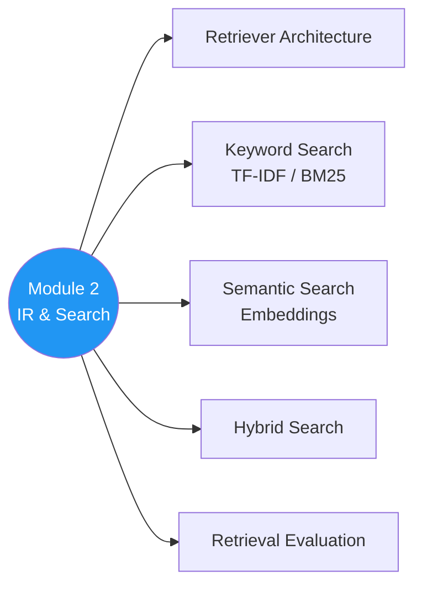

# 🔎 Module 2 — Information Retrieval & Search Foundations

> Search ka science — TF-IDF se lekar embeddings tak, sab yahan! 📊

---

## 🧠 Brain — Module Overview

## 📊 Progress

| # | Lesson | Confidence | Revised |
|---|--------|-----------|---------|
| 01 | [Module 2 Introduction](01-module-introduction.md) | 🔴 | — |
| 02 | [Retriever Architecture Overview](02-retriever-architecture.md) | 🔴 | — |
| 03 | [Metadata Filtering](03-metadata-filtering.md) | 🔴 | — |
| 04 | [Keyword Search: TF-IDF](04-keyword-search-tfidf.md) | 🔴 | — |
| 05 | [Keyword Search: BM25](05-keyword-search-bm25.md) | 🔴 | — |
| 06 | [Semantic Search: Introduction](06-semantic-search-intro.md) | 🔴 | — |
| 07 | [Semantic Search: Embedding Deep Dive](07-embedding-model-deepdive.md) | 🔴 | — |
| 08 | [Vector Embeddings in RAG](08-vector-embeddings-in-rag.md) | 🔴 | — |
| 09 | [Hybrid Search](09-hybrid-search.md) | 🔴 | — |
| 10 | [Evaluating Retrieval](10-evaluating-retrieval.md) | 🔴 | — |
| 11 | [Retrieval Metrics](11-retrieval-metrics.md) | 🔴 | — |
| 12 | [Lab: Implementing Retriever Functions](12-lab-retriever-functions.md) | 🔴 | — |

**Overall confidence:** 🔴 Not started

## 🧩 Memory Fragments
> - _Add fragments as you learn..._

---

## 🎬 Teach Mode

| # | Lesson | What You'll Get |
|---|--------|-----------------|
| 01 | Module 2 Introduction | Module roadmap |
| 02 | Retriever Architecture | How the retriever component works |
| 03 | Metadata Filtering | Pre-filtering documents by metadata |
| 04 | TF-IDF | Classic keyword search algorithm |
| 05 | BM25 | Improved keyword ranking |
| 06 | Semantic Search Intro | Beyond keywords — meaning-based search |
| 07 | Embedding Deep Dive | How embedding models work under the hood |
| 08 | Vector Embeddings | Using embeddings in RAG pipelines |
| 09 | Hybrid Search | Combining keyword + semantic |
| 10 | Evaluating Retrieval | How to measure retriever quality |
| 11 | Retrieval Metrics | Precision, recall, MRR, etc. |
| 12 | Lab: Retriever Functions | Hands-on implementation |

**Supporting:** [Flashcards](flashcards.md)

---

## 📚 Source
> 🎓 [RAG Course — Module 2](https://learn.deeplearning.ai/courses/retrieval-augmented-generation) — DeepLearning.AI

## 🔗 Connected Topics
> ← [Module 1: RAG Overview](../module-1-rag-overview/) · → [Module 3: Vector Databases](../module-3-ir-vector-databases/)
