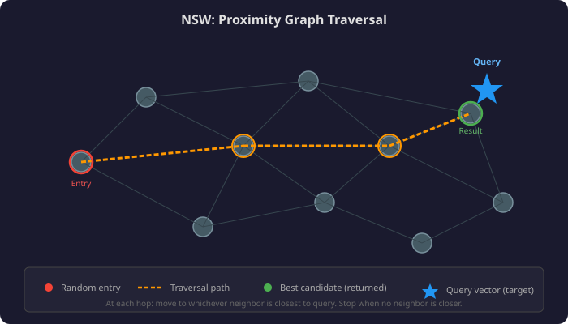

# Lesson 02: Approximate Nearest Neighbors — KNN → NSW → HNSW

## 📌 Overview

Exact k-nearest neighbor (KNN) search scales **linearly** — 1B docs = 1B distance calculations per query. Production vector search uses **Approximate Nearest Neighbor (ANN)** algorithms that trade a tiny accuracy loss for logarithmic speed. The gold standard: **HNSW (Hierarchical Navigable Small World)** — a layered proximity graph enabling billion-scale vector search in milliseconds.

---

## 🎯 Key Concepts

### 1. The KNN Scaling Problem

**KNN algorithm:**
1. Embed all documents + query → vectors
2. Calculate distance from query to **every** document vector
3. Sort by distance → return top-k

**Problem:** Linear scaling = unusable at scale

| Knowledge Base Size | Distances to Calculate | Relative Speed |
|--------------------|:---------------------:|:--------------:|
| 1,000 docs | 1,000 | 1× |
| 1,000,000 docs | 1,000,000 | 1,000× slower |
| 1,000,000,000 docs | 1,000,000,000 | 1,000,000× slower |

> KNN is easy to understand, easy to implement... aur scale pe completely useless! 💀

---

### 2. Approximate Nearest Neighbors (ANN) — The Tradeoff

| Property | KNN (Exact) | ANN (Approximate) |
|----------|:-----------:|:-----------------:|
| Guarantees best match? | ✅ Yes | ❌ No (but very close) |
| Speed at scale | 🐢 Linear O(n) | 🚀 ~Logarithmic O(log n) |
| Pre-computation needed? | None | Build data structure (one-time) |
| Production-ready? | ❌ No | ✅ Yes |

**The deal:** Sacrifice guaranteed-optimal results → get 1000×+ speed improvement. In practice, ANN finds results that are *extremely close* to the true nearest neighbors.

---

### 3. Navigable Small World (NSW)

#### Building the Proximity Graph (Pre-computation)

1. Calculate distance between **every pair** of vectors
2. Create one **node** per document
3. Add **edges** connecting each node to its few closest neighbors

Result: A web-like graph where nearby nodes are connected.

#### Searching the Proximity Graph

```
1. Random entry point (any node)
2. Look at neighbors → which is closest to query vector?
3. Move to that neighbor (new candidate)
4. Repeat step 2-3
5. Stop when NO neighbor is closer than current candidate
6. Return current candidate
```



**Key properties:**
- Only compares query to a few neighbors at each step (fast!)
- Greedy: always picks locally best move
- May not find global optimum (can't see entire graph)
- In practice: finds very close results

---

### 4. HNSW — Hierarchical Navigable Small World

HNSW adds **layers** to NSW for faster convergence:

#### Building the Hierarchical Graph

| Layer | Vectors | Purpose |
|-------|:-------:|---------|
| Layer 3 (top) | 10 (random sample) | Big jumps → rough neighborhood |
| Layer 2 (mid) | 100 (random sample) | Medium jumps → closer |
| Layer 1 (bottom) | 1,000 (ALL vectors) | Fine-grained → final answer |

Each layer has its own proximity graph built from its subset of vectors.

#### Search Algorithm

```
┌─────────────────────────────────────────┐
│  Layer 3 (10 vectors)                   │
│  Random entry → greedy search → best₃   │
└─────────────────────┬───────────────────┘
                      ▼ (drop down)
┌─────────────────────────────────────────┐
│  Layer 2 (100 vectors)                  │
│  Start at best₃ → greedy search → best₂│
└─────────────────────┬───────────────────┘
                      ▼ (drop down)
┌─────────────────────────────────────────┐
│  Layer 1 (ALL 1000 vectors)             │
│  Start at best₂ → greedy search → best₁│
└─────────────────────┴───────────────────┘
                      ▼
              Return best₁ (final answer)
```

**Why it's faster:** Upper layers have exponentially fewer vectors → algorithm makes **big jumps** early to get into the right neighborhood. By the time it reaches Layer 1, it's already very close → minimal fine-tuning needed.

---

### 5. Runtime Comparison

| Algorithm | Time Complexity | 1B docs latency | Quality |
|-----------|:--------------:|:---------------:|---------|
| KNN | O(n) | ~seconds-minutes | Perfect (guaranteed best) |
| NSW | O(n^α), α < 1 | ~100s of ms | Very good (approximate) |
| HNSW | **O(log n)** | **~few ms** | Very good (approximate) |

> HNSW: Billions of vectors, milliseconds of latency. Yahi hai production ka jaadu! ⚡

---

## 📊 Visual Summary

```
    KNN                    NSW                     HNSW
    
  Query ──→ Compare      Query ──→ Enter        Query ──→ Layer 3 (big jumps)
  with ALL   graph at          ──→ Layer 2 (medium)
  vectors    random,           ──→ Layer 1 (fine-tune)
             hop to                    
  O(n) 🐢    neighbors         O(log n) 🚀
             until stuck
             
  EXACT      APPROXIMATE       APPROXIMATE
  but slow   and faster        and FASTEST
```

---

## 🧠 Key Takeaways

1. **KNN doesn't scale** — linear complexity makes it useless beyond ~10K docs
2. **ANN trades accuracy for speed** — tiny quality loss, massive speed gain
3. **NSW uses a proximity graph** — greedy traversal from random entry point
4. **HNSW adds hierarchy** — upper layers (fewer nodes) provide big jumps, bottom layer has all vectors
5. **O(log n) at scale** — enables billion-vector search in milliseconds
6. **Pre-computation required** — building the proximity graph is expensive but one-time

---

## 🃏 Flashcards

### Card 01: KNN Scaling Problem
**Q:** Why is exact KNN impractical for production vector search?
**A:** KNN computes distance from query to EVERY document vector — **O(n) linear scaling**. 1B docs = 1B calculations per query. A retriever that works fine with 1K docs becomes 1,000,000× slower with 1B docs.

### Card 02: ANN Tradeoff
**Q:** What tradeoff do Approximate Nearest Neighbor algorithms make?
**A:** They sacrifice the **guarantee of finding the absolute closest vectors** in exchange for dramatically faster search (~logarithmic vs linear). In practice, they still find vectors that are very close to the true nearest neighbors.

### Card 03: NSW — Proximity Graph
**Q:** What is a proximity graph and how is it built?
**A:** A graph where each document is a node, connected by edges to its few closest neighbors. Built by: 1) computing all pairwise distances, 2) creating nodes, 3) connecting each node to its K nearest neighbors. This enables traversal instead of brute-force comparison.

### Card 04: NSW — Search Process
**Q:** How does Navigable Small World search work?
**A:** 1) Pick random entry node. 2) Check which neighbor is closest to query vector. 3) Move to that neighbor (new candidate). 4) Repeat until no neighbor is closer than current position. 5) Return current node. Greedy, local decisions — fast but may miss global optimum.

### Card 05: HNSW — Hierarchy Purpose
**Q:** What does the "Hierarchical" in HNSW add over plain NSW?
**A:** Multiple layers with exponentially fewer vectors at higher layers. Search starts at top (few vectors, big jumps to approximate neighborhood) → drops layer by layer → reaches bottom (all vectors) already near the answer. Result: O(log n) instead of NSW's slower convergence.

### Card 06: HNSW Layer Structure
**Q:** Describe a typical HNSW layer structure for 1000 documents.
**A:** Layer 3 (top): ~10 random vectors → Layer 2: ~100 random vectors → Layer 1 (bottom): ALL 1000 vectors. Each layer has its own proximity graph. Search flows top→bottom, using each layer's best candidate as the starting point for the next layer down.

### Card 07: Pre-computation Cost
**Q:** What must be pre-computed before HNSW can serve queries, and why is this acceptable?
**A:** The hierarchical proximity graph (computing pairwise distances + building edge structure per layer). It's expensive but **one-time** — built offline before any queries arrive. Once built, every search is fast. New documents require incremental updates.

### Card 08: Production Impact
**Q:** What makes HNSW the standard for production vector databases?
**A:** O(log n) search complexity enables **billion-scale vector search in milliseconds**. Combined with high recall (finds very close neighbors despite being approximate), it's the algorithm behind Weaviate, Pinecone, Milvus, pgvector, and most production vector DBs.

---

## 🔗 Related Topics
- **Module 2 / 06-semantic-search-embeddings.md** — Vector similarity (what ANN accelerates)
- **03-vector-databases.md** — Next: Tools that implement HNSW (Weaviate, Pinecone, etc.)
- **Module 2 / 08-hybrid-search.md** — Hybrid pipeline (semantic component uses ANN under the hood)

---

**Status:** 🟢 Complete | **Last Revised:** 2026-05-02 | **Confidence:** 🟢 Solid
