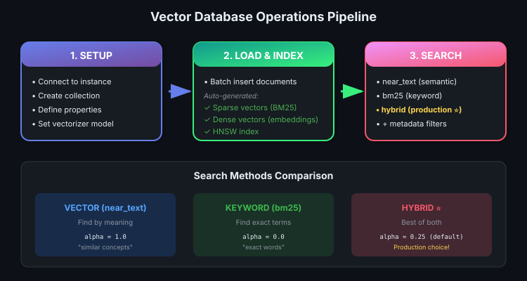

# 03 — Vector Databases: Purpose-Built for Vectors

> Relational DB mein vector search? Haan kar sakte ho... lekin slow AF! 🐢 → 🚀

---

## Why Vector Databases Exist

```
┌──────────────────────────────────────────────────────────────────┐
│                  THE SCALING PROBLEM                             │
├──────────────────────────────────────────────────────────────────┤
│                                                                  │
│   Relational DB + Vectors = KNN-like performance 🐢              │
│   • Computes distance to EVERY vector                            │
│   • Works at 1K docs, dies at 1M docs                            │
│                                                                  │
│   Vector DB = ANN algorithms built-in 🚀                         │
│   • HNSW indexes, optimized distance computation                 │
│   • Scales to millions/billions of vectors                       │
│                                                                  │
└──────────────────────────────────────────────────────────────────┘
```

| Feature | Relational DB | Vector DB |
|---------|---------------|-----------|
| Vector search | Brute-force (slow) | ANN algorithms (fast) |
| Index type | B-tree, hash | HNSW, IVF, PQ |
| Scale | 10K-100K vectors | Millions-Billions |
| Built for | Rows, joins, ACID | High-dimensional similarity |

> 💡 Vector DBs grew popular in early 2020s alongside LLMs and embedding-based techniques.

---

## What Vector Databases Do



### Setup Steps (before searching)

| Step | What Happens | Who Does It |
|------|--------------|-------------|
| 1. Database setup | Create/connect to instance | You |
| 2. Load documents | Insert raw text data | You |
| 3. Create sparse vectors | BM25/inverted index for keywords | VDB (auto) |
| 4. Create dense vectors | Embeddings for semantic search | VDB (via vectorizer) |
| 5. Build HNSW index | Proximity graph for ANN | VDB (auto) |
| 6. **Ready to search!** | — | — |

---

## Weaviate: The Vector DB You'll Use

**Weaviate** = popular open-source vector DB, runs locally or in cloud.

> Other options: Pinecone, Qdrant, Milvus, Chroma, pgvector — all provide similar functionality.

---

## Core Operations

### 1. Create a Collection

```python
# Create collection with schema
client.collections.create(
    name="Article",
    properties=[
        Property(name="title", data_type=DataType.TEXT),
        Property(name="body", data_type=DataType.TEXT),
    ],
    vectorizer_config=Configure.Vectorizer.text2vec_openai()  # embedding model
)
```

| Concept | What It Means |
|---------|--------------|
| **Collection** | Like a table — holds objects of same type |
| **Properties** | Schema fields (title, body, etc.) |
| **Vectorizer** | Which embedding model to use |

---

### 2. Add Data (Batch Insert)

```python
with collection.batch.dynamic() as batch:
    for article in articles:
        batch.add_object(
            properties={
                "title": article["title"],
                "body": article["body"]
            }
        )
        # Automatically: counts errors, handles failures
```

> 💡 `batch.add_object` = insert + error tracking + failure handling. Production-ready.

---

### 3. Vector Search (Semantic)

```python
response = collection.query.near_text(
    query="technology trends",
    limit=3,
    return_metadata=MetadataQuery(distance=True)  # get similarity scores
)
```

- `near_text` → converts query to vector, finds nearest neighbors
- `distance` → how far each result is from query vector (lower = better)

---

### 4. Keyword Search (BM25)

```python
response = collection.query.bm25(
    query="artificial intelligence",
    limit=3
)
```

- Uses auto-created **inverted index**
- Same BM25 algorithm from Module 2

---

### 5. Hybrid Search (Best of Both)

```python
response = collection.query.hybrid(
    query="machine learning applications",
    alpha=0.25,  # 25% vector, 75% keyword
    limit=3
)
```

| Alpha Value | Weighting |
|-------------|-----------|
| `alpha=0.0` | 100% keyword, 0% vector |
| `alpha=0.25` | 25% vector, 75% keyword |
| `alpha=0.5` | 50/50 balanced |
| `alpha=0.75` | 75% vector, 25% keyword |
| `alpha=1.0` | 100% vector, 0% keyword |

> 💡 **Production default:** Most companies use hybrid search — balances semantic similarity with exact keyword matching.

---

### 6. Filtered Search

```python
response = collection.query.hybrid(
    query="AI research",
    alpha=0.5,
    filters=Filter.by_property("category").equal("technology"),
    limit=3
)
```

- Filter by metadata **before** ranking
- Object must match filter to be returned

---

## Complete Workflow

```
┌─────────────┐     ┌─────────────┐     ┌─────────────┐
│  CONFIGURE  │ ──▶ │  LOAD DATA  │ ──▶ │   SEARCH    │
│  DATABASE   │     │  + INDEX    │     │  (hybrid +  │
│             │     │             │     │   filters)  │
└─────────────┘     └─────────────┘     └─────────────┘
      │                   │                   │
      ▼                   ▼                   ▼
   Connect/         Insert docs,         near_text,
   Create           auto-vectorize,      bm25,
   Collection       build HNSW           hybrid + filter
```

---

## Quick Reference

| Operation | Weaviate Method | Use Case |
|-----------|-----------------|----------|
| Semantic search | `query.near_text()` | Find by meaning |
| Keyword search | `query.bm25()` | Find exact terms |
| Hybrid search | `query.hybrid(alpha=X)` | Best of both |
| Add filter | `filters=Filter.by_property()` | Metadata constraints |
| Batch insert | `batch.add_object()` | Load data efficiently |

---

## 🔗 Connections
- ← Uses: [ANN Algorithms](02-ann-algorithms.md) (HNSW under the hood)
- ← Uses: [BM25](../module-2-ir-search-foundations/05-keyword-search-bm25.md) for keyword search
- ← Uses: [Hybrid Search](../module-2-ir-search-foundations/08-hybrid-search.md) concepts
- → Next: Hands-on lab with Weaviate API
