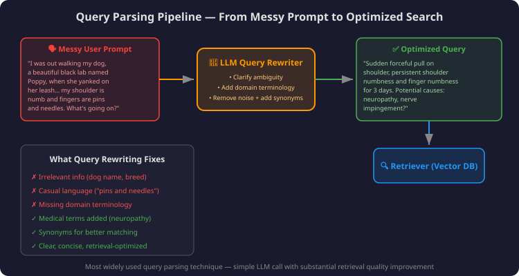
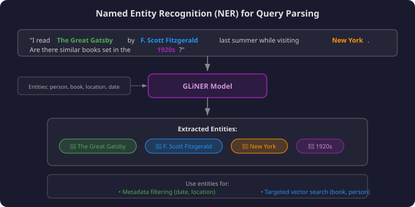
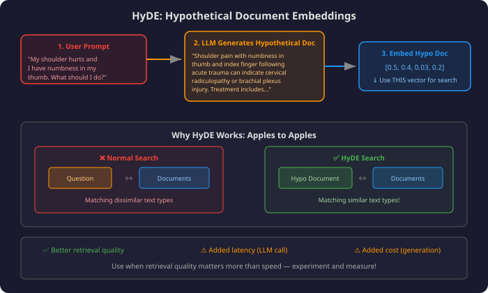

# Lesson 04: Query Parsing — Rewriting, NER & HyDE

## 📌 Overview

Human-written prompts make **terrible search queries** — they're chatty, ambiguous, and lack domain terminology. Production retrievers **parse and transform** queries before searching. Three techniques: **LLM Query Rewriting** (essential, always use), **Named Entity Recognition** (targeted filtering), and **HyDE** (hypothetical document matching for better recall).

---

## 🎯 Key Concepts

### 1. The Problem: Messy Prompts

Users interact with RAG systems conversationally, but retrievers need optimized search queries:

| User Prompt Style | Problem for Retrieval |
|------------------|-----------------------|
| Casual language ("pins and needles") | Won't match medical terminology in docs |
| Irrelevant details (dog name, breed) | Dilutes search signal |
| Missing domain terms | Can't find relevant documents |
| Ambiguous phrasing | Retriever doesn't know true intent |

---

### 2. LLM Query Rewriting (Essential Technique)

**The most widely used and most impactful technique.** Simple: add an LLM call before retrieval.



#### System Prompt Template

```
The following prompt was submitted by a user to query a database of 
{DOMAIN} documents. Rewrite the prompt to optimize it for search by:
- Clarifying ambiguous phrases
- Using {DOMAIN} terminology where applicable
- Adding synonyms that increase matching odds
- Removing unnecessary or distracting information

User prompt: {USER_PROMPT}
```

#### Before vs After

| Aspect | Original | Rewritten |
|--------|----------|-----------|
| **Content** | Walking dog, Poppy yanked leash, shoulder numb, pins and needles | Sudden forceful shoulder pull, persistent numbness, finger tingling |
| **Terminology** | Casual | Medical (neuropathy, nerve impingement) |
| **Noise** | Dog name, breed, 3 days later narrative | Just symptoms + mechanism of injury |
| **Synonyms** | None | Added (neuropathy, nerve impingement) |

> 💡 **Almost every production RAG system uses query rewriting.** Benefits easily justify the cost of one LLM call. Iterate on your rewriter prompt!

---

### 3. Named Entity Recognition (NER)

Identifies **categories of information** in the query → enables targeted filtering and search.



#### How It Works

1. User submits a query
2. NER model (e.g., **GLiNER**) extracts labeled entities
3. Entities inform metadata filtering and/or search refinement

| Entity Type | Example | Use in RAG |
|-------------|---------|-----------|
| 📖 Book | "The Great Gatsby" | Filter to book-related docs |
| 👤 Person | "F. Scott Fitzgerald" | Author metadata filter |
| 📍 Location | "New York" | Geographic metadata filter |
| 📅 Date | "1920s" | Temporal metadata filter |

**GLiNER** = general NER model. You provide text + entity types → it returns labeled entities. Fast and efficient enough to run on every query.

> NER outputs feed directly into **metadata filtering** — converting vague queries into structured search criteria! 🎯

---

### 4. HyDE — Hypothetical Document Embeddings

**Idea:** Instead of matching query→document (apples to oranges), generate a hypothetical "perfect answer" document, embed THAT, and search document→document (apples to apples).



#### Pipeline

```
User prompt → LLM generates hypothetical "ideal answer" document
           → Embed the hypothetical document
           → Use THAT embedding for vector search
           → Find real documents closest to hypothetical
```

#### Why It Works

| Normal Search | HyDE Search |
|:---:|:---:|
| Question vector ↔ Document vectors | Hypothetical Doc vector ↔ Document vectors |
| Apples to oranges 🍎🍊 | Apples to apples 🍎🍎 |
| Cross-type matching (harder) | Same-type matching (easier for embeddings) |

#### Tradeoffs

| ✅ Benefit | ⚠️ Cost |
|-----------|---------|
| Better retrieval quality | Added latency (LLM generation step) |
| More semantically rich search vector | Added cost (LLM call per query) |
| Helps bridge query-document gap | Hypothetical doc may hallucinate |

---

### 5. Decision Framework — Which Technique to Use

| Technique | When to Use | Cost | Impact |
|-----------|-------------|:----:|:------:|
| **Query Rewriting** | **ALWAYS** — default for every RAG system | 1 LLM call | 🟢 High |
| **NER** | When queries contain structured info (names, dates, places) | Fast model inference | 🟡 Medium |
| **HyDE** | When retrieval quality is critical and latency is acceptable | 1 LLM call (generation) | 🟡 Medium |

> Instructor's advice: **Start with query rewriting. Always.** Advanced techniques (NER, HyDE) — experiment and let results decide. Don't over-engineer. 🧪

---

## 📊 Visual Summary

```
                QUERY PARSING TECHNIQUES
                
    ┌─────────────────────────────────────────────┐
    │  1. QUERY REWRITING (always use!)           │
    │     Messy prompt → LLM → Clean query        │
    │     Cost: 1 LLM call | Impact: HIGH         │
    ├─────────────────────────────────────────────┤
    │  2. NAMED ENTITY RECOGNITION (optional)     │
    │     Query → GLiNER → Labeled entities       │
    │     Use: Metadata filtering                 │
    │     Cost: Fast model | Impact: MEDIUM       │
    ├─────────────────────────────────────────────┤
    │  3. HyDE (optional, advanced)               │
    │     Query → LLM → Hypothetical doc → Embed  │
    │     Use: Doc-to-doc matching                │
    │     Cost: 1 LLM call | Impact: MEDIUM       │
    └─────────────────────────────────────────────┘
```

---

## 🧠 Key Takeaways

1. **Human prompts ≠ good search queries** — always parse/transform before retrieval
2. **Query rewriting = #1 priority** — simple LLM call, massive quality improvement, always justify the cost
3. **NER extracts structured info** — feeds metadata filters (dates, names, locations)
4. **HyDE turns questions into answers** — embed hypothetical doc for apples-to-apples matching
5. **Start simple, add complexity only if results improve** — don't over-engineer

---

## 🃏 Flashcards

### Card 01: Why Query Parsing?
**Q:** Why can't you directly use user prompts as search queries in a RAG retriever?
**A:** Users write conversationally — prompts contain irrelevant details, casual language, missing domain terminology, and ambiguity. Retrievers need focused, keyword/semantic-rich queries to find relevant documents. Query parsing bridges this gap.

### Card 02: Query Rewriting
**Q:** What is LLM query rewriting and why is it the #1 recommended technique?
**A:** An LLM rewrites the user's messy prompt into an optimized search query — removing noise, adding domain terminology, clarifying ambiguity, and inserting synonyms. Recommended because: substantial quality improvement, easy to implement (one LLM call), and cost easily justified by better retrieval.

### Card 03: Query Rewriter Prompt Design
**Q:** What instructions should a query rewriter LLM prompt include?
**A:** 1) Clarify ambiguous phrases, 2) Use domain-specific terminology, 3) Add synonyms for better matching, 4) Remove unnecessary/distracting information. Also specify the domain context (medical, legal, etc.) so the LLM uses appropriate vocabulary.

### Card 04: Named Entity Recognition
**Q:** How does NER improve RAG retrieval, and what model is commonly used?
**A:** NER (e.g., **GLiNER**) identifies categorized entities in queries (people, dates, locations, books). These entities feed directly into **metadata filtering** — converting vague text into structured search criteria. Fast enough to run on every query with minimal added latency.

### Card 05: HyDE Concept
**Q:** What is HyDE (Hypothetical Document Embeddings) and why does it work?
**A:** HyDE uses an LLM to generate a hypothetical "perfect answer" document, then embeds THAT document (not the query) for vector search. It works because normally retrievers match questions↔documents (dissimilar types), but HyDE matches documents↔documents (similar types) — easier for embedding models.

### Card 06: HyDE Tradeoffs
**Q:** What are HyDE's benefits and costs?
**A:** ✅ Better retrieval quality (document-to-document matching). ⚠️ Added latency (must generate hypothetical doc before search). ⚠️ Added cost (LLM call per query). ⚠️ Hypothetical doc may contain hallucinations. Use when retrieval quality > speed.

### Card 07: Decision Framework
**Q:** In what order should you adopt query parsing techniques for a production RAG system?
**A:** 1) **Query rewriting — ALWAYS** (default, high impact, low complexity). 2) NER — if queries contain structured info (names/dates/places) that maps to metadata. 3) HyDE — if retrieval quality is critical and latency budget allows. Start simple, measure results, add complexity only when justified.

### Card 08: Apples to Apples Analogy
**Q:** Explain the "apples to apples" vs "apples to oranges" analogy for HyDE.
**A:** Normal retrieval: embed a **question** and compare to **documents** = comparing different text types (apples to oranges). HyDE: embed a **hypothetical document** and compare to **real documents** = comparing same text types (apples to apples). Embedding models are better at measuring similarity within the same text type.

---

## 🔗 Related Topics
- **03-vector-databases.md** — Previous: Where these optimized queries get sent
- **Module 2 / 08-hybrid-search.md** — Hybrid pipeline that receives the parsed query
- **Module 2 / 03-metadata-filtering.md** — NER outputs feed metadata filters
- **05-chunking.md** — Next: How documents are prepared before indexing

---

**Status:** 🟢 Complete | **Last Revised:** 2026-05-03 | **Confidence:** 🟢 Solid
