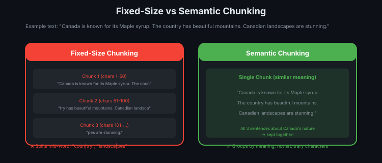
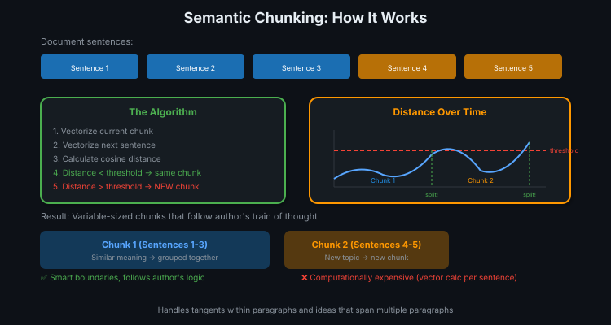
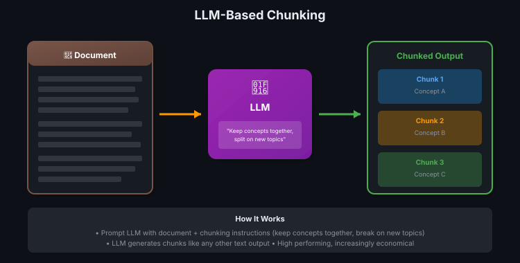
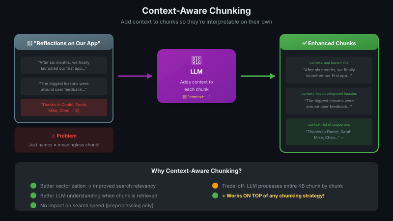

# 07 — Advanced Chunking: Semantic, LLM-Based & Context-Aware

> Fixed-size chunking = simple but dumb. Advanced chunking = follows the author's train of thought! 🧠

---

## The Problem with Basic Chunking

Fixed-size and recursive splitting can break text in ways that **lose context**:

```
Original: "That night she dreamed, as she did often, 
           that she was finally an Olympic champion."

Bad split: "...she dreamed, as she did often, that she was"
           "finally an Olympic champion."

Result: First chunk makes it sound like she's ALREADY a champion!
        Context is lost, meaning is distorted.
```

> 💡 Basic chunking doesn't understand meaning — it just counts characters.

---

## Strategy 1: Semantic Chunking

**Idea:** Group sentences together based on **similar meanings**, not arbitrary character limits.





### The Algorithm

```
1. Move through document sentence by sentence
2. For each sentence:
   a. Vectorize current chunk content
   b. Vectorize the next sentence
   c. Calculate cosine distance between them
3. If distance < threshold → add sentence to current chunk
4. If distance > threshold → start NEW chunk
5. Repeat until document is processed
```

### Visualized

```
Distance from chunk to next sentence:
                                    ← threshold (red line)
     ╭─╮        ╭──╮     ╭─────╮
    ╱   ╲      ╱    ╲   ╱       ╲
───╱     ╲────╱      ╲─╱         ╲────
   │      │   │       │          │
   └──────┘   └───────┘          └────
   Chunk 1     Chunk 2          Chunk 3
   
When the line crosses threshold → new chunk starts
```

### Pros & Cons

| Pros | Cons |
|------|------|
| ✅ Follows author's train of thought | ❌ Computationally expensive |
| ✅ Smarter chunk boundaries | ❌ Repeated vector calculations for every sentence |
| ✅ Higher precision and recall | ❌ Harder to tune threshold |
| ✅ Handles tangents and multi-paragraph ideas | ❌ Variable chunk sizes |

---

## Strategy 2: LLM-Based Chunking

**Idea:** Give the document to an LLM with instructions on how to chunk it.



### Pros & Cons

| Pros | Cons |
|------|------|
| ✅ Very high performing | ❌ Black box — hard to audit |
| ✅ Flexible instructions | ❌ LLM costs (but decreasing!) |
| ✅ Understands nuance | ❌ Slower preprocessing |
| ✅ Becoming economically viable | ❌ May produce inconsistent results |

---

## Strategy 3: Context-Aware Chunking

**Idea:** Use an LLM to **add context** to every chunk, explaining its place in the broader document.



### Pros & Cons

| Pros | Cons |
|------|------|
| ✅ Works on TOP of any chunking strategy | ❌ LLM processes entire knowledge base |
| ✅ Better search relevancy | ❌ Expensive preprocessing |
| ✅ Better downstream generation | ❌ Increases chunk size |
| ✅ No impact on search speed | — |

---

## Comparison Table

| Strategy | Complexity | Cost | Quality | Best For |
|----------|-----------|------|---------|----------|
| **Fixed-size** | Low | Free | Baseline | Prototyping, simple docs |
| **Recursive char** | Low | Free | Better | Structured docs (HTML, code) |
| **Semantic** | Medium | Compute | High | Long-form content, essays |
| **LLM-based** | High | LLM calls | Very High | Complex documents |
| **Context-aware** | Medium | LLM calls | Highest | Any strategy (add-on) |

---

## Decision Framework

```
┌─────────────────────────────────────────────────────────┐
│  START: What's your situation?                          │
├─────────────────────────────────────────────────────────┤
│                                                         │
│  Prototyping / simple docs?                             │
│  └─→ Fixed-size with overlap (500 chars, 10% overlap)  │
│                                                         │
│  Structured docs (HTML, code)?                          │
│  └─→ Recursive character splitting                      │
│                                                         │
│  Need higher relevancy?                                 │
│  └─→ Try semantic chunking on a subset first           │
│                                                         │
│  Complex documents, budget for LLM?                     │
│  └─→ LLM-based chunking                                │
│                                                         │
│  Want easy improvement to any strategy?                 │
│  └─→ Add context-aware chunking on top ⭐               │
│                                                         │
└─────────────────────────────────────────────────────────┘
```

---

## Key Insight

> 💡 The goal isn't to implement the **most cutting-edge** technique. It's to understand your options and choose based on **your data, your costs, and your quality requirements**.

### Practical Advice

1. **Start simple** — fixed-size with overlap is a fine default
2. **Measure first** — check precision/recall before upgrading
3. **Experiment on subset** — don't process entire KB with expensive methods until validated
4. **Context-aware is low-hanging fruit** — can improve any strategy with manageable cost

---

## Quick Reference

| Technique | When to Use |
|-----------|------------|
| Fixed-size | Default starting point |
| Semantic | Long-form content where topics flow across paragraphs |
| LLM-based | Complex documents, decreasing LLM costs make it viable |
| Context-aware | **First upgrade to try** — works on top of anything |

---

## 🔗 Connections
- ← Builds on: [Chunking Concepts](05-chunking-concepts.md) (basic strategies)
- → Uses: Embedding models (for semantic chunking vectors)
- → Feeds: [Vector Databases](03-vector-databases.md) (stores the chunks)
- Related: Retrieval metrics (measure chunk quality with Precision/Recall)
