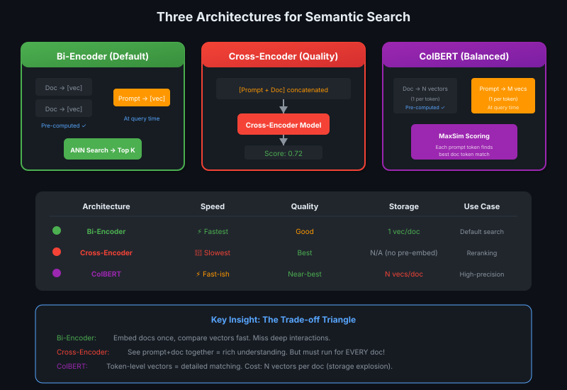
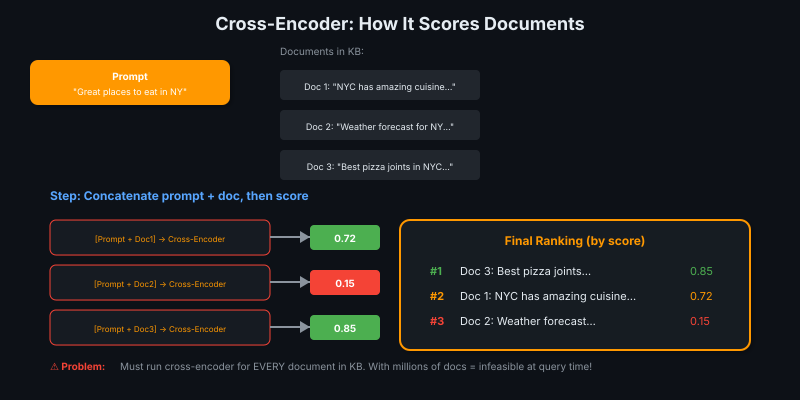
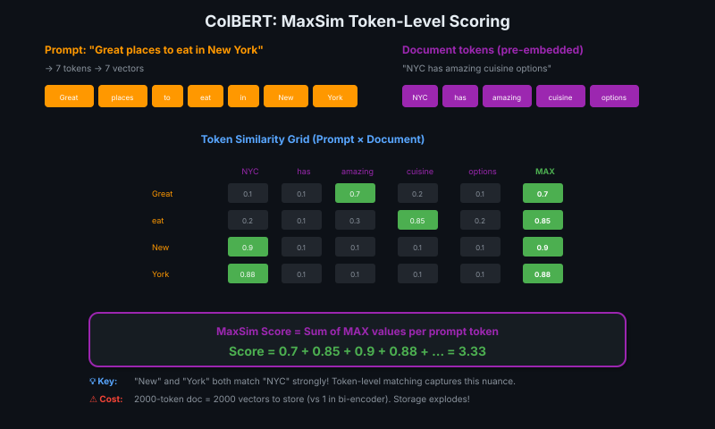

# 09 — Cross-Encoders & ColBERT: Beyond Vanilla Semantic Search

> Bi-encoder = fast but shallow. Cross-encoder = deep but slow. ColBERT = trying to have it both ways! 🎯

---

## The Problem with Bi-Encoders

Everything you've seen so far uses the **bi-encoder** architecture:
- Each document gets **one vector** (pre-computed)
- Each prompt gets **one vector** (at query time)
- ANN finds closest document vectors

This is fast, but the document and prompt never "see" each other during comparison. You're comparing **summary representations**, not understanding deep interactions between words.

> 💡 **Bi-encoder = comparing two book summaries. Cross-encoder = reading both books side-by-side. ColBERT = comparing chapter-by-chapter! 📚**

---

## Three Architectures Compared



---

## Architecture 1: Bi-Encoder (The Default)

**What happens:**
1. All documents embedded **ahead of time** → stored in vector DB
2. Prompt arrives → embedded to single vector
3. ANN finds closest document vectors
4. Top K returned

**Why it's fast:**
- Documents already embedded
- Only prompt needs embedding at query time
- ANN search is O(log N) not O(N)

**The limitation:**
```
Prompt: "Great places to eat in New York"
Doc:    "NYC has amazing cuisine options"

These are clearly related, but:
- "New York" ≠ "NYC" (different tokens)
- "eat" ≠ "cuisine" (semantic overlap, not exact)

Bi-encoder might miss this because embeddings are computed SEPARATELY.
Cross-encoder would see them TOGETHER and understand the connection.
```

---

## Architecture 2: Cross-Encoder (The Gold Standard)

**Key insight:** Concatenate prompt + document, then process as ONE input.



### How It Works

```
Input:  [Prompt] + [Separator] + [Document]
        "Great places to eat in NY [SEP] NYC has amazing cuisine..."

Model sees BOTH texts at once → understands deep contextual interactions
Output: Single relevancy score (0 to 1)
```

### Why It's Better

| Aspect | Bi-Encoder | Cross-Encoder |
|--------|-----------|---------------|
| What's compared | Summary vectors | Full texts together |
| Interaction depth | None (separate embeddings) | Deep (attention across both) |
| Quality | Good | **Best** |

The model can now **attend to relationships** between prompt and document tokens:
- "New York" ↔ "NYC" → same place!
- "eat" ↔ "cuisine" → same concept!

### Why It's Infeasible

**The scalability nightmare:**

```
You have: 1 million documents
For each prompt: run 1 million [prompt + doc] pairs through the model

Even at 100 pairs/second:
1,000,000 / 100 = 10,000 seconds = ~2.8 hours per query! 😱
```

No pre-computation possible because you need the prompt to concatenate!

> 💡 **Cross-encoder ko production mein direct use karna = har customer ke liye puri library padh ke jawab dena. Quality toh best, but speed zero! 🐢**

---

## Architecture 3: ColBERT (The Middle Ground)

**ColBERT** = **C**ontextualized **L**ate **I**nteraction over **BERT**

**Key idea:** Token-level vectors + late interaction scoring



### How It Works

**Step 1: Embedding (different from bi-encoder!)**
```
Document with 1000 tokens → 1000 vectors (one per token)
Prompt with 10 tokens    → 10 vectors (one per token)
```

**Step 2: MaxSim Scoring**
```
For each prompt token:
  1. Compare to ALL document tokens
  2. Take the MAX similarity
  
Final score = SUM of all max similarities
```

### Why It's Clever

```
Prompt: "Great places to eat in New York"
Doc:    "NYC has amazing cuisine options"

Token matching:
- "New" → best match "NYC" (0.9)
- "York" → best match "NYC" (0.88)
- "eat" → best match "cuisine" (0.85)
- "Great" → best match "amazing" (0.7)

Sum = 0.9 + 0.88 + 0.85 + 0.7 + ... = high score! ✓
```

The semantic connections are **captured at token level**, not compressed into one vector.

### The Trade-off

| What you gain | What you pay |
|--------------|-------------|
| Near cross-encoder quality | Storage explosion |
| Real-time capable | N vectors per document |
| Pre-computation works | 2000-token doc = 2000 vectors |

> 💡 **ColBERT = storing not just book summary, but summary of EVERY paragraph. More detail, but your bookshelf needs to be 1000× bigger! 📚💾**

---

## Comparison Table

| Architecture | Speed | Quality | Storage | Pre-compute? | Use Case |
|-------------|-------|---------|---------|--------------|----------|
| **Bi-Encoder** | ⚡⚡⚡ Fastest | Good | 1 vec/doc | ✅ Yes | Default search |
| **Cross-Encoder** | 🐢 Slowest | **Best** | N/A | ❌ No | **Reranking** |
| **ColBERT** | ⚡⚡ Fast-ish | Near-best | N vecs/doc | ✅ Yes | High-precision domains |

---

## When to Use What

### Bi-Encoder (Default Choice)
- General-purpose search
- Large knowledge bases
- Speed is critical
- Storage is limited

### Cross-Encoder (For Reranking)
- Too slow for initial search
- **Perfect for re-scoring top K candidates**
- Run bi-encoder first → get 100 candidates → cross-encoder re-ranks them
- More on this in the next lesson!

### ColBERT (For High-Stakes Domains)
- Legal document search (precision matters)
- Medical literature (can't miss relevant papers)
- When storage cost is acceptable
- Growing vector DB support (Weaviate, etc.)

> 💡 **Use bi-encoder to cast a wide net, then cross-encoder to pick the best fish. ColBERT = expensive net that catches better fish from the start! 🎣**

---

## Key Takeaways

| Concept | Summary |
|---------|---------|
| **Bi-Encoder** | Separate embeddings → fast but shallow comparison |
| **Cross-Encoder** | Concatenate prompt+doc → deep understanding but O(N) scaling |
| **ColBERT** | Token-level vectors → rich matching, storage proportional to tokens |
| **MaxSim** | ColBERT scoring: each prompt token finds best doc token match, sum the maxes |
| **Trade-off** | Quality ↔ Speed ↔ Storage — pick two! |
| **Production pattern** | Bi-encoder for retrieval → cross-encoder for reranking (next lesson!) |

---

## Quick Check

<details>
<summary>❓ Why can't cross-encoders be used directly for search at scale?</summary>

Cross-encoders require the prompt + document to be concatenated and passed through the model **together**. This means:
- No pre-computation possible (need the prompt first)
- Must run the model for EVERY document in the KB
- With millions of docs, this takes hours per query

Solution: Use bi-encoder for initial retrieval, then cross-encoder to rerank the top K candidates.
</details>

<details>
<summary>❓ How does ColBERT's MaxSim scoring work?</summary>

1. Document: each token → one vector (pre-computed, stored)
2. Prompt: each token → one vector (at query time)
3. For each prompt token, find its MAX similarity to any doc token
4. Sum all the max similarities = final document score

This allows token-level matching (e.g., "New York" ↔ "NYC") while still pre-computing document vectors.
</details>

<details>
<summary>❓ What is the main trade-off of ColBERT vs bi-encoder?</summary>

**Storage explosion.** 

Bi-encoder: 1 vector per document
ColBERT: N vectors per document (one per token)

A 2000-token document needs 2000 vectors in ColBERT vs 1 in bi-encoder. This is 2000× more storage, but provides much richer matching capability.
</details>

---

## 🔗 Connections
- ← Builds on: [Semantic Search](../module-2-ir-search-foundations/06-semantic-search-embeddings.md) (bi-encoder is the default)
- → Enables: [Reranking](10-reranking.md) (cross-encoders shine here!)
- Related: [Vector Databases](03-vector-databases.md) (increasingly support ColBERT)
- Related: [Hybrid Search](../module-2-ir-search-foundations/08-hybrid-search.md) (bi-encoder is the semantic component)
