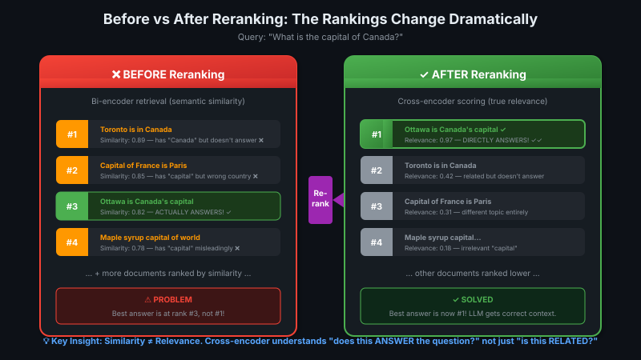
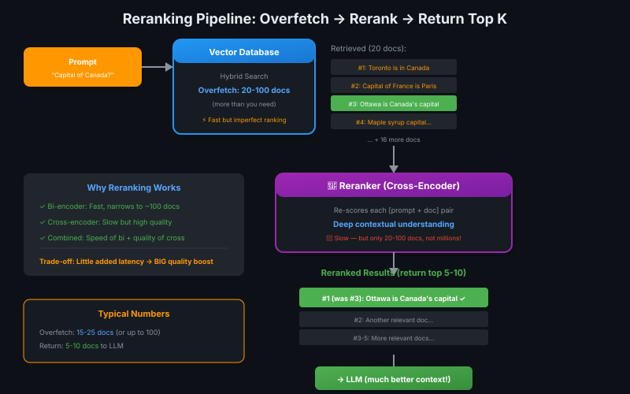
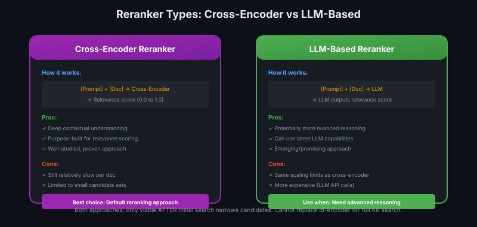
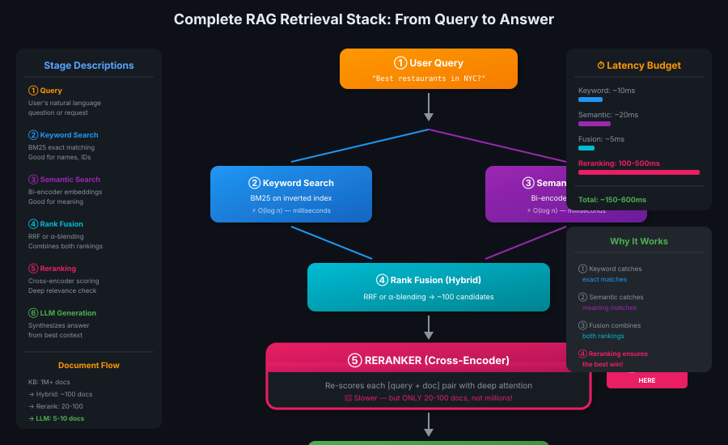

# 10 — Reranking: Post-Retrieval Quality Boost

> Bi-encoder finds candidates, cross-encoder picks the winners. Best of both worlds! 🏆

---

## What is Reranking?

**Reranking** = re-scoring and re-ordering documents **after** initial retrieval, **before** sending to LLM.

```
Vector DB retrieves 20-100 docs → Reranker re-scores them → Return top 5-10 to LLM
```

Why? Because initial retrieval (bi-encoder) is **fast but imperfect**. Reranking uses **expensive but high-quality** models on a small candidate set.

> 💡 **Phase 1 mein sab eligible candidates dhundho (fast). Phase 2 mein best candidates chuno (accurate). Job interview jaisa — screening round → final round! 🎯**

---

## The Problem Reranking Solves



**Example:** Prompt = "What is the capital of Canada?"

Vector DB might return:
1. "Toronto is in Canada" — semantically related ❌
2. "The capital of France is Paris" — has "capital" ❌
3. "Ottawa is Canada's capital" — actually relevant ✅
4. "Canada is the maple syrup capital" — has "capital" ❌

All are **somewhat related**, but only #3 actually answers the question. Bi-encoder can't always tell the difference — it just finds "close enough" vectors.

A **reranker** sees prompt + document together and understands #3 is the real answer.

---

## The Reranking Pipeline



### Step-by-Step

| Step | What Happens | Key Numbers |
|------|--------------|-------------|
| 1️⃣ **Initial Retrieval** | Bi-encoder / hybrid search returns candidates | **Overfetch: 20-100 docs** |
| 2️⃣ **Reranking** | Cross-encoder re-scores each [prompt + doc] pair | Deep contextual analysis |
| 3️⃣ **Final Selection** | Return top K by new scores | **Return: 5-10 docs** |
| 4️⃣ **To LLM** | Much better context for generation | Higher quality answers |

### Why Overfetching?

You retrieve **more than you need** because:
- Bi-encoder ranking isn't perfect
- True best docs might be at rank 15, not rank 3
- Reranker will sort them properly

> 💡 **Overfetch = cast a wide net. Rerank = pick the best fish. Don't return the whole net to the LLM! 🐟**

---

## Reranker Types



### Cross-Encoder Reranker (Most Common)

```
Input:  [Prompt] + [Document] (concatenated)
Model:  Cross-encoder architecture
Output: Relevance score (0.0 to 1.0)
```

**Why it works now (but not for initial search):**
- Cross-encoder needs prompt + doc together → can't pre-compute
- For initial search: millions of docs → infeasible
- For reranking: only 20-100 docs → totally viable!

### LLM-Based Reranker (Emerging)

```
Input:  [Prompt] + [Document] to an LLM
Prompt: "Rate relevance of this doc to the query (0-10)"
Output: LLM generates a score
```

**Same trade-offs as cross-encoder:**
- Can't pre-compute (need the prompt)
- Only viable on small candidate sets
- More expensive (full LLM API call per doc)

---

## Why Reranking is Worth It

| Without Reranking | With Reranking |
|-------------------|----------------|
| Fast bi-encoder ranking only | Bi-encoder + cross-encoder refinement |
| "Good enough" results | **Best** results from candidates |
| Semantically similar ≠ actually relevant | Deep relevance understanding |

**The trade-off:**

```
Cost:    A little added latency (scoring 20-100 docs)
Benefit: BIG quality boost (right docs in top positions)
```

Almost always worth it.

> 💡 **Reranking = proofread before submitting. 2 extra minutes → much better grade! 📝**

---

## Implementation: Often One Line

Many vector databases support reranking natively:

```python
# Without reranking
results = collection.query.hybrid(query="Capital of Canada?", limit=10)

# With reranking (often just one parameter!)
results = collection.query.hybrid(
    query="Capital of Canada?",
    limit=10,
    rerank=True  # or specify reranker model
)
```

This makes reranking **one of the easiest RAG improvements** to implement.

---

## Best Practices

### Typical Numbers

| Parameter | Recommended Range | Notes |
|-----------|-------------------|-------|
| **Overfetch** | 15-25 docs | Up to 100 for high-stakes |
| **Final return** | 5-10 docs | What LLM actually sees |
| **Latency impact** | 100-500ms | Acceptable for quality boost |

### When to Use Reranking

| Use Case | Recommendation |
|----------|----------------|
| Prototyping | Start without, add later |
| Production | Almost always use it |
| Latency-critical | Overfetch fewer (15 instead of 100) |
| Quality-critical | Overfetch more (50-100) |

> 💡 **First technique to try when improving search relevance. Easy to implement, big payoff! 🚀**

---

## The Full Picture: Retrieval Stack



```
┌─────────────────────────────────────────────────────────────┐
│  PROMPT                                                      │
└─────────────────────────────────────────────────────────────┘
                          ▼
          ┌───────────────┴───────────────┐
          ▼                               ▼
   ┌─────────────┐                 ┌─────────────┐
   │  Keyword    │                 │  Semantic   │
   │  (BM25)     │                 │ (Bi-encoder)│
   └─────────────┘                 └─────────────┘
          │                               │
          └───────────────┬───────────────┘
                          ▼
                ┌──────────────────┐
                │   Rank Fusion    │
                │ (RRF, α-blend)   │
                └──────────────────┘
                          │
                          │ 20-100 candidates
                          ▼
                ┌──────────────────┐
                │    RERANKER      │  ← You are here!
                │ (Cross-encoder)  │
                └──────────────────┘
                          │
                          │ Top 5-10
                          ▼
                ┌──────────────────┐
                │      LLM         │
                │  (Generation)    │
                └──────────────────┘
```

---

## Key Takeaways

| Concept | Summary |
|---------|---------|
| **Reranking** | Re-score documents after initial retrieval, before LLM |
| **Why** | Bi-encoder is fast but imperfect; cross-encoder is slow but accurate |
| **Pattern** | Overfetch (20-100) → rerank → return top 5-10 |
| **Cross-encoder** | [prompt + doc] together → relevance score. Standard approach. |
| **LLM-based** | LLM scores relevance. Emerging alternative. |
| **Implementation** | Often just one line/parameter in vector DB query |
| **Trade-off** | Small latency cost → big quality improvement |
| **Recommendation** | First technique to try when improving RAG quality |

---

## Quick Check

<details>
<summary>❓ What is overfetching and why do we do it?</summary>

**Overfetching** = retrieving more documents than you'll ultimately return (e.g., retrieve 50, return 10).

Why: Bi-encoder ranking isn't perfect. The true best document might be at rank 15, not rank 3. By overfetching, you give the reranker a chance to find and promote the truly relevant docs.
</details>

<details>
<summary>❓ Why can cross-encoders be used for reranking but not initial search?</summary>

Cross-encoders require **prompt + document together** — no pre-computation possible.

- For initial search: Must score **millions** of docs → infeasible (hours per query)
- For reranking: Only score **20-100** docs → totally viable (100-500ms)

The bi-encoder does the heavy lifting first, narrowing down candidates. Then cross-encoder refines.
</details>

<details>
<summary>❓ What's the typical overfetch/return ratio?</summary>

**Overfetch:** 15-25 docs (up to 100 for high-stakes applications)
**Return:** 5-10 docs to the LLM

The 3-5× ratio gives the reranker room to find truly relevant docs that might have ranked lower in initial retrieval.
</details>

<details>
<summary>❓ When should you add reranking to your RAG pipeline?</summary>

Reranking is **one of the first improvements to try** when optimizing RAG quality. It's:
- Easy to implement (often one line)
- Minimal latency impact
- Big quality improvement

Skip only if latency is extremely critical (sub-100ms requirements).
</details>

---

## 🔗 Connections
- ← Builds on: [Cross-Encoders & ColBERT](09-cross-encoders-colbert.md) (reranking uses cross-encoders)
- ← Uses: [Hybrid Search](../module-2-ir-search-foundations/08-hybrid-search.md) (initial retrieval stage)
- → Feeds: LLM generation (better context = better answers)
- Related: Retrieval metrics — reranking directly improves Precision@K
