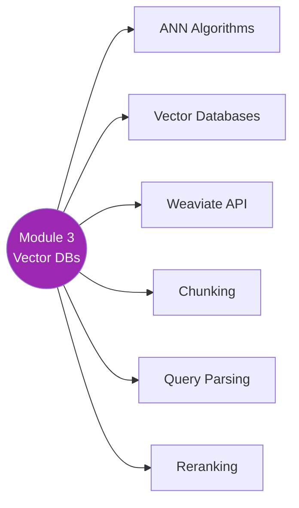

# 🗄️ Module 3 — Information Retrieval with Vector Databases

> Embeddings store karna, chunk karna, rank karna — sab vector DB ke andar! 🏗️

---

## 🧠 Brain — Module Overview

## 📊 Progress

| # | Lesson | Confidence | Revised |
|---|--------|-----------|---------|
| 01 | [Module 3 Introduction](01-module-introduction.md) | 🔴 | — |
| 02 | [ANN Algorithms](02-ann-algorithms.md) | 🔴 | — |
| 03 | [Vector Databases](03-vector-databases.md) | 🔴 | — |
| 04 | [Introduction to Weaviate API](04-weaviate-api.md) | 🔴 | — |
| 05 | [Chunking (Concepts)](05-chunking-concepts.md) | 🔴 | — |
| 06 | [Chunking (Lab)](06-chunking-lab.md) | 🔴 | — |
| 07 | [Advanced Chunking Techniques](07-advanced-chunking.md) | 🔴 | — |
| 08 | [Query Parsing](08-query-parsing.md) | 🔴 | — |
| 09 | [Cross-Encoders & ColBERT](09-cross-encoders-colbert.md) | 🔴 | — |
| 10 | [Reranking](10-reranking.md) | 🔴 | — |
| 11 | [Lab: Building RAG with Vector DB](11-lab-rag-vector-db.md) | 🔴 | — |

**Overall confidence:** 🔴 Not started

## 🧩 Memory Fragments
> - _Add fragments as you learn..._

---

## 🎬 Teach Mode

| # | Lesson | What You'll Get |
|---|--------|-----------------|
| 01 | Module 3 Introduction | Module roadmap |
| 02 | ANN Algorithms | Approximate nearest neighbors — fast similarity search |
| 03 | Vector Databases | Purpose-built DBs for embeddings |
| 04 | Weaviate API | Hands-on with a vector DB |
| 05 | Chunking (Concepts) | How to split documents for retrieval |
| 06 | Chunking (Lab) | Hands-on chunking strategies |
| 07 | Advanced Chunking | Semantic, recursive, parent-child |
| 08 | Query Parsing | Breaking down complex user queries |
| 09 | Cross-Encoders & ColBERT | Advanced retrieval models |
| 10 | Reranking | Post-retrieval reranking for better results |
| 11 | Lab: RAG + Vector DB | End-to-end hands-on |

**Supporting:** [Flashcards](flashcards.md)

---

## 📚 Source
> 🎓 [RAG Course — Module 3](https://learn.deeplearning.ai/courses/retrieval-augmented-generation) — DeepLearning.AI

## 🔗 Connected Topics
> ← [Module 2: IR & Search](../module-2-ir-search-foundations/) · → [Module 4: LLMs & Text Generation](../module-4-llms-text-generation/)
