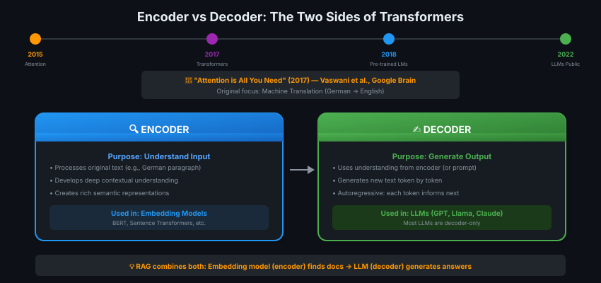
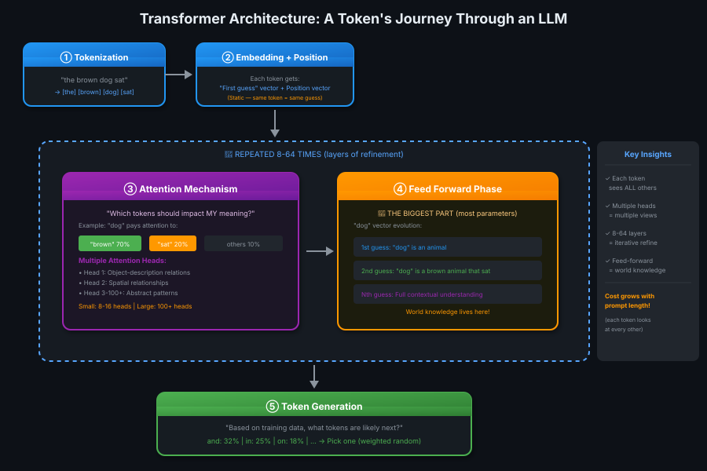
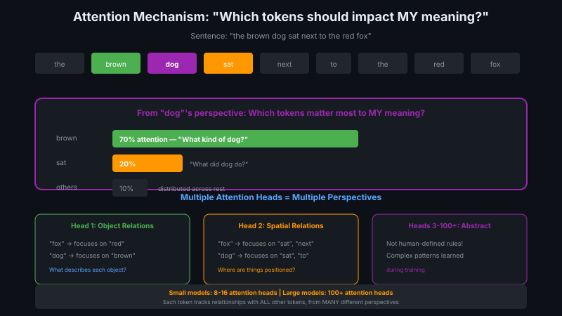

# 02 — Transformer Architecture: How LLMs Work Under the Hood

> Attention is All You Need — but let's actually understand what that means! 🧠

---

## Why This Matters for RAG

Before diving in, ask yourself: **Why does RAG even work?**

The answer: LLMs can **deeply understand** the meaning and relevance of information added to prompts. This understanding comes from the **transformer architecture** — specifically the attention mechanism and feed-forward layers.

> 💡 **RAG kaam karta hai kyunki LLM prompt mein inject ki gayi info ko sach mein samajh sakta hai — ye magic transformer se aata hai! ✨**

---

## Origins of the Transformer



The transformer was proposed in **"Attention is All You Need"** (Vaswani et al., Google Brain, 2017), originally for machine translation.

| Component | Purpose | Used In |
|-----------|---------|---------|
| **Encoder** | Develops deep understanding of input | Embedding models (BERT, Sentence Transformers) |
| **Decoder** | Generates new text from understanding | LLMs (GPT, Llama, Claude) |

> 💡 **RAG mein dono use hote hain: Embedding model (encoder) docs dhundhta hai, LLM (decoder) jawab generate karta hai!**

---

## The Token's Journey Through an LLM



### Step 1: Tokenization

Your prompt is split into **tokens** (words or sub-words).

```
"the brown dog sat" → [the] [brown] [dog] [sat]
```

### Step 2: Initial Embeddings + Position

Each token gets two vectors:

| Vector | What It Is | Important Property |
|--------|------------|-------------------|
| **Embedding** | "First guess" of token's meaning | **Static** — same token = same guess |
| **Position** | Where the token sits in the prompt | Captures word order |

These vectors are combined and sent for processing.

### Step 3: Attention Mechanism



This is where the magic happens. Each token asks:

> **"Which other tokens should have the biggest impact on MY meaning?"**

**Example:** In "the brown dog sat next to the red fox"

| Token | Pays Attention To | Why |
|-------|------------------|-----|
| "dog" | "brown" (70%) | What kind of dog? |
| "dog" | "sat" (20%) | What did it do? |
| "dog" | others (10%) | Background context |

#### Multiple Attention Heads

LLMs don't use just one attention pattern — they use **many** (8-16 for small models, 100+ for large ones).

| Head | Specializes In | Example |
|------|---------------|---------|
| Head 1 | Object-description relations | "fox" → "red", "dog" → "brown" |
| Head 2 | Spatial relationships | "fox" → "sat", "next" |
| Head 3+ | Abstract patterns learned during training | Not human-interpretable! |

> 💡 **Multiple heads = ek hi cheez ko alag-alag angles se dekhna. Jaise ek problem ko 100 experts review karein! 🔍**

### Step 4: Feed-Forward Phase

This is the **biggest part** of the LLM (most parameters).

Based on each token's:
- Original embedding
- Position
- Attention scores

...it generates **updated vector embeddings** — a "second guess" of each token's true meaning, now informed by context.

```
"dog" evolution:
  1st guess: "dog" is an animal
  2nd guess: "dog" is a brown animal that sat
  Nth guess: Full contextual understanding of THIS dog
```

**The world knowledge lives in these feed-forward layers!**

### Step 5: Iterative Refinement

The attention + feed-forward process is repeated **8-64 times** (layers), each time refining the understanding.

```
Input → Layer 1 → Layer 2 → ... → Layer N → Refined Understanding
        ↑                              ↑
    First Pass                   Nth Pass
```

### Step 6: Token Generation

Once understanding is refined, the model asks:

> "Based on my training data, what tokens are likely to come next?"

| Token | Probability |
|-------|-------------|
| "and" | 32% |
| "in" | 25% |
| "on" | 18% |
| "that" | 12% |
| ... | ... |

The LLM picks one token from this distribution (weighted random), appends it to the prompt, and **repeats the entire process** for the next token.

> 💡 **Ek token generate karne ke liye pura process chalta hai. 100 tokens = 100 bar yahi process! 🔄**

---

## The Generation Loop

```
┌─────────────────────────────────────────────────────────────┐
│                    TOKEN GENERATION LOOP                     │
│                                                              │
│  1. Process entire prompt through all layers                │
│  2. Generate probability distribution for next token        │
│  3. Pick one token (weighted by probability)                │
│  4. Append to prompt                                        │
│  5. REPEAT until:                                           │
│     - Token limit reached, OR                               │
│     - End-of-completion token [EOS] generated               │
│  6. De-tokenize and return to user                          │
│                                                              │
│  Note: Early random choices influence later ones!            │
└─────────────────────────────────────────────────────────────┘
```

---

## Why This Matters for RAG

| Insight | Implication for RAG |
|---------|-------------------|
| **LLMs deeply understand context** | Retrieved documents genuinely inform the response |
| **Attention sees ALL tokens** | The model can connect query to relevant retrieved info |
| **World knowledge in feed-forward** | LLM can reason about retrieved content |
| **Inherently random** | Even with good context, LLM might ignore it! Need controls. |
| **Computationally expensive** | Cost grows with prompt length (each token looks at ALL others) |

---

## Cost Implications

```
                    COST GROWTH
                         │
                         │        /
                         │       /
                         │      /
                         │     /
                  COST   │    /
                         │   /
                         │  /
                         │ /
                         │/________________
                              PROMPT LENGTH

Each token must examine EVERY other token.
Longer prompts = quadratically more computation.
Most RAG system costs come from running transformers!
```

---

## Key Takeaways

| Concept | Summary |
|---------|---------|
| **Tokenization** | Split text into tokens, assign initial embedding + position |
| **Attention** | Each token decides which others impact its meaning (multiple heads) |
| **Feed-forward** | Updates embeddings based on context; contains world knowledge |
| **Layers** | Process repeats 8-64 times for iterative refinement |
| **Generation** | Probability distribution → pick token → repeat |
| **For RAG** | LLMs genuinely understand injected context (good!), but are still random (need controls) |

---

## Quick Check

<details>
<summary>❓ Why are embedding vectors called "first guesses"?</summary>

Because they're **static** — every time a token appears, it gets the same initial vector regardless of context. The attention and feed-forward layers then **refine** this guess based on surrounding tokens.
</details>

<details>
<summary>❓ What does "attention" actually mean in transformers?</summary>

Attention = "which other tokens should have the biggest impact on MY meaning?"

Each token assigns attention weights to all other tokens. "dog" might assign 70% attention to "brown" (describing word) and 20% to "sat" (action), with 10% distributed across others.
</details>

<details>
<summary>❓ Why do LLMs have multiple attention heads?</summary>

Each head specializes in **different types of relationships**:
- One head might track object-description relations
- Another might track spatial relationships
- Others learn abstract patterns during training

Multiple perspectives = richer understanding. Small models use 8-16 heads; large ones use 100+.
</details>

<details>
<summary>❓ Why does cost grow with prompt length in RAG?</summary>

Each token must examine **every other token** to compute attention. With N tokens:
- 100 tokens = 100 × 100 = 10,000 attention comparisons
- 1000 tokens = 1,000,000 comparisons

This quadratic growth means most RAG costs come from the transformer, not the retriever.
</details>

<details>
<summary>❓ Why does RAG work, based on transformer architecture?</summary>

1. **Attention mechanism** allows the LLM to connect query tokens to retrieved document tokens
2. **Feed-forward layers** contain world knowledge to reason about the content
3. **Deep understanding** develops through multiple layers of refinement

The LLM genuinely comprehends injected context — it's not just keyword matching.
</details>

---

## 🔗 Connections
- ← Previous: [Module Introduction](01-module-introduction.md)
- → Next: [LLM Sampling Strategies](03-llm-sampling-strategies.md) (controlling the randomness)
- Related: [Bi-encoder vs Cross-encoder](../module-3-ir-vector-databases/09-cross-encoders-colbert.md) — encoders in retrieval
- Related: [Agentic AI](../../agentic-ai/) — building on LLM capabilities
