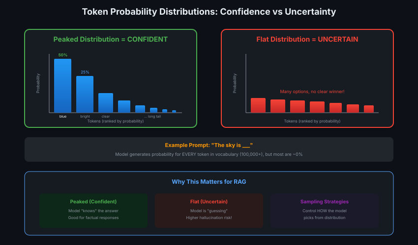
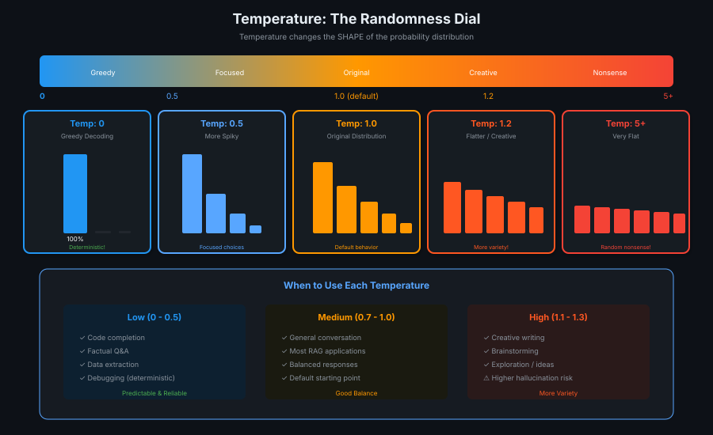
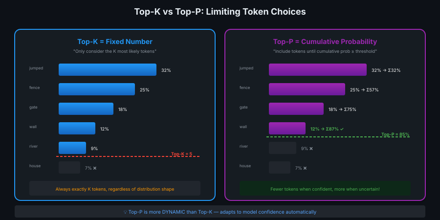
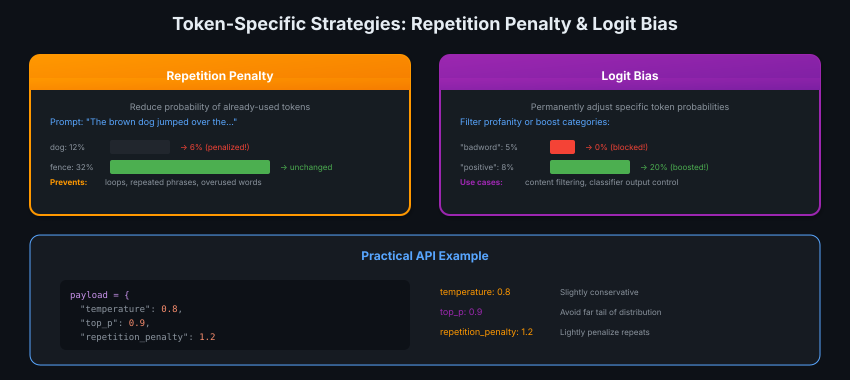

# 03 · LLM Sampling Strategies

> **TL;DR:** LLMs don't output text — they output probability distributions. Sampling strategies control HOW we pick tokens from these distributions.

---

## The Core Problem

Every generation step, the LLM produces probabilities for ~100,000 tokens. How do we pick one?



**Key insight:** Distribution shape = model confidence. Peaked = knows the answer. Flat = guessing.

---

## Strategy 1: Temperature

The "randomness dial" — reshapes the entire distribution.



| Temp | Distribution | Use Case |
|------|--------------|----------|
| 0 | Spike (greedy) | Code, factual Q&A |
| 0.5 | Spiky | Focused responses |
| 1.0 | Original | Default/balanced |
| 1.2 | Flatter | Creative writing |
| 5+ | Nearly uniform | Random nonsense |

**Formula:** `softmax(logits / temperature)`

---

## Strategy 2: Top-K vs Top-P

Both LIMIT which tokens can be sampled — but differently.



| Method | Cutoff Rule | Behavior |
|--------|-------------|----------|
| **Top-K** | Fixed count (e.g., K=5) | Always exactly K tokens |
| **Top-P** | Cumulative probability (e.g., P=0.9) | Adapts to confidence |

**Top-P advantage:** Fewer tokens when confident, more when uncertain.

---

## Strategy 3: Token-Specific Controls

Target individual tokens rather than the whole distribution.



| Control | What It Does | Use Case |
|---------|--------------|----------|
| **Repetition Penalty** | Reduce prob of already-used tokens | Prevent loops |
| **Logit Bias** | Permanently adjust specific tokens | Content filtering |

---

## Practical API Settings

```python
payload = {
    "temperature": 0.8,      # Slightly conservative
    "top_p": 0.9,            # Avoid far tail
    "repetition_penalty": 1.2 # Light repeat penalty
}
```

### RAG-Specific Recommendations

| Task | Temperature | Top-P | Notes |
|------|-------------|-------|-------|
| Factual Q&A | 0.3-0.5 | 0.9 | Low hallucination |
| Summarization | 0.5-0.7 | 0.9 | Balanced |
| Creative | 0.8-1.0 | 0.95 | More variety |
| Code Gen | 0-0.3 | 0.9 | Deterministic |

---

## Key Takeaways

1. **Temperature** = distribution shape (global control)
2. **Top-K/P** = which tokens are candidates (filtering)
3. **Top-P > Top-K** for dynamic adaptation
4. **Repetition penalty** = prevent loops
5. **Logit bias** = hard control specific tokens
6. **RAG default:** temp 0.5-0.7, top_p 0.9

---

## Quick Reference

```
Temperature 0   → Always pick highest prob (greedy)
Temperature 1   → Sample from original distribution
Temperature >1  → Flatten distribution (more random)

Top-K = 5       → Only consider top 5 tokens
Top-P = 0.9     → Consider tokens until cumsum ≥ 90%

Repetition = 1.2 → 20% penalty on repeated tokens
Logit bias = -100 → Effectively block that token
```
