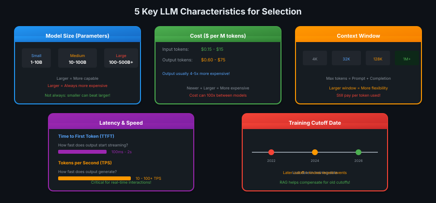
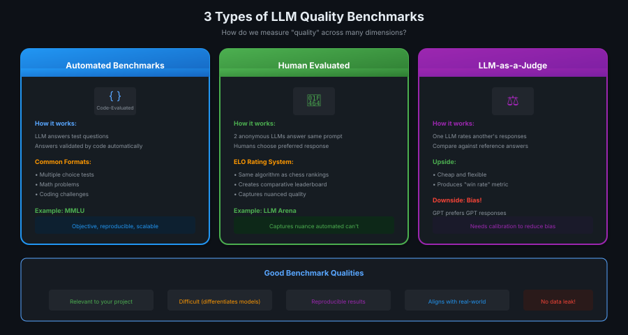
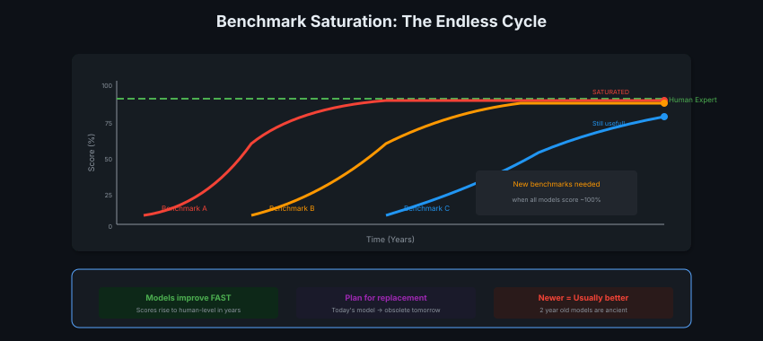

# 04 · Choosing Your LLM

> **TL;DR:** Pick an LLM based on 5 quantifiable factors + quality benchmarks. Plan to swap it later — models improve FAST.

---

## The 5 Key Characteristics

Every LLM can be compared on these quantifiable metrics:



| Factor | What to Know | RAG Impact |
|--------|--------------|------------|
| **Size** | 1-10B (small) → 500B+ (large) | Larger ≠ always better |
| **Cost** | $0.15-$75 per M tokens | Output 4-5x more expensive |
| **Context Window** | 4K → 1M+ tokens | More docs = bigger window |
| **Speed** | TTFT + TPS | Critical for real-time |
| **Cutoff** | Training data recency | RAG compensates! |

---

## Quality Benchmarks

Quantifiable metrics narrow choices. Benchmarks measure **quality** — harder to quantify.



| Type | How It Works | Example |
|------|--------------|---------|
| **Automated** | Code validates answers | MMLU (57 subjects) |
| **Human** | Humans pick preferred response | LLM Arena (ELO ranking) |
| **LLM-as-Judge** | One LLM rates another | Cheap but biased |

**Warning:** LLM-as-Judge has bias — GPT prefers GPT, Gemini prefers Gemini!

---

## The Saturation Problem

Benchmarks have a shelf life. Models improve so fast that benchmarks become useless.



**Pattern:**
1. New benchmark introduced → models score low
2. Few years later → all models score ~100%
3. Benchmark "saturated" → can't differentiate
4. New harder benchmark needed → cycle repeats

---

## Data Contamination Warning

Models train on billions of internet tokens. If benchmark data was in training:
- Model "memorized" answers
- Scores inflated
- Real-world performance doesn't match

**Check:** Does benchmark align with actual developer experience?

---

## Practical Selection Guide

```
Step 1: Filter by hard constraints
├── Budget limit? → Eliminate expensive models
├── Latency requirement? → Eliminate slow models
└── Context needs? → Eliminate small windows

Step 2: Check relevant benchmarks
├── Code generation? → HumanEval, MBPP
├── Reasoning? → GSM8K, MATH
├── General? → MMLU, LLM Arena
└── Your domain? → Find specialized benchmark

Step 3: Test on YOUR data
├── Run on real queries
├── Measure actual latency
└── Verify quality yourself
```

---

## Key Takeaways

1. **5 factors:** size, cost, context, speed, cutoff
2. **3 benchmark types:** automated, human, LLM-as-judge
3. **Benchmarks saturate** — newer ones always needed
4. **Plan for replacement** — today's best → obsolete in 2 years
5. **Test on YOUR data** — benchmarks are guidance, not gospel
