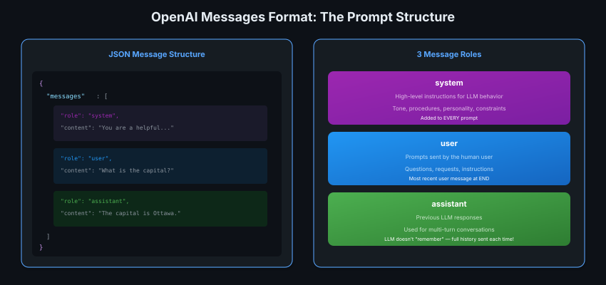
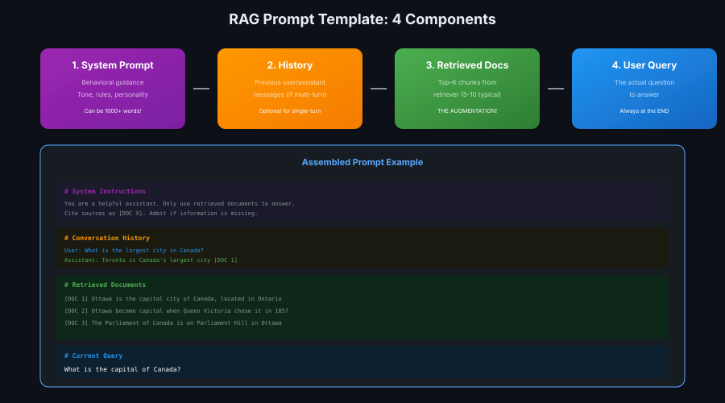

# 06 · Prompt Engineering: Augmented Prompt

> **TL;DR:** RAG prompts have 4 components: system prompt, history, retrieved docs, user query. Templates make experimentation easy.

---

## The Messages Format

LLM APIs use a standard JSON structure for prompts.



**Key insight:** LLMs don't "remember" conversations. The **entire history** is sent every time!

---

## The 4 Components

Every RAG prompt assembles these pieces:



| Component | Purpose | Placement |
|-----------|---------|-----------|
| **System** | Behavior rules | Start |
| **History** | Prior conversation | After system |
| **Documents** | Retrieved chunks | Before query |
| **Query** | Current question | End |

---

## System Prompt Best Practices

The system prompt sets global behavior. Can be **thousands of words!**

```markdown
# Good system prompt includes:

1. Role definition
   "You are a helpful assistant for [domain]"

2. Knowledge cutoff + current date
   "Your training data ends April 2024. Today is May 2026."

3. RAG-specific instructions
   - Use ONLY retrieved documents
   - Cite sources as [DOC X]
   - Admit when information is missing
   - Judge document relevance

4. Tone and style
   - "Respond in markdown"
   - "Be concise" OR "Provide detailed explanations"
   - "Reason step-by-step"

5. Safety constraints
   - "Don't help with harmful requests"
```

---

## Template Structure

```python
prompt_template = """
# System Instructions
{system_prompt}

# Conversation History
{conversation_history}

# Retrieved Documents
{retrieved_chunks}

# Current Query
{user_query}
"""
```

**Why templates?** Easy to experiment with structure without rewriting code.

---

## RAG-Specific System Prompts

| Goal | Instruction |
|------|-------------|
| **Ground answers** | "Only use retrieved documents" |
| **Force citations** | "Cite sources as [DOC X]" |
| **Handle missing info** | "Say 'I don't know' if info not in docs" |
| **Relevance check** | "Ignore irrelevant documents" |

---

## Key Takeaways

1. **3 roles:** system, user, assistant
2. **No memory** — full conversation sent each time
3. **System prompt** = global behavior (can be huge!)
4. **Templates** = structured prompt assembly
5. **RAG-specific:** force grounding + citations
