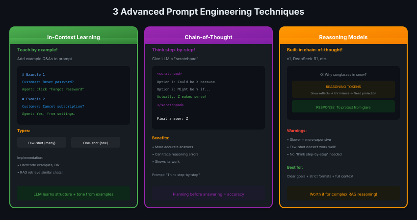
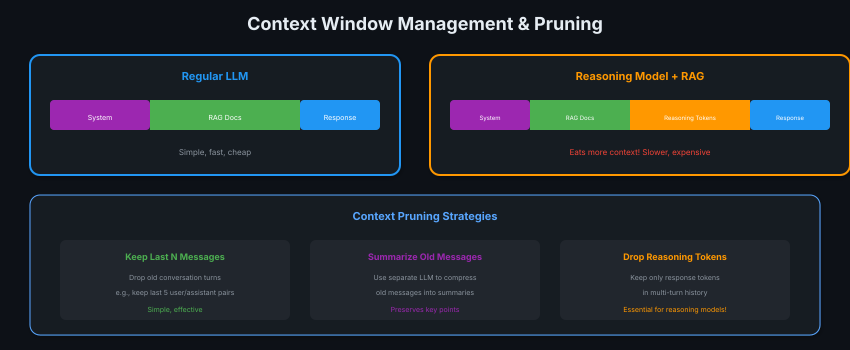

# 07 · Prompt Engineering: Advanced Techniques

> **TL;DR:** In-context learning, chain-of-thought, and reasoning models improve quality — but eat more context. Prune wisely.

---

## 3 Advanced Techniques



| Technique | How It Works | Best For |
|-----------|--------------|----------|
| **In-Context Learning** | Add example Q&As | Teaching tone/structure |
| **Chain-of-Thought** | Add scratchpad for thinking | Complex reasoning |
| **Reasoning Models** | Built-in CoT (o1, DeepSeek-R1) | Math, code, planning |

---

## In-Context Learning

Teach the LLM by showing examples.

```markdown
# Example 1
Customer: How do I reset my password?
Agent: Click "Forgot Password" on the login page.

# Example 2
Customer: Can I cancel my subscription?
Agent: Yes, from your account settings.
```

**Types:**
- **Few-shot:** Many examples
- **One-shot:** Just one example

**Implementation:**
1. Hardcode examples in prompt
2. OR use RAG to retrieve similar past conversations!

---

## Chain-of-Thought (CoT)

Give the LLM a "scratchpad" to think before answering.

```markdown
<scratchpad>
Option 1: Could be X because...
Option 2: Might be Y if...
Actually, Z makes most sense because...
</scratchpad>

Final answer: Z
```

**Prompt:** "Think step-by-step before answering."

**Benefits:**
- More accurate answers
- Can trace reasoning errors
- Shows its work

---

## Reasoning Models Warning

Models like o1, DeepSeek-R1 have **built-in** chain-of-thought.

| Do | Don't |
|----|-------|
| Clear goals | "Think step-by-step" (they already do!) |
| Strict formats | Few-shot examples (confuses them) |
| Full context dump | Complex prompting techniques |
| High-level guidance | Over-engineering prompts |

**Trade-off:** Slower + more expensive, but better for complex reasoning.

---

## Context Window Management

Advanced techniques eat more tokens. Manage carefully!



---

## Pruning Strategies

| Strategy | When to Use |
|----------|-------------|
| **Keep last N messages** | Multi-turn conversations |
| **Summarize old messages** | Long conversations, preserve context |
| **Drop reasoning tokens** | Reasoning models in multi-turn |
| **Remove no-value techniques** | Single-turn if technique adds nothing |
| **Only current query's docs** | Don't include docs from older turns |

---

## Key Takeaways

1. **In-context learning** = teach by example
2. **Chain-of-thought** = scratchpad before answering
3. **Reasoning models** = built-in CoT, different prompting rules
4. **Context fills fast** — prune aggressively
5. **Add techniques only when needed** — simple prompts often work
